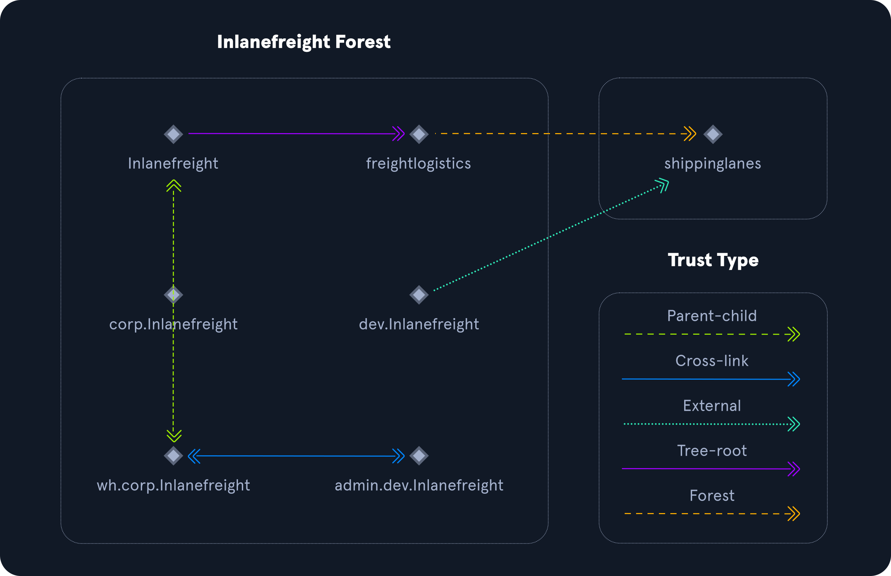

# Active Directory Functionality

Güven (trust), orman-orman veya domain-domain kimlik doğrulaması oluşturmak için kullanılır ve kullanıcıların, hesaplarının bulunduğu etki alanı dışındaki başka bir etki alanındaki kaynaklara erişmesine (veya yönetmesine) olanak tanır. Güven, iki etki alanının kimlik doğrulama sistemleri arasında bir bağlantı oluşturur.

| Trust Type | Description |
|---|---|
| Parent-child | Aynı orman içindeki etki alanları. Alt etki alanı, üst etki alanıyla iki yönlü geçişli bir güvene sahiptir. |
| Cross-link | Kimlik doğrulamayı hızlandırmak için alt etki alanları arasında bir güven. |
| External | Halihazırda bir orman güveniyle birleştirilmemiş ayrı ormanlardaki iki ayrı etki alanı arasındaki geçişli olmayan güven. Bu güven türü SID filtrelemeyi kullanır. |
| Tree-root | Bir orman kök etki alanı ile yeni bir ağaç kök etki alanı arasında iki yönlü geçişli güven. |
| Forest | İki orman kök etki alanı arasında geçişli bir güven. |

Güvenler geçişli veya geçişsiz olabilir:

1. Geçişli güven, güvenin, alt etki alanının güvendiği nesnelere kadar genişletildiği anlamına gelir.
2. Geçişli olmayan güvende, yalnızca alt etki alanının kendisine güvenilir.

Güvenler tek yönlü veya iki yönlü (çift yönlü) olacak şekilde ayarlanabilir:

1. Çift yönlü güvende, her iki güvenen etki alanındaki kullanıcılar kaynaklara erişebilir.
2. Tek yönlü güvende, yalnızca güvenilen etki alanındaki kullanıcılar güvenen etki alanındaki kaynaklara erişebilir. Bunun tersi geçerli değildir. Güven yönü erişim yönünün tersidir.
