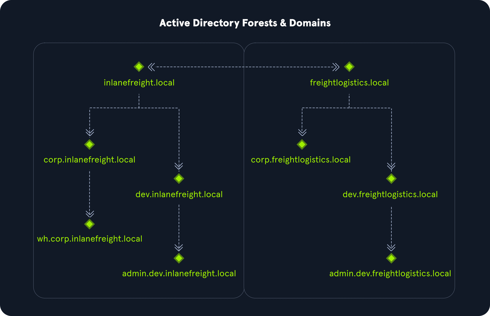

# Active Directory Structure

Çok sayıda satın alma gerçekleştiren kuruluşlarda güven ilişkileri (trust relationships) yoluyla birbirine bağlanan birden fazla domain görülmesi yaygındır. Başka bir domain ile güven ilişkisi oluşturmak kullanıcıları yeniden oluşturmaktan daha hızlı ve kolaydır. Domain güvenleri uygun şekilde yönetilmediği takdirde çok sayıda güvenlik sorununa neden olabilir.

Yukarıdaki grafik `inlanefreight.local` ve `freightlogistics.local` olmak üzere iki ormanı (forest) göstermektedir. Çift yönlü ok iki orman arasındaki çift yönlü güveni (trust) temsil eder. Bu şu anlama gelir: `inlanefreight.local` içindeki kullanıcılar `freightlogistics.local` içindeki kaynaklara erişebilir ve bunun tam tersi de mümkündür. Ayrıca her kök domain (etki alanı) altında birden fazla alt domain bulunabilir. Bu örnekte kök etki alanı, altındaki etki alanlarının her birine güvenmektedir. Ancak bu durum sol taraftaki ormanda bulunan alt etki alanlarının, sağ taraftaki ormanda bulunan alt etki alanlarıyla da bir güven ilişkisi kurmuş olmasını gerektirmez. Bu şu anlama gelir: `inlanefreight.local` ve `freightlogistics.local` arasında çift yönlü bir güven mevcut olsa bile, varsayılan olarak `admin.dev.freightlogistics.local` etki alanı altında olan bir kullanıcı `wh.corp.inlanefreight.local` etki alanı altında olan makinelerde kimlik doğrulaması gerçekleştiremez. Bunun için başka bir güvenin kurulması gerekir.
