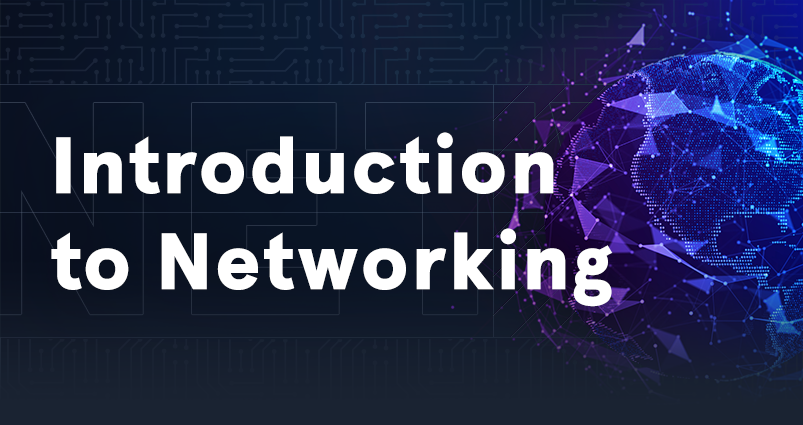

# Introduction to Networking

|  |
|---|
| As an information security professional, a firm grasp of networking fundamentals and the required components is necessary. Without a strong foundation in networking, it will be tough to progress in any area of information security. Understanding how a network is structured and how the communication between the individual hosts and servers takes place using the various protocols allows us to understand the entire network structure and its network traffic in detail and how different communication standards are handled. This knowledge is essential to create our tools and to interact with the protocols. |
