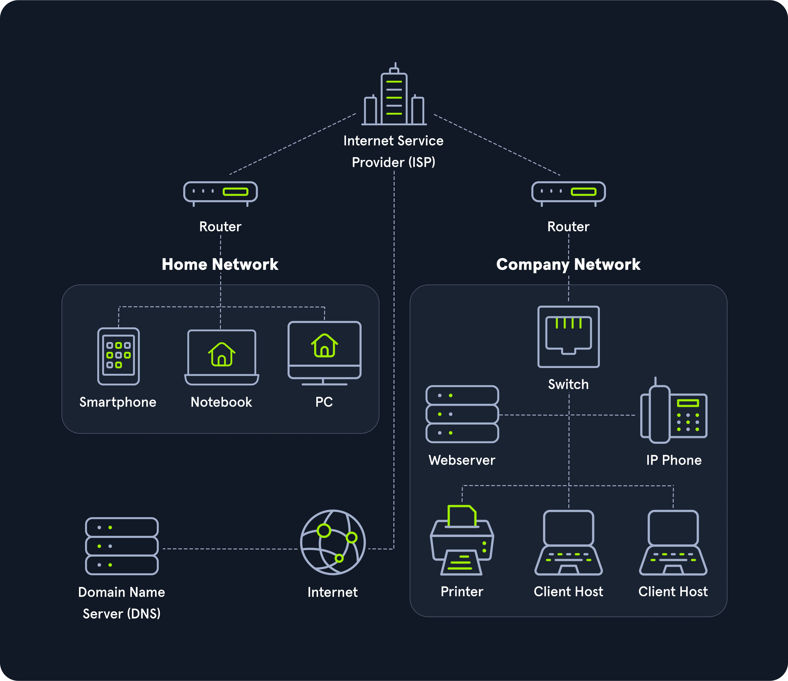

# Networking Overview

## Example No. 1

Daha küçük ağlar oluşturmak ve bunların etrafına erişim kontrol listeleri koymak, bir mülkün sınırlarının etrafına belirli giriş ve çıkış noktaları oluşturan bir çit çekmek gibidir. Evet, bir saldırgan çitin üzerinden atlayabilir ancak bu şüpheli görünmektedir ve yaygın değildir. Yazıcı ağı neden sunucularla HTTP üzerinden konuşuyor?

## Example No. 2

Her bir ağın amacını haritalandırmak ve belgelendirmek için zaman ayırmak, bir mülkün etrafına ışıklar yerleştirmek ve tüm faaliyetlerin görülebildiğinden emin olmak gibidir. Yazıcı ağı neden internet ile konuşuyor?

## Example No. 3

Pencerelerin etrafına çalılar konulması pencereyi açmaya çalışanlar için caydırıcıdır. IDS çözümlerinin ağ taramalarını çalıştırma konusunda caydırıcı olması da bu şekildedir. Port taraması neden yazıcı ağından kaynaklandı?

## Basic Information

Networking kavramı, bir bilgisayar tarafından gönderilen ve diğer bir bilgisayar tarafından alınan posta veya paketlerin teslimi olarak düşünülebilir.
