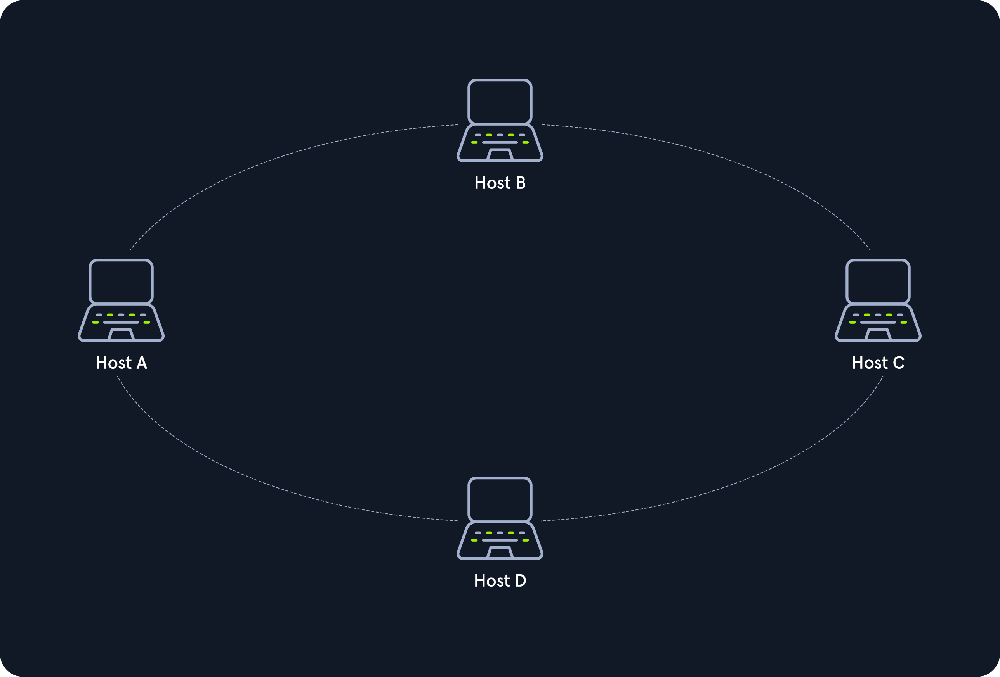
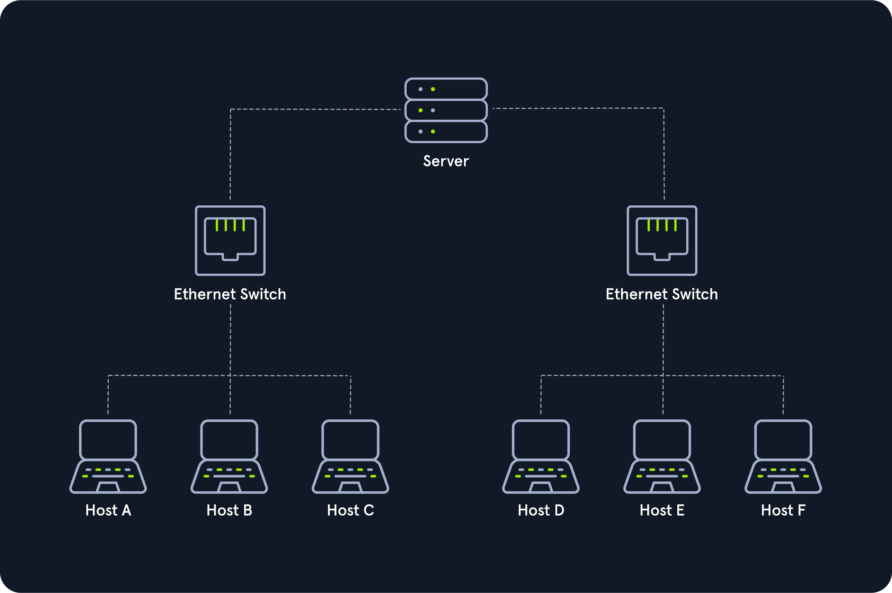
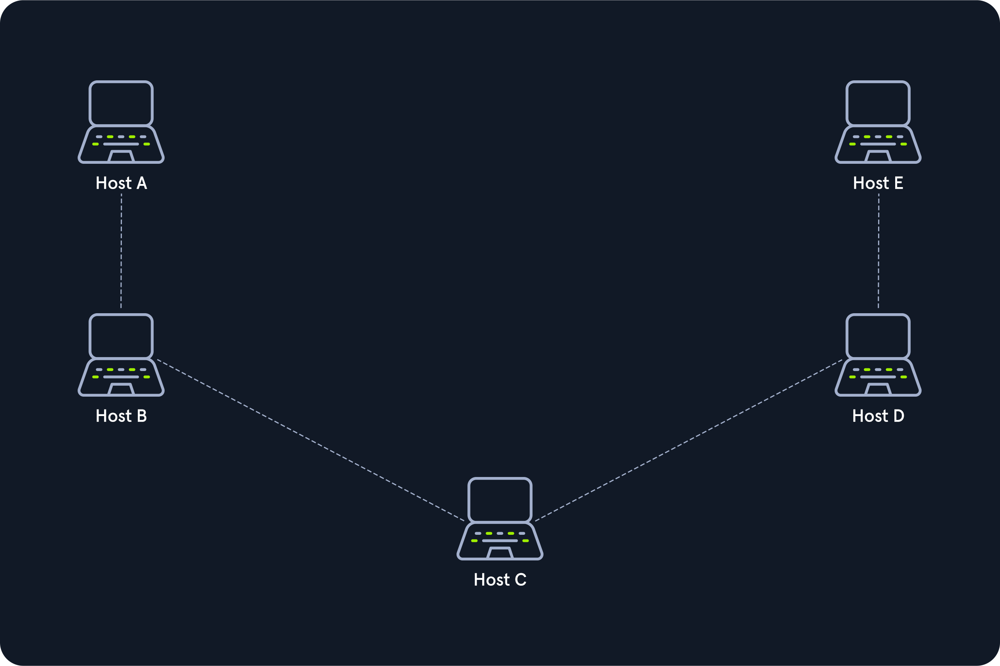

# Network Topologies

Ağ topolojisi bir ağdaki cihazların tipik bir düzenlemesi ve fiziksel veya mantıksal bağlantısıdır. Bilgisayarlar, ağı aktif olarak kullanan istemci ve sunucu gibi cihazlardır. Ayrıca dağıtım fonksiyonuna sahip olan ve tüm ağ cihazlarının birbiriyle mantıksal bağlantı kurabilmesini sağlayan switch, bridge, router gibi ağ bileşenlerini de içerirler. Ağ topolojisi, kullanılacak bileşenleri ve iletim ortamına erişim yöntemlerini belirler.

Ağ topolojisi alanının tamamını üç alana ayırabiliriz: Connections (wired, wireless), nodes (repeater, hub, bridge, switch, router/modem, gateway, firewall), classifications (point-to-point, bus, star, ring, mesh, tree, hybrid, daisy chain).

## Point-to-Point

İki bilgisayarın aralarında özel bir bağlantıya sahip olduğu en basit ağ topolojisidir. Bu topolojide, doğrudan ve basit fiziksel bağlantı yalnızca iki bilgisayar arasında mevcuttur. Bu topoloji geleneksel telefonun temel modelidir ve P2P (Peer-to-Peer) mimarisi ile karıştırılmamalıdır.

## Bus

Tüm bilgisayarlar veri yolu topolojisindeki bir iletim ortamı aracılığıyla bağlanır. Her bilgisayarın iletim ortamına ve onun üzerinden iletilen sinyallere erişimi vardır. Üzerindeki işlemleri kontrol eden merkezi bir ağ bileşeni yoktur. Ortam paylaşıldığı için yalnızca bir bilgisayar veri gönderebilir ve diğerleri yalnızca verileri alıp değerlendirebilir.

## Star

Yıldız topolojisi tüm bilgisayarlarla bağlantıyı sürdüren bir ağ bileşenidir. Her bilgisayar merkezi ağ bileşenine ayrı bir bağlantı aracılığıyla bağlanır. Ağ bileşeni genellikle router, hub veya switch cihazıdır. Bu cihazlar veri paketleri için iletme işlevini yerine getirir. Bunu yapmak için veri paketleri alınır ve hedefe iletilir. Merkezi ağ bileşenindeki trafik çok yüksek olabilir.

## Ring

Fiziksel halka topolojisi her bilgisayarın veya düğümün halkaya iki kabloyla bağlanacağı şekilde oluşturulur:

1. Bir kablo gelen sinyaller için kullanılır.
2. Diğer bir kablo giden sinyaller için kullanılır.

Bu, her bilgisayara bir kablonun geldiği ve bir kablonun ayrıldığı anlamına gelir. Halka topolojisi genellikle aktif bir ağ bileşeni gerektirmez. İletim ortamının kontrolü ve erişimi tüm istasyonların bağlı olduğu bir protokol tarafından düzenlenir. Mantıksal halka topolojisi fiziksel yıldız topolojisine dayanır.

## Mesh

Örgülü ağlarda birçok düğüm fiziksel düzeydeki bağlantılara ve mantıksal düzeydeki yönlendirmeye karar verir. Bu nedenle örgü yapıların sabit bir topolojisi yoktur. İki temel örgülü yapı vardır: Tamamen örgülü yapı ve kısmen örgülü yapı.

Tamamen örgülü yapıda her bilgisayar ağdaki diğer tüm bilgisayarlara bağlıdır. Bu yapı daha çok WAN (Wide Area Network) veya MAN (Metropolitan Area Network) ağlarında yüksek güvenilirlik ve bant genişliği sağlamak için kullanılır. Bu kurulumda router gibi önemli ağ düğümleri birlikte ağa bağlanabilir. Bir router arızalanırsa diğerleri sorunsuz çalışmaya devam edebilir.

Kısmen örgülü yapıda uç noktalar, yalnızca tek bir bağlantıyla birbirine bağlıdırlar.

## Tree

Ağaç topolojisi daha kapsamlı yerel ağların yer aldığı genişletilmiş bir yıldız topolojisidir. Özellikle birkaç topoloji birleştirildiğinde kullanışlıdır. Bu topoloji genellikle büyük şirket binalarında kullanılır. Hub hiyerarşisine sahip yapısal kablolamaya dayanan modüler modern ağlar da bir ağaç yapısına sahiptir. Ağaç topolojileri aynı zamanda geniş bant ağları ve şehir ağlarında kullanılır.

## Hybrid

Melez ağlar iki veya daha fazla topolojinin birleştirilmesiyle ortaya çıkan ağ yapılarıdır.

## Daisy Chain

Papatya zinciri topolojisinde birden fazla bilgisayar bir düğümden diğerine kablo ile bağlanır. Bu, bir bağlantı zinciri oluşturduğundan, birden fazla donanım bileşeninin seri olarak bağlandığı papatya zinciri yapılandırması olarak da bilinir. Bu tür ağ iletişimi genellikle otomasyon teknolojisinde kullanılır.
