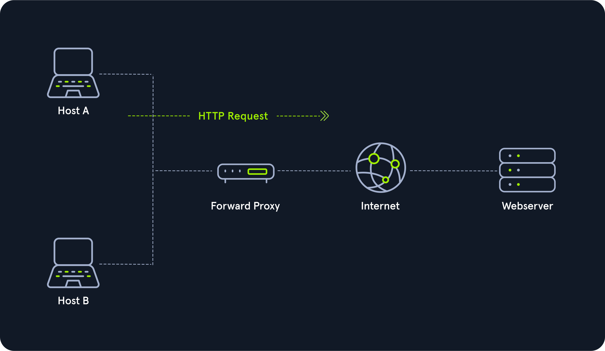
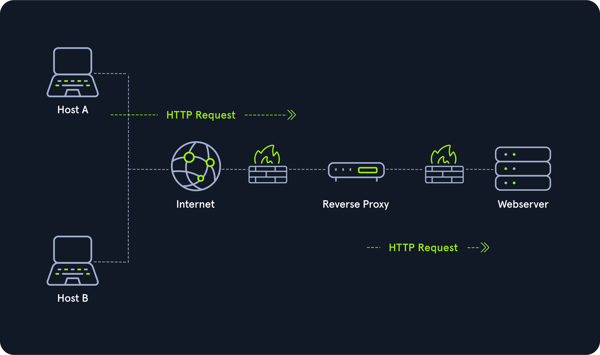

# Proxies

Proxy nedir sorusu sorulduğunda birçok kişinin farklı görüşleri vardır:

* Web geliştiricileri kötü amaçlı trafiği engellemek için proxy kullanır.
* Sıradan kullanıcılar konum gizlemek veya başka bir ülkenin Netflix kataloğuna erişmek için proxy kullanıldığını düşünebilir.
* Kolluk kuvvetleri proxy ile yasa dışı faaliyetleri birbirine bağlar.

Yukarıdaki örneklerin hiçbiri doğru değildir. Proxy, bağlantının ortasında bulunarak aracı görevi görür. Aracı olma yeteneği olmadan cihaz teknik olarak bir proxy değil, bir ağ geçididir.

Yukarıdaki soruya dönecek olursak, sıradan bir kullanıcı proxy konusunda yanlış bir fikre sahiptir, çünkü büyük olasılıkla konumlarını gizlemek için teknik olarak proxy olmayan bir VPN kullanıyordur.

Proxy neredeyse her zaman OSI modelinin 7. katmanında çalışır. Pek çok proxy hizmeti türü vardır ancak en önemlileri şunlardır:

* Dedicated Proxy / Forward Proxy
* Reverse Proxy
* Transparent Proxy

## Dedicated Proxy / Forward Proxy

İleri proxy bir istemcinin bir bilgisayara istekte bulunması ve bu bilgisayarın isteği yerine getirmesidir.

Örneğin kurumsal bir ağda hassas bilgisayarların internete doğrudan erişimi olmayabilir. Bir web sitesine erişmek için bir proxy veya web filtresinden geçmeleri gerekir. Bu, kötü amaçlı yazılımlara karşı inanılmaz derecede güçlü bir savunma hattı olabilir.

## Reverse Proxy

Ters proxy ileri proxy sisteminin tersidir. Giden istekleri filtrelemek yerine gelen istekleri filtreler. Ters proxy kullanımının en yaygın amacı bir adresi dinlemek ve onu kapalı bir ağa iletmektir.

Sızma testi uzmanları zararlı yazılımdan etkilenmiş uç noktalarda ters proxy yapılandırması uygular. Etkilenen uç nokta belirlenen port üzerinden dinleme gerçekleştirir ve bu porta bağlanan herhangi bir istemciyi, etkilenen uç nokta aracılığıyla saldırgana yönlendirir. Bu, güvenlik duvarlarını atlatmak veya günlük kaydından kaçınmak için kullanışlıdır. Kuruluşların harici web isteklerini izleyen IDS sistemleri olabilir. Saldırganın SSH üzerinden kuruluşa erişim sağlaması durumunda ters proxy, SSH tüneli üzerinden web istekleri gönderebilir ve IDS sisteminden kaçabilir.

## (Non-) Transparent Proxy

Proxy hizmetleri şeffaf veya şeffaf olmayan şekilde çalışır.

Şeffaf proxy kullanımında istemci, proxy varlığından haberdar olmaz. Dışarıdan bakıldığında şeffaf proxy, şeffaf olmayan proxy gibi bir iletişim ortağı görevi görür.

Şeffaf olmayan proxy kullanımında proxy varlığından haberdar olmamız gerekir. Bu sebeple bize ve kullanmak istediğimiz yazılıma, internet trafiğinin proxy tarafına yönlendirilmesini sağlayan özel bir proxy yapılandırması verilir. Bu yapılandırma mevcut değilse proxy üzerinden iletişim kuramayız.
