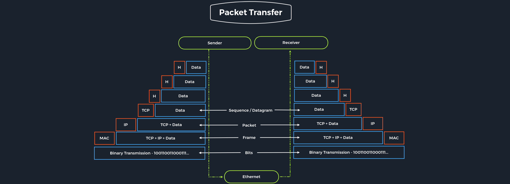

# Networking Models

## The OSI Model

Çoğunlukla ISO/OSI katman modeli olarak adlandırılan OSI modeli, sistemler arasındaki iletişimi tanımlamak için kullanılabilecek bir referans modeldir. Referans modeli, her biri açıkça ayrılmış görevlere sahip yedi ayrı katmana sahiptir.

## The TCP/IP Model

TCP/IP, birçok ağ protokolü için kullanılan genel bir terimdir. Protokoller veri paketlerinin taşınmasından sorumludur. İnternet tamamen TCP/IP protokol ailesine dayanmaktadır. Ancak TCP/IP yalnızca bu iki protokolü ifade etmez, genellikle tüm protokol ailesi için genel bir terim olarak kullanılır.

## ISO/OSI vs. TCP/IP

TCP/IP, bilgisayarların internete bağlanmasını sağlayan bir iletişim protokolüdür. OSI modelinin aksine -genel kurallara uyulması şartıyla- mevcut kuralların hafifletilmesine olanak tanır.

OSI ise ağ ile son kullanıcılar arasında bir iletişim ağ geçididir. OSI modeli daha eski olduğundan genellikle referans model olarak anılır. Aynı zamanda katı protokolü ve sınırlamalarıyla da bilinir.

## Packet Transfers

Katmanlı bir sistemde, katmandaki cihazlar, PDU (Protocol Data Unit) adı verilen farklı bir format kullanarak veri alışverişi yapar. Örneğin bir web sitesine göz atmak istediğimizde, uzak sunucu yazılımı öncelikle istenen verileri uygulama katmanına aktarır. Bu veriler katman katman işlenir. Her katman kendisine atanan işlevleri yerine getirir. Veriler daha sonra hedef makine veya başka bir cihaz onu alana kadar ağın fiziksel katmanı aracılığıyla aktarılır.

İletim sırasında her katman, üst katmandan PDU üzerine paketi kontrol eden ve tanımlayan bir başlık ekler. Bu işleme kapsülleme denir. İşlem, verilerin alıcıya iletildiği fiziksel katmana kadar devam eder. Alıcı işlemi tersine çevirir ve her katmandaki verileri başlık bilgileriyle birlikte açar. Bundan sonra uygulama nihayet verileri kullanır. Bu işlem, tüm veriler gönderilip alınana kadar devam eder.

Sızma testi uzmanları için her iki referans modeli de faydalıdır. TCP/IP sayesinde tüm bağlantının nasıl kurulduğu hızlı bir şekilde anlaşılabilir. ISO/OSI sayesinde ise bağlantı parçalara ayrılıp detaylı olarak analiz edilebilir.
