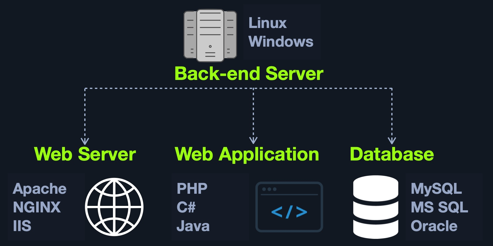

# Front End vs. Back End

## Front End

Ön uç, bir web uygulamasını ziyaret ettiğimizde görüntülediğimiz web sayfasının kaynak kodunu oluşturur ve genellikle HTML, CSS ve JavaScript içerir ve bunlar daha sonra tarayıcılarımız tarafından gerçek zamanlı olarak yorumlanır.

Bir web uygulamasının ön ucu iyi optimize edilmemişse, bu durum, web uygulamasının yavaşlamasına ve yanıt vermemesine neden olabilir. Bu durumda bazı kullanıcılar sunucunun veya internet bağlantısının yavaş olduğunu düşünebilir. Ancak bu durumda sorun kullanıcının tarayıcısındaki istemci tarafında yatmaktadır. Bu nedenle bir web uygulamasının ön ucu, çoğu platform, cihaz ve ekran boyutu için optimize edilmelidir.

Ön uç kod geliştirmenin yanı sıra, ön uç web uygulaması geliştirmeyle ilgili diğer görevlerden bazıları şunlardır:

* Visual Concept Web Design
* User Interface (UI) design
* User Experience (UX) design

## Back End

Arka uç, bir web uygulamasının tüm temel işlevlerini yürütür.

Web uygulamaları için dört ana arka uç bileşeni vardır:

| Component | Description |
|---|---|
| Back End Servers | Diğer tüm bileşenleri barındıran donanım ve işletim sistemleridir. Genellikle Linux ve Windows gibi işletim sistemlerinde çalışır. |
| Web Servers | HTTP isteklerini ve bağlantılarını yönetir. Örnek olarak Apache, NGINX ve IIS verilebilir. |
| Databases | Web uygulaması verilerini saklar ve alır. Örnek olarak MySQL, MSSQL, Oracle, PostgreSQL, NoSQL ve MongoDB verilebilir. |
| Development Frameworks | Web uygulamasını geliştirmek için kullanılır. Bazı iyi bilinen çerçeveler arasında Laravel (PHP), ASP.NET (C#), Spring (Java), Django (Python) ve Express (NodeJS) bulunur. |
