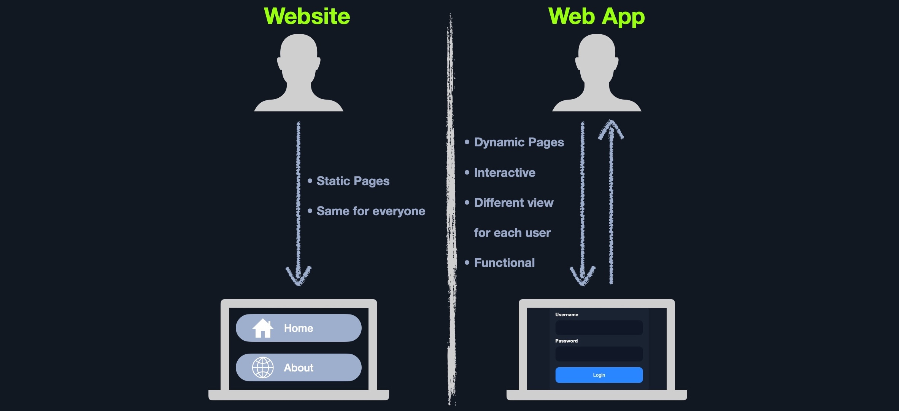

# Introduction

Web uygulamaları, web tarayıcılarında çalışan etkileşimli uygulamalardır. Web uygulamaları, etkileşimleri çalıştırmak ve yönetmek için genellikle istemci-sunucu modelini benimser. Genellikle istemci tarafında (tarayıcı) çalışan ön uç bileşenlere (kullanıcının gördüğü şey) ve sunucu tarafında çalışan diğer arka uç bileşenlere (web uygulaması kaynak kodu) sahiptirler.

## Web Applications vs. Websites

Statik sayfalar işlev içermez ve bu nedenle gerçek zamanlı değişiklikler üretmez. Bu tür web sitelerine Web 1.0 da denir.

Öte yandan çoğu web sitesi, web uygulamalarını veya kullanıcı etkileşimine dayalı dinamik içerik sunan Web 2.0 çalıştırır. Web uygulamaları tamamen işlevseldir ve son kullanıcıya yönelik çeşitli işlevleri yerine getirebilir.

## Web Applications vs. Native Operating System Applications

Web uygulamaları yerel işletim sistemi uygulamalarından farklı olarak platformdan bağımsızdır ve herhangi bir işletim sistemindeki tarayıcıda çalışabilir. Web uygulamalarının kullanıcının sistemine kurulmasına gerek yoktur. Çünkü bu web uygulamaları ve bunların işlevleri uzaktan yürütülür ve dolayısıyla son kullanıcının sabit diskinde herhangi bir yer tüketmez.
