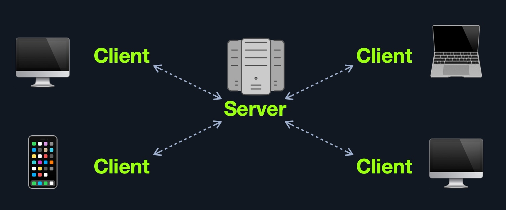
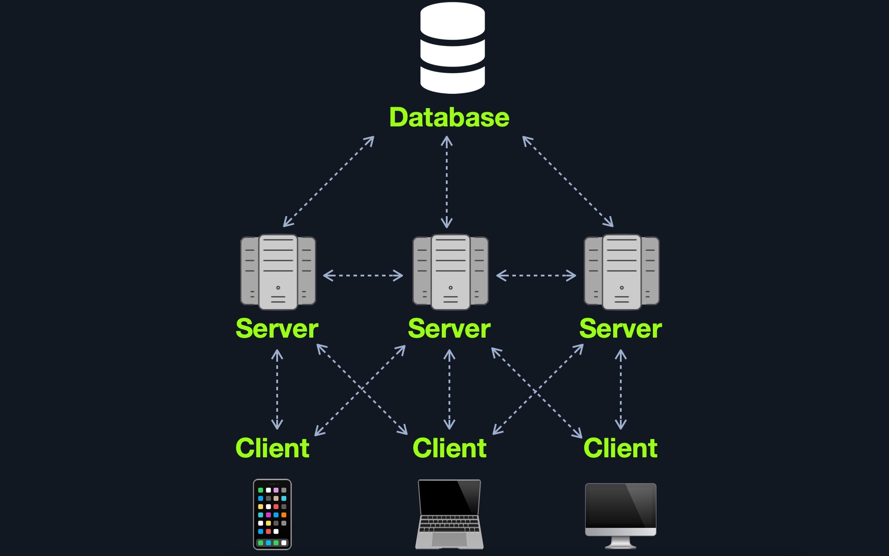
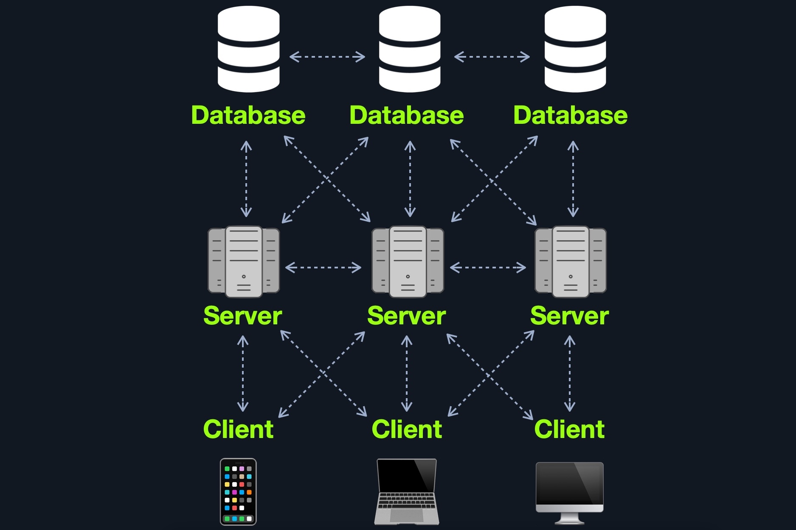

# Web Application Layout

## Web Application Infrastructure

Web uygulamaları birçok farklı altyapı kurulumunu kullanabilir. Bunlara modeller de denir. En yaygın olanları aşağıdaki dört türe ayrılabilir:

1. Client-Server
2. One Server
3. Many Servers - One Database
4. Many Servers - Many Databases

### Client-Server

Web uygulamaları genellikle istemci-sunucu modelini benimser. Sunucu, web uygulamasını, istemci-sunucu modelinde barındırır ve erişmeye çalışan tüm istemcilere dağıtır.

### One Server

Bu mimaride web uygulamasının tamamı, hatta birkaç web uygulaması ve bunların bileşenleri, veri tabanı da dahil olmak üzere tek bir sunucu üzerinde barındırılmaktadır. Bu tasarım basit ve uygulaması kolay olmasına rağmen aynı zamanda en riskli tasarımdır.

### Many Servers - One Database

Bu model, veri tabanını kendi veri tabanı sunucusuna ayırır ve web uygulama sunucusunun verileri depolamak ve almak için veri tabanı sunucusuna erişmesine olanak tanır.

### Many Servers - Many Databases

Her web uygulamasının verileri ayrı bir veri tabanında barındırılır. Web uygulaması yalnızca özel ve paylaşılan ortak verilere erişebilir. Her web uygulamasının veri tabanını ayrı bir veri tabanı sunucusunda barındırmak da mümkündür.

## Web Application Components

Her web uygulamasının farklı sayıda bileşeni olabilir. Bununla birlikte daha önce bahsedilen modellerin tüm bileşenleri şu şekilde ayrılabilir:

* Client
* Server
* Services
* Functions

## Web Application Architecture

Bir web uygulamasının bileşenleri üç farklı katmana (üç katmanlı mimari) bölünmüştür:

| Layer | Description |
|---|---|
| Presentation Layer | Uygulama ve sistem ile iletişimi sağlayan UI süreç bileşenlerinden oluşur. İstemci tarafından web tarayıcısı aracılığıyla erişilebilir ve HTML, CSS ve JavaScript biçiminde döndürülür. |
| Application Layer | Tüm istemci isteklerinin (web isteklerinin) doğru şekilde işlenmesini sağlar. Yetkilendirme, ayrıcalıklar ve istemciye aktarılan veriler gibi çeşitli kriterler kontrol edilir. |
| Data Layer | Gerekli verilerin tam olarak nerede saklandığını ve bu verilere erişilebileceğini belirlemek için uygulama katmanıyla yakın iş birliği içinde çalışır. |

### Microservices

Mikro hizmetler, çoğu durumda yalnızca tek bir görev için programlanan web uygulamasının bağımsız bileşenleri olarak düşünülebilir.

### Serverless

AWS, GCP, Azure gibi bulut sağlayıcıları sunucusuz mimariler sunar. Altyapıyı yönetmeye gerek kalmadan uygulama ve hizmetler oluşturma ve dağıtma esnekliği sağlar. Tüm sunucu yönetimi bulut sağlayıcı tarafından yapılır. Bu sayede uygulamaları ve veri tabanlarını çalıştırmak için gereken sunucuları sağlama, ölçeklendirme ve bakım ihtiyacı ortadan kalkmış olur.
