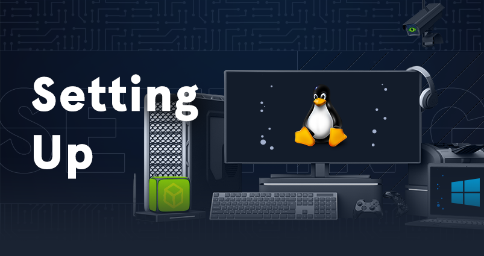

# Setting Up

|  |
|---|
| This module covers topics that will help us be better prepared before conducting penetration tests. Preparations before a penetration test can often take a lot of time and effort, and this module shows how to prepare efficiently. |
