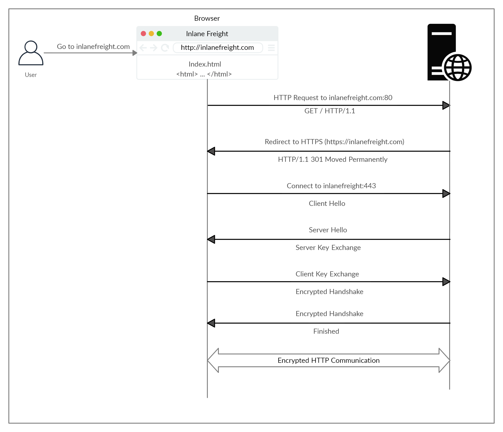

# Hypertext Transfer Protocol Secure (HTTPS)

HTTP bağlantısında tüm veriler açık metin olarak aktarılır. Bu, kaynak ve hedef arasındaki herkesin, aktarılan verileri görüntülemek için ortadaki adam (MITM) saldırısı gerçekleştirebileceği anlamına gelir. Bu durumu önlemek için tüm iletişimlerin şifreli bir biçimde aktarıldığı HTTPS protokolü oluşturulmuştur.

## HTTPS Flow



1. HTTPS uygulayan bir web sitesini ziyaret etmek istediğimizde adres çubuğundaki URL kısmına protokol olarak HTTP verirsek, tarayıcı, öncelikle alan adını çözümlemeye çalışır ve kullanıcıyı hedef web sitesini barındıran web sunucusuna yönlendirir.
2. İstek ilk önce HTTP protokolü için kullanılan 80 numaralı porta gönderilir.
3. Sunucu bunu algılar ve istemciyi güvenli HTTPS portuna (443) yönlendirir. Bunun için 301 Moved Permanently yanıt kodu kullanılır.
4. Daha sonra istemci (web tarayıcısı) kendisi hakkında bilgi veren bir Client Hello paketi gönderir.
5. Bundan sonra sunucu yanıt olarak Server Hello paketi gönderir ve ardından SSL sertifikalarının değişimi için bir anahtar değişimi yapılır.
6. İstemci, anahtarı/sertifikayı doğrular ve kendisine ait olan bir anahtar gönderir. Bundan sonra şifrelemenin ve aktarımın doğru şekilde çalışıp çalışmadığını doğrulamak için şifreli bir el sıkışma başlatılır.
7. El sıkışma başarıyla tamamlandıktan sonra normal HTTP iletişimine devam edilir.

## cURL for HTTPS

```bash
curl -k https://inlanefreight.com
```
