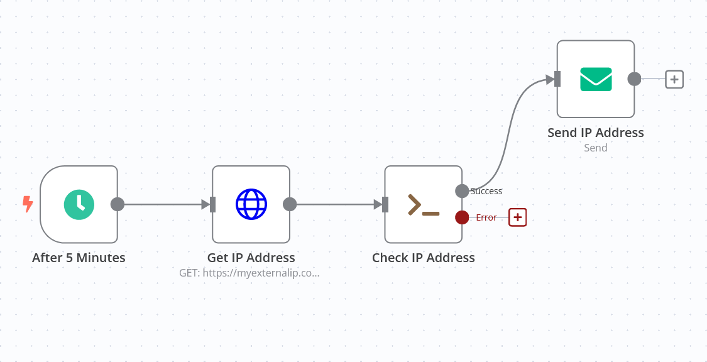

# N8N Workflow Automation Tool

Bu yazıda, iş akışı otomasyonu gerçekleştirmeye yarayan [N8N](https://n8n.io/) aracının [Docker](https://www.docker.com/) ile kullanımı anlatılmıştır. İşletim sistemi olarak Windows kullanılmıştır.

## Get Docker

İlk önce Docker Desktop uygulamasını [buradan](https://docs.docker.com/desktop/install/windows-install/) indirip sistemimize yüklemeliyiz.

## Download Required N8N Images

Docker kurulduktan sonra Windows Terminal uygulamasında aşağıdaki komut çalıştırılmalıdır:

```batch
docker run --restart always --name n8n -p 5678:5678 -v C:\Users\Serhat\.n8n:/home/node/.n8n docker.n8n.io/n8nio/n8n
```

Komutu kısım kısım açıklayalım:

| Command | Description |
|---|---|
| `docker run` | Yeni bir Container oluşturulur ve başlatılır. |
| `--restart always` | Yeniden [başlatma politikası](https://docs.docker.com/engine/reference/run/#restart-policies---restart) ayarlandı. Bu sayede sistem açılışında ilgili container (`n8n`) otomatik olarak çalıştırılacaktır. Bunun için Docker Desktop uygulamasının, sistem açılışında otomatik olarak başlayacak şekilde ayarlanması gerekmektedir. |
| `--name n8n` | Container ismi. |
| `-p 5678:5678` | Container portu (`5678`) sistem portu (`5678`) ile ilişkilendirildi. |
| `-v C:\Users\Serhat\.n8n:/home/node/.n8n` | N8N imajında bulunan ilgili yol (`/home/node/.n8n`) yerel sistemdeki ilgili yola (`C:\Users\Serhat\.n8n`) bağlandı. Burada olduğu gibi sistemde gözüken bir Bind Mount kullanmak yerine, normal bir Docker [volume](https://docs.docker.com/storage/volumes/) (örneğin `n8n_data`) da tercih edilebilirdi. |
| `docker.n8n.i0/n8nio/n8n` | Kullanılacak olan imaj dosyası. İlk yüklemede indirilir ve kurulur. |

## Accessing N8N Editor

Artık web tarayıcısı üzerinden [http://localhost:5678](http://localhost:5678) adresine giderek N8N editörünü kullanabiliriz.

## Set Up Owner Account

Öncelikle bir hesap oluşturmalıyız. Bu hesap sadece Docker içerisinde kullanılabilir olacaktır.

## Example Workflow

Örnek workflow aşağıdaki şekilde çalışmaktadır:

* Workflow çalışmasını başlatmak için `After 5 Minutes` isminde bir `Schedule Trigger` oluşturuldu. Bu tetikleyici her 5 dakikada bir tetiklenecektir.
* Workflow tetiklendikten sonra `Get IP Address` isimli bir `HTTP Request` düğümü çalışacaktır. Bu düğüm [https://myexternalip.com/raw](https://myexternalip.com/raw) adresine GET isteği gönderecek ve yanıt olarak public IP adres bilgisini alacaktır.
* IP adres bilgisi alındıktan sonra `Check IP Address` isimli bir `Execute Command` düğümü çalışacaktır. Bu düğüm, sistemde bulunan `ip.txt` dosyasının içeriği ile en son edinilen IP adres bilgisini karşılaştıracaktır. İki IP adres bilgisi de aynı ise hata koduyla çıkış yapacaktır. Böyle bir dosya yoksa ya da IP adres bilgileri farklı ise, yeni IP adres bilgisini dosyaya kaydedecek ve başarılı bir şekilde çıkış yapacaktır. Düğümün doğru çalışabilmesi için `Settings` --> `On Error` kısmının `Continue (using error output)` olarak ayarlanması gerekmektedir. Düğümün çalıştıracağı kod aşağıda verilmiştir:

```bash title="Check IP Address" linenums="1"
if [ "$(cat /home/node/.n8n/ip.txt)" = "{{ $json.data }}" ]
then
  return 1
else
  echo -n "{{ $json.data }}" > /home/node/.n8n/ip.txt
  return 0
fi
```

* Bir önceki düğümün `Success` bağlantısına `Send IP Address` isimli `Send Email` düğümü bağlanacaktır. Bu düğüm, IP adres bilgisini belirtilen adrese mail aracılığıyla gönderecektir. Bunun için öncelikle bir kimlik bilgisi tanımlamalıyız. Bu anlatımda kimlik bilgisi için Gmail servisi kullanılacaktır. Kimlik bilgisi eklemek için `Parameters` --> `Credential to connect with` altında `Create New Credential` seçilir. Açılan pencerede `User` kısmına mail adresi, `Password` kısmına parola, `Host` kısmına `smtp.gmail.com` ve `Port` kısmına `465` değerleri girilmelidir. Ayrıca `SSL/TLS` seçeneği aktif edilmelidir. Değişiklikleri kaydettikten sonra, oluşturulan kimlik bilgisi seçilir ve `From Email` kısmına gönderen mail adresi, `To Email` kısmına alıcı mail adresi (gönderen ile aynı olabilir), `Subject` kısmına mail konusu girilir ve `Email Format` olarak `Text` seçilir. Metin kısmına `{{ $('Get IP Address').item.json.data }}` bilgisi girilir.

Workflow en son aşağıda verilen resimdeki gibi gözükmelidir:



Workflow aktifleştirmek için sağ üst köşede bulunan anahtar `Inactive` --> `Active` olarak değiştirilmelidir.
