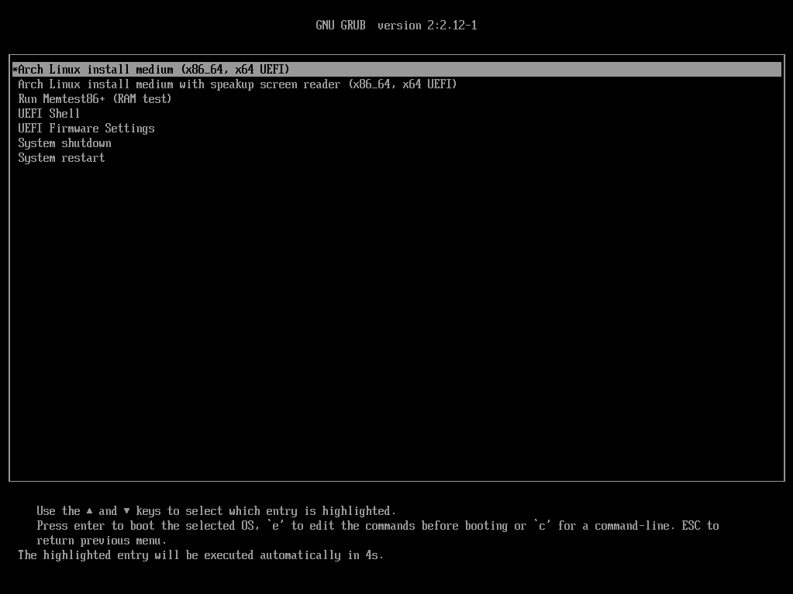
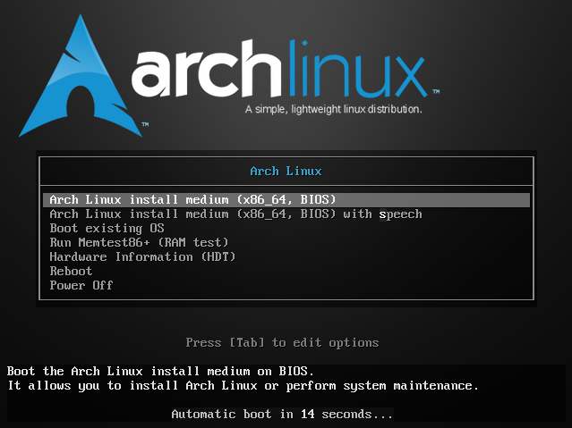
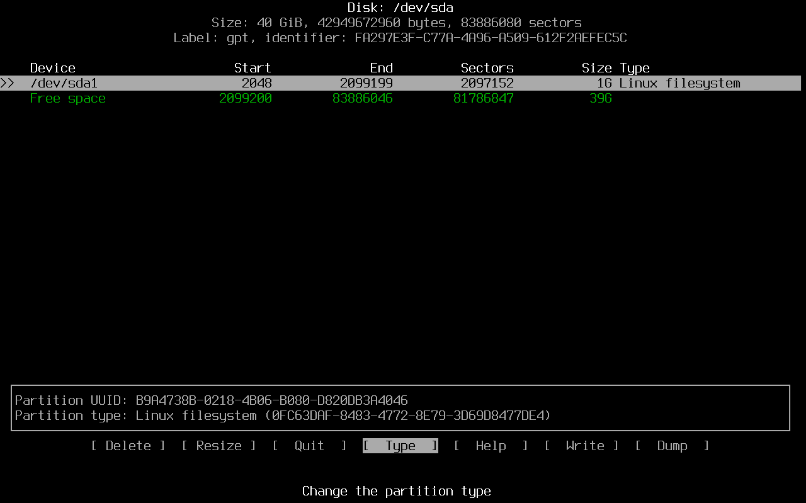
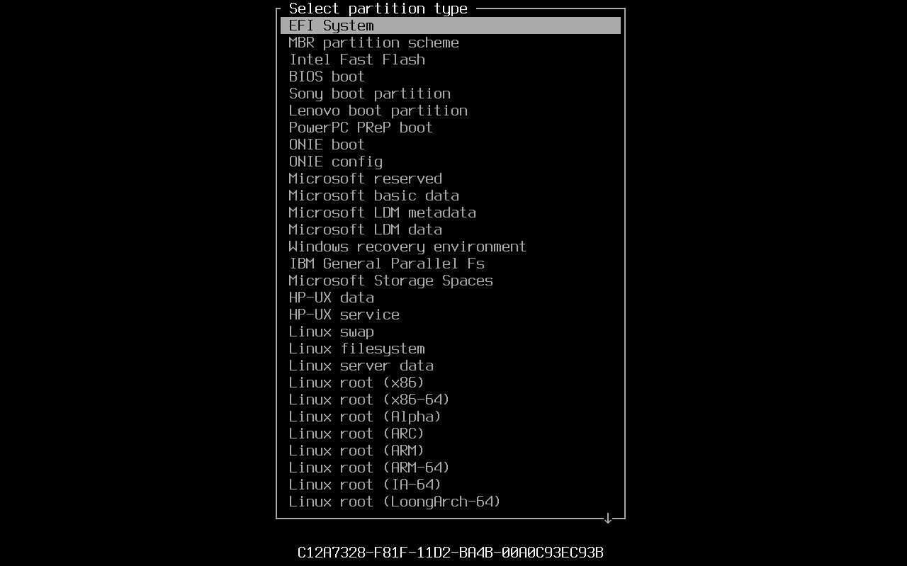

# Arch Linux Installation Guide

## Archinstall

Bu anlatımda, Arch Linux sisteminin nispeten daha zor yoldan kurulumu anlatılmıştır. Daha kolay bir yol tercih etmek isterseniz, `archinstall` aracını kullanabilirsiniz.

!!! warning "ModuleNotFoundError"

    Aracı kullanmadan önce `pacman` ile güncellemeyin. Bu durum, kurulumda bulunan Python sürümü ile uyuşmazlığa sebep olabilir.

## Pre-installation

### Acquire an installation image

Kuruluma başlamadan önce [bu](https://archlinux.org/download/) siteden ISO dosyasını indir.

### Verify signature

İndirilen ISO dosyasının doğrulanması önerilir. Bunun için ilk önce ISO PGP [imzasını](https://archlinux.org/download/#checksums) indir.

!!! info "Files"

    Bu anlatımda ISO dosyası olarak `archlinux-2024.02.01-x86_64.iso` ve ISO PGP imza dosyası olarak `archlinux-2024.02.01-x86_64.iso.sig` kullanılmıştır.

İmza dosyasını ISO dosyası ile aynı konuma taşı ve aşağıdaki komutu çalıştır:

```bash
gpg --keyserver-options auto-key-retrieve --verify archlinux-2024.02.01-x86_64.iso.sig
```

```text title="Output" hl_lines="5 8"
gpg: assuming signed data in 'archlinux-2024.02.01-x86_64.iso'
gpg: Signature made Thu 01 Feb 2024 03:10:46 PM +03
gpg:                using EDDSA key 3E80CA1A8B89F69CBA57D98A76A5EF9054449A5C
gpg:                issuer "pierre@archlinux.org"
gpg: Good signature from "Pierre Schmitz <pierre@archlinux.org>" [unknown]
gpg: WARNING: This key is not certified with a trusted signature!
gpg:          There is no indication that the signature belongs to the owner.
Primary key fingerprint: 3E80 CA1A 8B89 F69C BA57  D98A 76A5 EF90 5444 9A5C
```

Çıktıda görülen geliştiriciye (`Pierre Schmitz`) ait `Primary key fingerprint` değerini, [bu](https://archlinux.org/people/developers/#pierre) sitedeki geliştirici `PGP Key` değeri ile karşılaştır. Bu iki değer de aynı ise, indirilen dosya güvenilir demektir.

### Boot the live environment

Bu anlatımda kurulum için VirtualBox sanal makinesi kullanılmıştır.

!!! info "Secure Boot"

    Kurulum öncesi, BIOS ayarlarında Secure Boot seçeneği [devre dışı](https://wiki.archlinux.org/title/Unified_Extensible_Firmware_Interface/Secure_Boot#Disabling_Secure_Boot) bırakılmalıdır.

#### Boot for UEFI systems

!!! warning "UEFI"

    Anlatım boyunca bahsedilecek olan kurulum işlemleri, UEFI ve UEFI olmayan sistemler için farklılık göstermektedir.

    Bu kısım, UEFI sistemler içindir.

    [Atla](#boot-for-non-uefi-systems){ .md-button }

* Type --> Linux
* Version --> Arch Linux (64-bit)
* Base Memory --> 4096 MB
* Processors --> 2
* Enable EFI (special OSes only)
* Disk Size --> 40 GB
* Enable PAE/NX
* Video Memory --> 128 MB

Arch Linux başlatıldıktan sonra aşağıdaki gibi bir ekran ile karşılaşılır:



Burada `Arch Linux install medium (x86_64, x64 UEFI)` seç ve ++enter++ tuşuna basarak kurulumu başlat.

#### Boot for non-UEFI systems

!!! warning "Non-UEFI"

    Anlatım boyunca bahsedilecek olan kurulum işlemleri, UEFI ve UEFI olmayan sistemler için farklılık göstermektedir.

    Bu kısım, UEFI olmayan sistemler içindir.

    [Atla](#set-the-console-keyboard-layout-and-font){ .md-button }

* Type --> Linux
* Version --> Arch Linux (64-bit)
* Base Memory --> 4096 MB
* Processors --> 2
* Disk Size --> 40 GB
* Enable PAE/NX
* Video Memory --> 128 MB

Arch Linux başlatıldıktan sonra aşağıdaki gibi bir ekran ile karşılaşılır:



Burada `Arch Linux install medium (x86_64, BIOS)` seç ve ++enter++ tuşuna basarak kurulumu başlat.

### Set the console keyboard layout and font

Kurulum sırasında varsayılan [klavye düzeni](https://wiki.archlinux.org/title/Linux_console/Keyboard_configuration) `US` olarak gelir. Diğer mevcut düzenler aşağıdaki komut ile listelenebilir:

```bash
localectl list-keymaps
```

```text title="Output" hl_lines="10"
...SNIP...

sv-latin1
tj_alt-UTF8
tr_f-latin5
tr_q-latin5
tralt
trf
trf-fgGIod
trq
ttwin_alt-UTF-8
ttwin_cplk-UTF-8
ttwin_ct_sh-UTF-8

...SNIP...
```

Klavye düzenini, örneğin Türkçe Q olarak değiştirmek için aşağıdaki komut kullanılabilir:

```bash
loadkeys trq
```

Daha sonrasında, sistemi kullanırken sıkıntı yaşamamak için aşağıdaki komut da kullanılmalıdır:

```bash
localectl --no-convert set-x11-keymap tr pc105
```

Bu komut, `/etc/X11/xorg.conf.d` dizininde `00-keyboard.conf` isimli bir dosya üretecektir. Dosyanın içeriği aşağıdaki gibidir:

```text title="/etc/X11/xorg.conf.d/00-keyboard.conf" linenums="1"
Section "InputClass"
    Identifier "Keyboard"
    MatchIsKeyboard "on"
    Option "XkbLayout" "tr"
    Option "XkbModel" "pc105"
EndSection
```

Kurulum sırasında font büyüklüğünü geçici olarak değiştirmek için aşağıdaki komut kullanılabilir:

```bash
setfont ter-124b
```

!!! info "List Fonts"

    Tüm font isimlerini öğrenmek için `/usr/share/kbd/consolefonts` dizini kontrol edilebilir. Örneğin en büyük font için `ter-132b` değeri kullanılabilir.

### Verify the boot mode

Aşağıdaki komut kullanılarak [UEFI](https://wiki.archlinux.org/title/Unified_Extensible_Firmware_Interface) modu kontrol edilebilir:

```bash
cat /sys/firmware/efi/fw_platform_size
```

Çıktı olarak 32 veya 64 değeri gözüküyorsa UEFI modunda olduğumuzu söyleyebiliriz. Dosya mevcut değilse, sistem [BIOS](https://en.wikipedia.org/wiki/BIOS) modunda başlatılmış olabilir.

### Connect to the internet

Cihazın bloke durumunu kontrol etmek için aşağıdaki komutu kullan:

```bash
rfkill
```

Cihaz (bu örnekte kablosuz ağ cihazı) soft-blocked durumunda gözüküyorsa, aşağıdaki komutu kullan:

```bash
rfkill unblock wlan
```

Kuruluma başlamak için `iwctl` aracını başlat:

```bash
iwctl
```

Ardından ağ cihazının adını öğrenmek için aşağıdaki komutu kullan (bu anlatımda kablosuz bağlantı için kurulum adımları gösterilmiştir):

```text
device list
```

```text title="Output" hl_lines="5"
                                    Devices                                   *
--------------------------------------------------------------------------------
  Name                  Address               Powered     Adapter     Mode
--------------------------------------------------------------------------------
  wlan0                 c0:4a:00:xx:xx:xx     on          phy0        station
```

Cihaz aktif değilse aşağıdaki komut ile cihazı aktifleştir:

```text
device wlan0 set-property Powered on
```

Kullanılabilir ağları taramak için aşağıdaki komutu kullan (bu komut herhangi bir çıktı üretmez):

```text
station wlan0 scan
```

Artık kullanılabilir ağlar görüntülenebilir:

```text
station wlan0 get-networks
```

```text title="Output" hl_lines="9"
                               Available networks                             *
--------------------------------------------------------------------------------
      Network name                      Security            Signal
--------------------------------------------------------------------------------
...SNIP...

SUPERONLINE_Wi-Fi_0750                  psk                 ****
SUPERONLINE-WiFi_0046                   psk                 ***
connectme                               psk                 ****
VODAFONE_7563                           psk                 **
Superbox_WiFi_1EF2                      psk                 ****

...SNIP...
```

İlgili ağa (bu örnekte `connectme` ağı) bağlanmak için aşağıdaki komutu kullan (istenirse parolayı ver):

```text
station wlan0 connect connectme
```

Komutun başarılı olduğunu kontrol etmek için aşağıdaki komutu çalıştır:

```text
known-networks list
```

```text title="Output" hl_lines="5"
                                 Known Networks                               *
--------------------------------------------------------------------------------
  Name                              Security     Hidden     Last connected
--------------------------------------------------------------------------------
  connectme                         psk                     Feb  9,  3:47 AM
```

Aracı kapatmak için `exit` komutunu kullan.

!!! info "Ping"

    Ağ bağlantısı `ping` komutu ile test edebilir.

### Update the system clock

Sistem saatinin internet üzerinden güncellenmesine izin vermek için NTP (Network Time Protocol) etkin olmalıdır:

```bash
timedatectl set-ntp true
```

### Partition the disks

#### Disk partition for UEFI systems

!!! warning "UEFI"

    Disk bölümlendirme işlemi, UEFI ve UEFI olmayan sistemler için farklılık göstermektedir.

    Bu kısım, UEFI sistemler içindir.

    [Atla](#disk-partition-for-non-uefi-systems){ .md-button }

Kullanılabilir diskleri görüntülemek için aşağıdaki komutu çalıştır:

```bash
fdisk -l
```

Kullanmak istediğin diski (bu örnekte `/dev/sda` diski) bölümlendirmek için `cfdisk` aracını başlat:

```bash
cfdisk /dev/sda
```

Etiket tipi olarak `gpt` seç:


Açılan pencerede, alt kısımdaki durum çubuğunda bulunan `[New]` seçeneğine gel ve ++enter++ ile onayla:


Birinci bölümü [ESP](https://wiki.archlinux.org/title/EFI_system_partition) (EFI System Partition) olarak ayarlamak için, bölümün boyutunu ayarla ve ++enter++ ile onayla:


Alt kısımdaki durum çubuğunda bulunan `[Type]` seçeneğine gel ve ++enter++ ile onayla:



Açılan menüde `EFI System` tipini seç:



İkinci bölümü ana bölüm (`Linux filesystem`) olarak ayarlamak için, geri kalan `Free space` kısmını kullan.

Değişiklikleri onaylamak için, alt kısımdaki durum çubuğunda bulunan `[Write]` seçeneğine gel ve ++enter++ ile onayla. Sorulduğunda `yes` yaz ve ++enter++ ile onayla:


Aracı kapatmak için, alt kısımdaki durum çubuğunda bulunan `[Quit]` seçeneğine gel ve ++enter++ ile onayla.

#### Disk partition for non-UEFI systems

!!! warning "Non-UEFI"

    Disk bölümlendirme işlemi, UEFI ve UEFI olmayan sistemler için farklılık göstermektedir.

    Bu kısım, UEFI olmayan sistemler içindir.

    [Atla](#format-the-partitions){ .md-button }

Kullanılabilir diskleri görüntülemek için aşağıdaki komutu çalıştır:

```bash
fdisk -l
```

Kullanmak istediğin diski (bu örnekte `/dev/sda` diski) bölümlendirmek için `cfdisk` aracını başlat:

```bash
cfdisk /dev/sda
```

Etiket tipi olarak `dos` seç:


Açılan pencerede, alt kısımdaki durum çubuğunda bulunan `[New]` seçeneğine gel ve ++enter++ ile onayla:


Birinci bölümü ana bölüm olarak ayarlamak için, bölümün boyutunu ayarla ve ++enter++ ile onayla:


Sorulduğunda `[primary]` seçeneğini seç ve ++enter++ ile onayla:


Alt kısımdaki durum çubuğunda bulunan `[Bootable]` seçeneğine gel ve ++enter++ ile onayla:


İkinci bölümü Swap olarak ayarlamak için, geri kalan `Free space` kısmını kullan.

Swap bölümü üzerinde iken, alt kısımdaki durum çubuğunda bulunan `[Type]` seçeneğine gel ve ++enter++ ile onayla:


Açılan menüde `82 Linux swap / Solaris` tipini seç:


Değişiklikleri onaylamak için, alt kısımdaki durum çubuğunda bulunan `[Write]` seçeneğine gel ve ++enter++ ile onayla. Sorulduğunda `yes` yaz ve ++enter++ ile onayla:


Aracı kapatmak için, alt kısımdaki durum çubuğunda bulunan `[Quit]` seçeneğine gel ve ++enter++ ile onayla.

### Format the partitions

#### Format for UEFI systems

!!! warning "UEFI"

    Disk biçimlendirme işlemi, UEFI ve UEFI olmayan sistemler için farklılık göstermektedir.

    Bu kısım, UEFI sistemler içindir.

    [Atla](#format-for-non-uefi-systems){ .md-button }

EFI bölümünü (`/dev/sda1`) biçimlendirmek için aşağıdaki komutu kullan:

```bash
mkfs.fat -F32 /dev/sda1
```

Ana bölümü (`/dev/sda2`) biçimlendirmek için aşağıdaki komutu kullan:

```bash
mkfs.ext4 -F /dev/sda2
```

!!! info "UEFI Swap"

    UEFI için Swap adımları ilerleyen kısımlarda verilecektir.

#### Format for non-UEFI systems

!!! warning "Non-UEFI"

    Disk biçimlendirme işlemi, UEFI ve UEFI olmayan sistemler için farklılık göstermektedir.

    Bu kısım, UEFI olmayan sistemler içindir.

    [Atla](#mount-the-file-systems){ .md-button }

Ana bölümü (`/dev/sda1`) biçimlendirmek için aşağıdaki komutu kullan:

```bash
mkfs.ext4 -F /dev/sda1
```

[Swap](https://wiki.archlinux.org/title/Swap) bölümünü (`/dev/sda2`) biçimlendirmek için aşağıdaki komutu kullan:

```bash
mkswap /dev/sda2
```

Swap bölümünü (`/dev/sda2`) aktif etmek için aşağıdaki komutu kullan:

```bash
swapon /dev/sda2
```

### Mount the file systems

#### Mount for UEFI systems

!!! warning "UEFI"

    Mount işlemi, UEFI ve UEFI olmayan sistemler için farklılık göstermektedir.

    Bu kısım, UEFI sistemler içindir.

    [Atla](#mount-for-non-uefi-systems){ .md-button }

Ana bölümü (`/dev/sda2`) mount etmek için aşağıdaki komutu kullan:

```bash
mount /dev/sda2 /mnt
```

EFI bölümü için bir klasör oluştur:

```bash
mkdir -p /mnt/boot/efi
```

EFI bölümünü (`/dev/sda1`) EFI klasörüne (`/mnt/boot/efi`) [mount](https://wiki.archlinux.org/title/File_systems#Mount_a_file_system) etmek için aşağıdaki komutu kullan:

```bash
mount /dev/sda1 /mnt/boot/efi
```

#### Mount for non-UEFI systems

!!! warning "Non-UEFI"

    Mount işlemi, UEFI ve UEFI olmayan sistemler için farklılık göstermektedir.

    Bu kısım, UEFI olmayan sistemler içindir.

    [Atla](#installation){ .md-button }

Ana bölümü (`/dev/sda1`) [mount](https://wiki.archlinux.org/title/File_systems#Mount_a_file_system) etmek için aşağıdaki komutu kullan:

```bash
mount /dev/sda1 /mnt
```

## Installation

### Select the mirrors

Herhangi bir işlem yapmadan önce [mirror](https://wiki.archlinux.org/title/Mirrors) dosyasının yedeğini almak faydalı olacaktır:

```bash
cp /etc/pacman.d/mirrorlist /etc/pacman.d/mirrorlist.bak
```

[Reflector](https://wiki.archlinux.org/title/Reflector) aracını yükle:

```bash
pacman -Sy reflector
```

Aşağıdaki komut ile mirror listesi güncellenebilir:

!!! info "List Countries"

    Bu örnekte ülke kodu olarak Germany (`DE`) kullanılmıştır. Ülke kodunu öğrenmek için `reflector --list-countries` komutu kullanılabilir.

```bash
reflector -c DE --save /etc/pacman.d/mirrorlist -p https -l 5 --sort rate --download-timeout 90
```

### Install essential packages

Arch Linux yüklemesi için aşağıdaki komutu kullan:

```bash
pacstrap /mnt base base-devel linux-firmware linux
```

Bu işlem, internet hızınıza bağlı olarak uzun sürebilir.

## Configure the system

### Network

Chroot Jail (`/mnt`) içerisinde yeni bir klasör oluştur:

```bash
mkdir -p /mnt/var/lib/iwd
```

Chroot Jail dışında oluşturulan ağ kimlik bilgilerini (bu anlatımda `connectme.psk` dosyası) Chroot Jail içerisine kopyala:

```bash
cp /var/lib/iwd/connectme.psk /mnt/var/lib/iwd
```

### Keyboard

Chroot Jail içerisinde yeni bir klasör oluştur:

```bash
mkdir -p /mnt/etc/X11/xorg.conf.d
```

Chroot Jail dışında oluşturduğumuz dosyayı (`00-keyboard.conf`) bu klasör içerisine kopyala:

```bash
cp /etc/X11/xorg.conf.d/00-keyboard.conf /mnt/etc/X11/xorg.conf.d
```

### Fstab

Aşağıdaki komutu kullanarak [Fstab](https://wiki.archlinux.org/title/Fstab) dosyası oluştur:

```bash
genfstab -U /mnt >> /mnt/etc/fstab
```

Oluşturulan `/mnt/etc/fstab` dosyasını, hata olması ihtimaline karşı kontrol etmek faydalı olacaktır.

### Chroot

Yeni sisteme geçiş yapmak için [Change Root](https://wiki.archlinux.org/title/Chroot) işlemi gerçekleştir. Böylece, yeni bir kök sistem ağacı (Chroot Jail) oluşacaktır:

```bash
arch-chroot /mnt
```

### Create swap file

!!! warning "UEFI"

    Bu kısım, UEFI sistemler içindir.

    [Atla](#time){ .md-button }

Oluşturulacak Swap dosyasına (`/swapfile`) yer tahsis etmek için aşağıdaki komutu kullan:

```bash
fallocate -l 8GB /swapfile
```

!!! tip "Swap Size"

    Swap dosyası hibernate işlemi için kullanılacaksa, dosya boyutunun en az RAM boyutu kadar olması önerilir.

Dosya için gerekli izinleri ayarla:

```bash
chmod 600 /swapfile
```

[Swap](https://wiki.archlinux.org/title/Swap) dosyasını (`/swapfile`) biçimlendirmek için aşağıdaki komutu kullan:

```bash
mkswap /swapfile
```

Swap dosyasını (`/swapfile`) aktif etmek için aşağıdaki komutu kullan:

```bash
swapon /swapfile
```

Oluşturulan Swap dosyası bilgisini `/etc/fstab` dosyasına ekle:

```bash
echo "/swapfile none swap defaults 0 0" >> /etc/fstab
```

### Time

Saat dilimini ayarlamak için (bu örnekte `Europe/Istanbul` saat dilimi) aşağıdaki komutu kullan.

```bash
ln -sf /usr/share/zoneinfo/Europe/Istanbul /etc/localtime
```

!!! info "Time Zones"

    Saat dilimlerinin bir listesi için [bu](https://en.wikipedia.org/wiki/List_of_tz_database_time_zones#List) siteye bakılabilir.

Donanım saatini sistem saati ile eşitle:

```bash
hwclock --systohc
```

İlgili servisleri otomatik başlayacak şekilde ayarla:

```bash
systemctl enable systemd-timesyncd.service
```

### Localization

Dosyalarda değişiklik yapabilmek için `vim` aracını kur:

```bash
pacman -Sy vim
```

Sistem dili, tarih ve para birimi gibi değerlerin biçimini belirlemek için `/etc/locale.gen` dosyasında ilgili satırları uncomment yap:

```text title="/etc/locale.gen" linenums="163" hl_lines="9 19"
...SNIP...

#en_NZ ISO-8859-1
#en_PH.UTF-8 UTF-8
#en_PH ISO-8859-1
#en_SC.UTF-8 UTF-8
#en_SG.UTF-8 UTF-8
#en_SG ISO-8859-1
en_US.UTF-8 UTF-8
#en_US ISO-8859-1
#en_ZA.UTF-8 UTF-8
#en_ZA ISO-8859-1

...SNIP...

#tpi_PG UTF-8
#tr_CY.UTF-8 UTF-8
#tr_CY ISO-8859-9
tr_TR.UTF-8 UTF-8
#tr_TR ISO-8859-9
#ts_ZA UTF-8
#tt_RU UTF-8
#tt_RU@iqtelif UTF-8
#ug_CN UTF-8
#uk_UA.UTF-8 UTF-8

...SNIP...
```

Yapılan değişikliği işlemek için aşağıdaki komutu çalıştır:

```bash
locale-gen
```

Sistem genelinde geçerli `LANG` değerini belirlemek için aşağıdaki komutu çalıştır:

```bash
echo "LANG=en_US.UTF-8" > /etc/locale.conf
```

Önceki aşamalarda klavye düzeni değişikliği yapıldıysa, bu değişikliği kalıcı hale getirmek için aşağıdaki komut çalıştırılmalıdır:

```bash
echo "KEYMAP=trq" > /etc/vconsole.conf
```

### Network configuration

Hostname dosyasını oluştur:

```bash
echo "my-cool-hostname" > /etc/hostname
```

Hosts dosyasını oluştur:

```text title="/etc/hosts" linenums="1"
127.0.0.1    localhost
::1          localhost
127.0.0.1    my-cool-hostname
```

Aşağıdaki komut ile bazı önemli araçları yükle:

```bash
pacman -Sy dhcpcd iwd networkmanager
```

İlgili servisleri otomatik başlayacak şekilde ayarla:

```bash
systemctl enable dhcpcd.service iwd.service NetworkManager.service
```

### Root password

Aşağıdaki komut ile `root` kullanıcısı için bir parola belirle:

```bash
passwd
```

### Bootloader

#### Bootloader for UEFI systems

!!! warning "UEFI"

    Önyükleyici kurulumu, UEFI ve UEFI olmayan sistemler için farklılık göstermektedir.

    Bu kısım, UEFI sistemler içindir.

    [Atla](#bootloader-for-non-uefi-systems){ .md-button }

Aşağıdaki komut ile GRUB paketlerini indir:

```bash
pacman -Sy grub efibootmgr
```

GRUB yüklemesini, önceden oluşturulan EFI klasörüne gerçekleştir:

!!! failure "Wrong Directory"

    Change Root işleminden sonra `/mnt` klasörüne geçildiği için, EFI klasörü olarak `/boot/efi` yolu belirtilmelidir.

```bash
grub-install --target=x86_64-efi --bootloader-id=GRUB --efi-directory=/boot/efi
```

GRUB yapılandırma dosyasını oluştur:

```bash
grub-mkconfig -o /boot/grub/grub.cfg
```

#### Bootloader for non-UEFI systems

!!! warning "Non-UEFI"

    Önyükleyici kurulumu, UEFI ve UEFI olmayan sistemler için farklılık göstermektedir.

    Bu kısım, UEFI olmayan sistemler içindir.

    [Atla](#reboot){ .md-button }

Aşağıdaki komut ile GRUB paketlerini indir:

```bash
pacman -Sy grub os-prober
```

GRUB yüklemesini, bu anlatımda kullanılan diske gerçekleştir:

!!! failure "GRUB"

    GRUB, disk bölümüne (`/dev/sda1`) değil, diskin kendisine (`/dev/sda`) kurulmalıdır.

```bash
grub-install --target=i386-pc /dev/sda
```

GRUB yapılandırma dosyasını oluştur:

```bash
grub-mkconfig -o /boot/grub/grub.cfg
```

## Reboot

Chroot Jail ortamından çık:

```bash
exit
```

Tüm bölümlerin bağlantısını kesmek için aşağıdaki komutu kullan:

```bash
umount -R /mnt
```

Sistemi yeniden başlat:

```bash
reboot
```

Sistemi tekrar açtıktan sonra GRUB ekranını görebilmek için kurulum diskini kaldırmalısın. Aksi halde GRUB ekranını göremeyebilirsin.

## Post-installation

### Login as ROOT

Bu kısımda bahsedilen işlemleri gerçekleştirmek için kök kullanıcı (`root`) olarak oturum açılmalıdır.

#### Add new user

```bash
useradd -m -G video,input,wheel my-cool-username
```

#### Set user password

```bash
passwd my-cool-username
```

#### Allow wheel group to use sudo commands

Metin editörünü `vim` olarak belirle ve `visudo` ile `/etc/sudoers` dosyasını aç:

```bash
EDITOR=vim visudo
```

Yeni kullanıcının `sudo` komutlarını çalıştırabilmesi için `wheel` grubuna gerekli izinleri sağlamalıyız. Bunun için `/etc/sudoers` dosyasında ilgili satırı uncomment yap:

```text title="/etc/sudoers" linenums="100" hl_lines="9"
...SNIP...

##
## User privilege specification
##
root ALL=(ALL:ALL) ALL

## Uncomment to allow members of group wheel to execute any command
%wheel ALL=(ALL:ALL) ALL

## Uncomment to allow members of group sudo to execute any command
# %sudo ALL=(ALL:ALL) ALL

...SNIP...
```

Değişiklikleri kaydet ve çık.

#### Logout ROOT

Kök kullanıcı oturumunu kapat:

```bash
exit
```

### Login as USER

Bu kısımda bahsedilen işlemleri gerçekleştirmek için standart kullanıcı (`my-cool-username`) olarak oturum açılmalıdır.

#### Git

Ekstra kaynak kodlar ile çalışabilmek için `git` aracını yükle:

```bash
sudo pacman -Sy git
```

Ardından [bu](https://github.com/x3525/arch-clean) GitHub reposunu bir incele.

#### Logout USER

Standart kullanıcı oturumunu kapat:

```bash
exit
```
