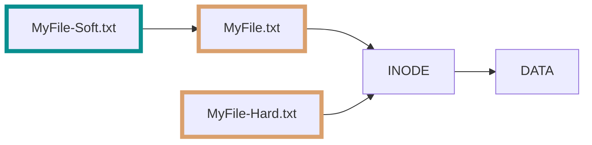

# Soft Link and Hard Link

* [x] Bir dosya (`MyFile.txt`) oluşturulduğunda, dosya sistemindeki herhangi bir INODE (Index Node) numarasına bir link oluşturulur.
* [x] Bir hard link oluşturulduğunda, hard link oluşturmak için kullanılan asıl dosyanın (`MyFile.txt`) gösterdiği INODE numarasını gösteren başka bir dosya (`MyFile-Hard.txt`) oluşturulur.
* [x] Bir soft (symbolic) link oluşturulduğunda, soft link oluşturmak için kullanılan asıl dosyayı (`MyFile.txt`) gösteren başka bir dosya (`MyFile-Soft.txt`) oluşturulur.

Symbolic link kullanmanın bir avantajı, [multi-call](https://superuser.com/a/1823292) programlar ile kullanılabilmesidir. Multi-call programlar, çağrıldığı program ismine (`argv[0]`) göre farklı davranabilirler.

Örneğin `shutdown` programı ile `systemctl` programı arasında bir symbolic link vardır. Bu programlar bazı durumlarda farklı parametrelerle kullanılabilir.
