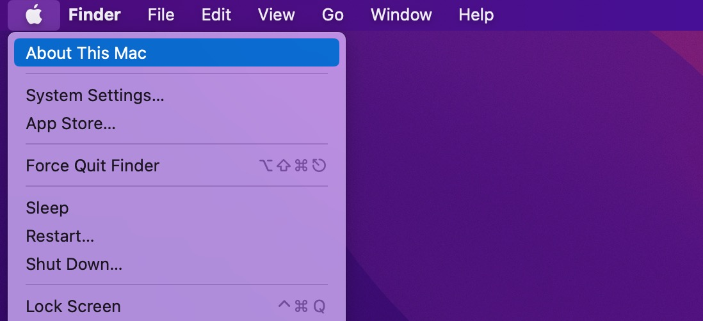
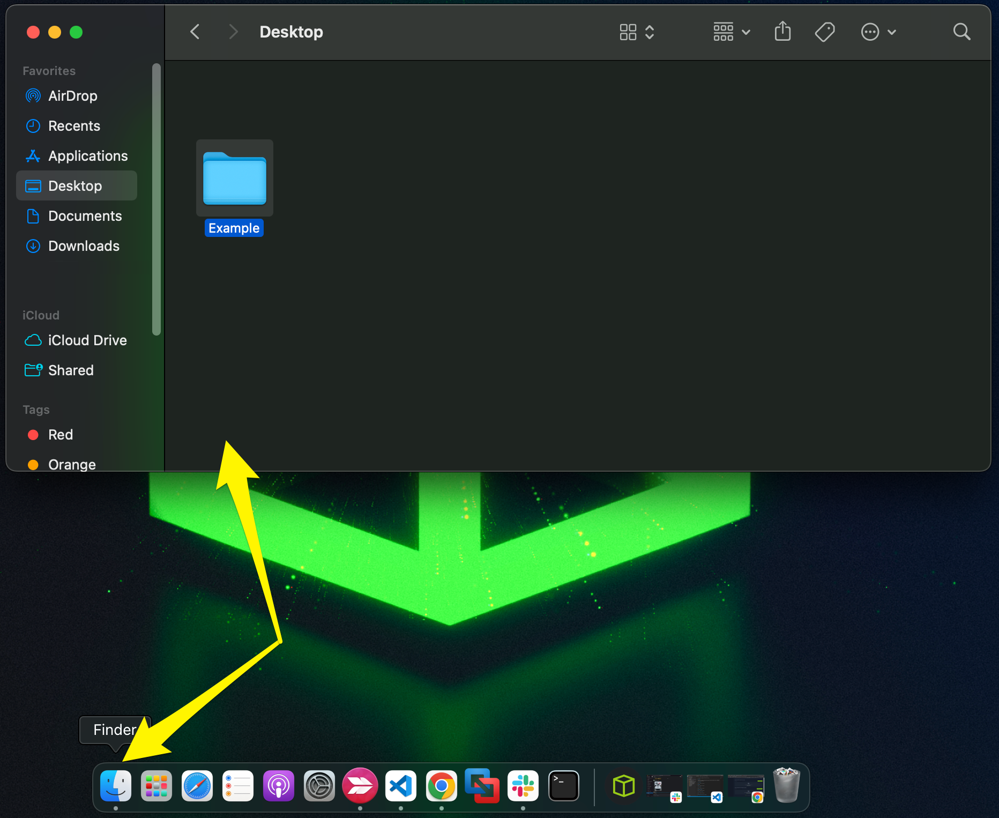
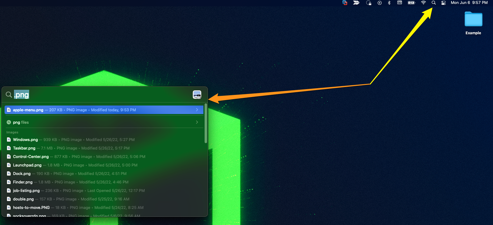
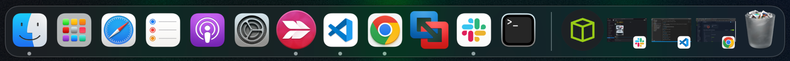
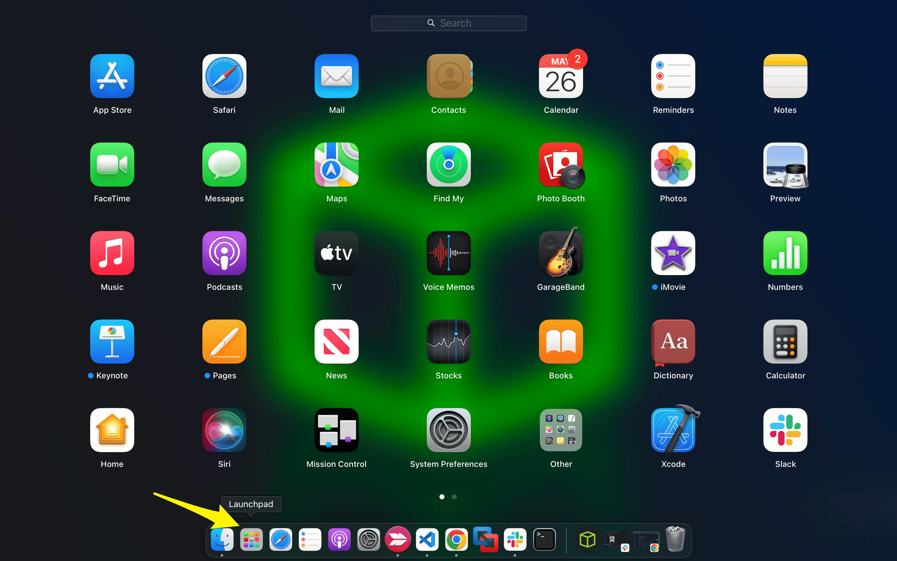
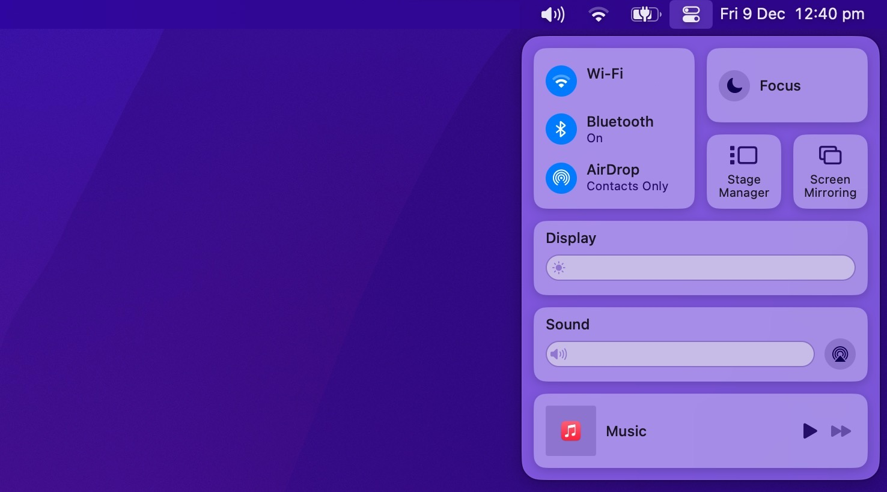

# Graphical User Interface

## Apple Menu

Apple Menu, bilgisayarı kapatma/yeniden başlatma veya sistem ayarlarına erişme gibi hızlı yönetici işlevlerini sağlar.

## Finder

Finder, dosyalarımızı yönetebildiğimiz ve erişebildiğimiz macOS dosya yöneticisidir. Finder, aşağıda verilen işlevleri sağlar:

* İlk masaüstü deneyimi.
* Dosya yönetimi.
* Üst kısımdaki menü çubuğu.
* Pencere içindeki kenar çubukları.

## Spotlight

Spotlight, indeksleme ve arama hizmeti sağlar. Ayrıca arama penceresinde hızlı matematiksel dönüşümler ve hesaplamalar gerçekleştirebilir.

## Dock

Dock, gerektiğinde hızlı bir şekilde erişebilmemiz için uygulamaları ve klasör kısayollarını saklamak için özelleştirilebilir bir ortam sağlar.

## Launchpad

Launchpad, uygulamalara erişmenin, düzenlemenin ve başlatmanın hızlı bir yolunu sunar.

## Control Center

Control Center, ses düzeyi, ekran parlaklığı, kablosuz bağlantı ayarları vb. gibi çeşitli ayarlara hızlı erişim sağlar.
