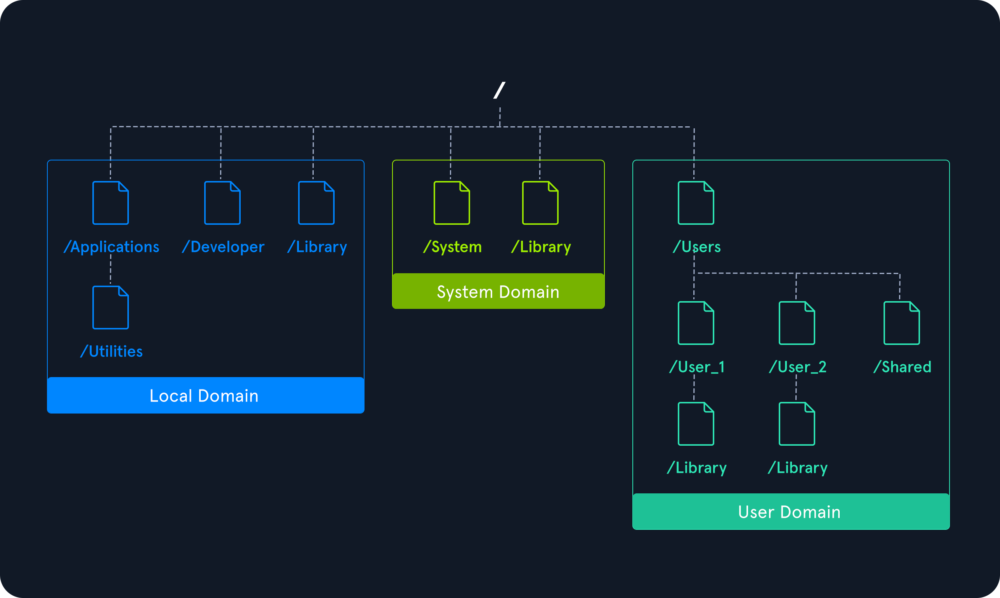
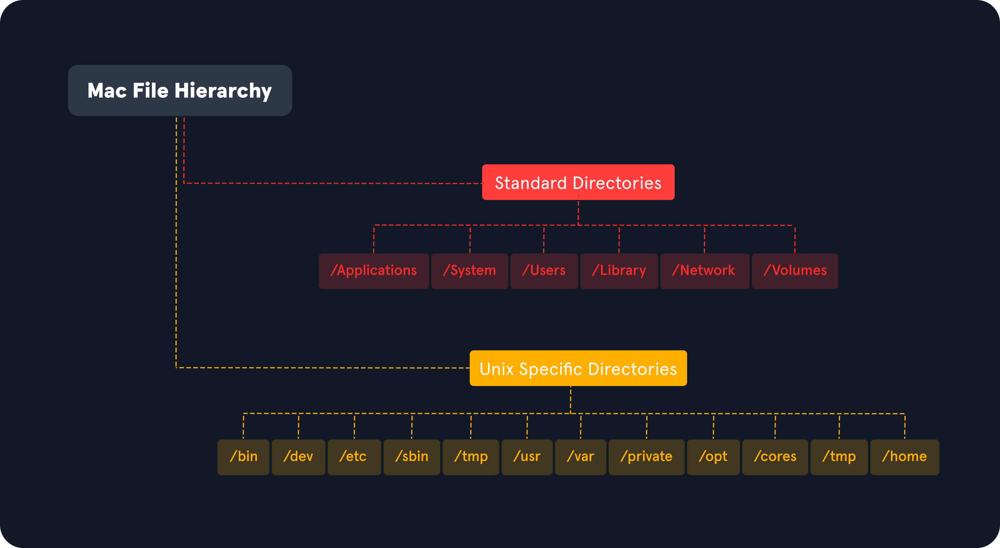

# System Hierarchy

## MacOS Domains

macOS dosya sistemi, dosyaları ve kaynakları kullanım amaçlarına göre ayıran birden çok alana bölünmüştür. Etki alanları, o etki alanındaki dosyalara ve kaynaklara erişim ayrıcalığını uygulayarak, yetkisiz kullanıcıların dosyaları değiştirmesini engeller.

| Domain | Description |
|---|---|
| Local Domain | Yerel olan ve tüm bilgisayar kullanıcıları arasında paylaşılan uygulama kaynaklarını içerir. |
| System Domain | Apple tarafından yüklenen sistem yazılımlarını içerir. |
| User Domain | Bu etki alanı, geçerli kullanıcının ev dizinini yansıtır. |
| Network Domain | Yerel alan ağının kullanıcıları arasında paylaşılan uygulamalar ve belgeler gibi kaynakları içerir. |

## macOS File System Structure

### Standard Directories

#### /Applications

Kullanıcıların yaygın olarak kullandığı uygulamaları içerir.

#### /Users

Kullanıcılarla ilgili uygulamaları, dosyaları ve kaynakları içerir.

#### /Library

Uygulamalar, önbellekler, yapılandırmalar, kaynaklar, tercihler ve kullanıcı verileri için özel veri dosyalarını içerir.

#### /Network

Yerel alan ağındaki bilgisayarların listesini içerir.

#### /System

Sistemin çalışması için gereken sistem kaynaklarını içerir. Bu dosyalar Apple tarafından yüklenir ve değiştirilmemelidir.
