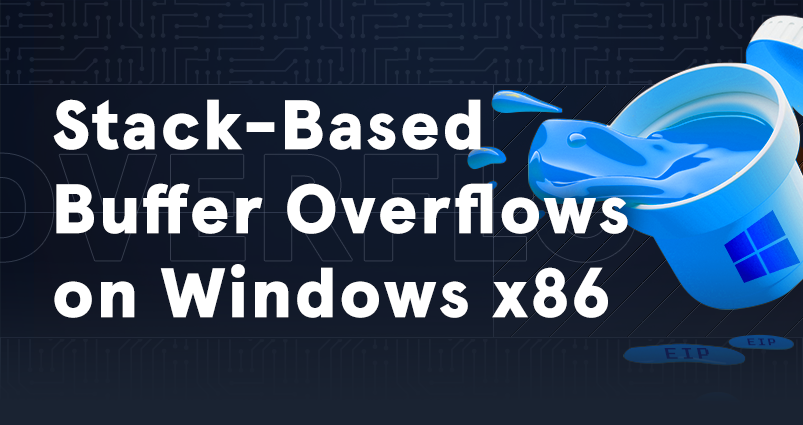

# Stack-Based Buffer Overflows on Windows x86

|  |
|---|
| This module is your first step into Windows Binary Exploitation, and it will teach you how to exploit local and remote buffer overflow vulnerabilities on Windows machines. |
