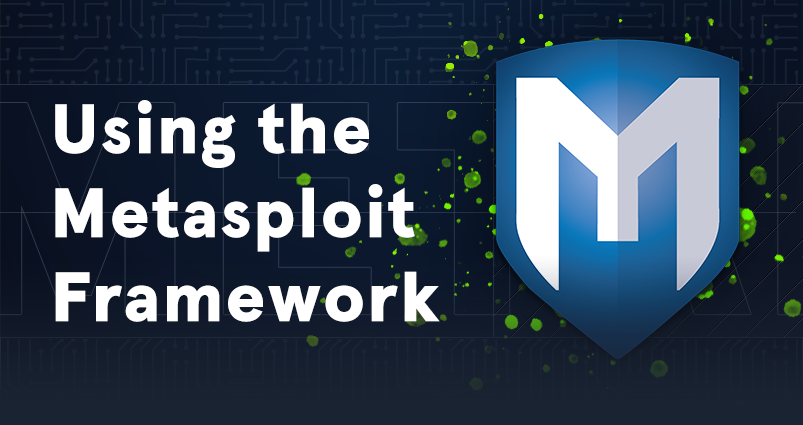

# Using the Metasploit Framework

|  |
|---|
| The Metasploit Framework is an open-source set of tools used for network enumeration, attacks, testing security vulnerabilities, evading detection, performing privilege escalation attacks, and performing post-exploitation. |
