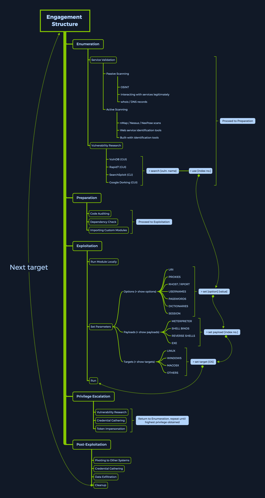

# Introduction to MSFconsole

## Installing MSF

Aşağıdaki komut ile Msfconsole yüklenebilir ya da halihazırda yüklü ise son sürüme güncellenebilir:

```bash
sudo apt install metasploit-framework
```

## MSF Engagement Structure

MSF ile çalışırken gerçekleştirilen adımlar beş ana kategoriye ayrılabilir:

1. Enumeration
2. Preparation
3. Exploitation
4. Privilege Escalation
5. Post-Exploitation



Yukarıda verilen resim, MSF kullanırken gerçekleştirilen adımların bir özeti niteliğindedir.
