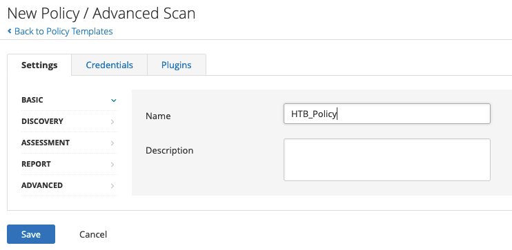
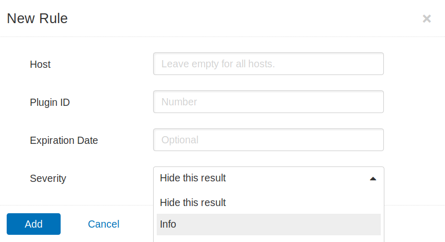
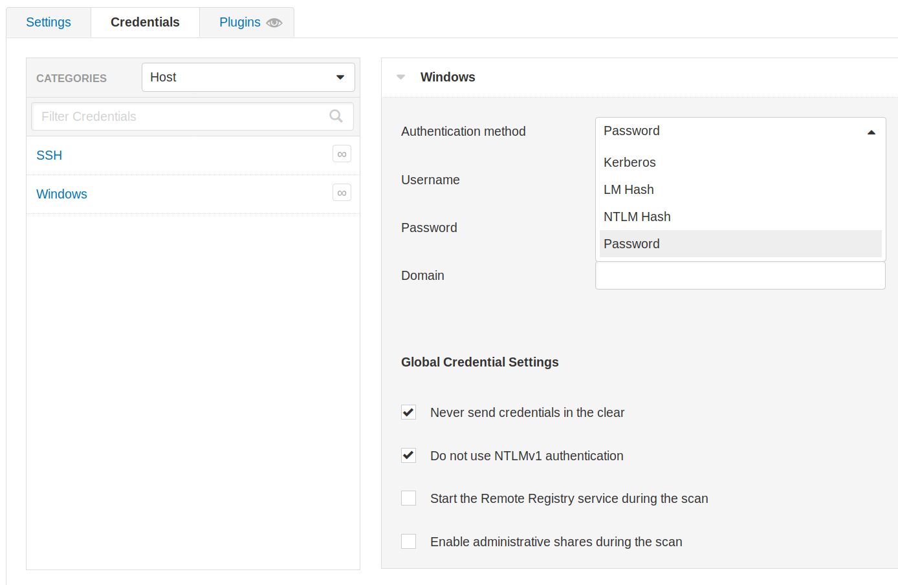
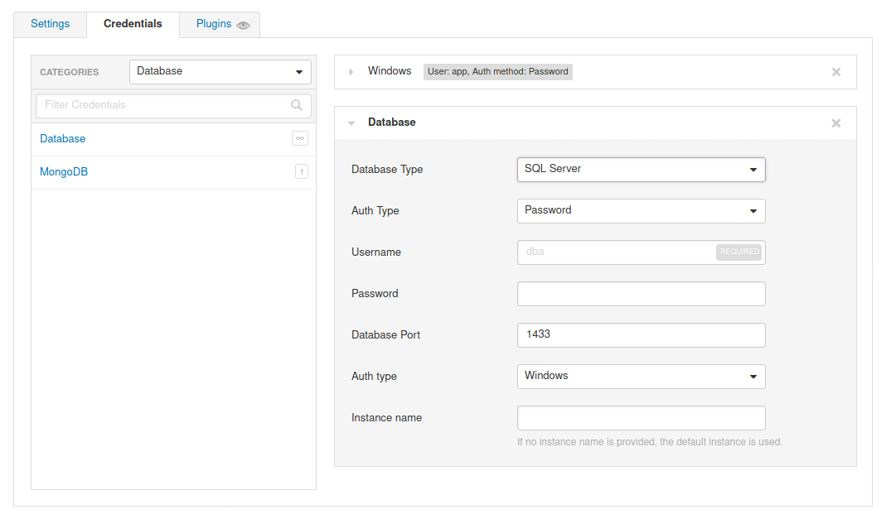
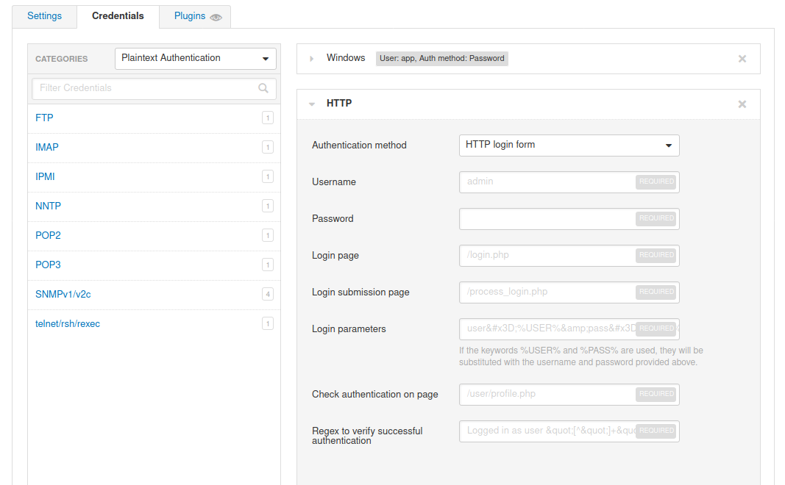
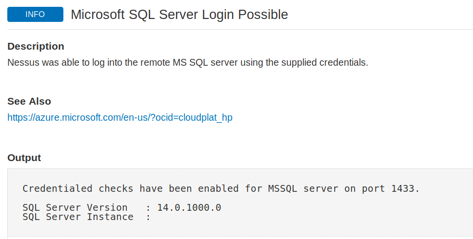

# Advanced Settings

## Scan Policies

Nessus, tarama politikaları oluşturma seçeneği sunmaktadır. Bu politikalar, belirli tarama seçeneklerini tanımlamamıza, ilke yapılandırmasını kaydetmemize ve yeni bir tarama oluştururken `Scan Templates` altında kullanmamıza olanak tanıyan, özelleştirilmiş taramalardır. Bu sayede, daha yavaş bir tarama, daha kaçınmalı (evasive) bir tarama, web odaklı bir tarama veya bir veya daha fazla kimlik bilgisi seti kullanarak belirli bir istemciye yönelik tarama gibi herhangi bir sayıda senaryo için hedefli taramalar oluşturabiliriz. Tarama politikaları diğer Nessus tarayıcılardan içe aktarılabilir veya daha sonra başka bir Nessus tarayıcısında kullanılmak üzere dışa aktarılabilir.

### Creating a Scan Policy

Bir tarama politikası oluşturmak için sağ üstteki `New Policy` butonuna tıklayabiliriz. Bunun ardından karşımıza önceden yapılandırılmış taramaların bir listesi çıkar. Önceden yapılandırılmış bir tarama yerine tamamen özelleştirilmiş bir tarama oluşturmak için `Advanced Scan` seçeneğini seçebiliriz.

Tarama türünü seçtikten sonra tarama politikasına bir ad ve açıklama verebiliriz:



Burada ayarları yapılandırabilir, gerekli kimlik bilgilerini ekleyebilir ve taramanın çalıştırılacağı uyumluluk standartlarını belirtebiliriz. Ayrıca [eklenti](https://docs.tenable.com/nessus/Content/Plugins.htm) ailelerinin tamamını veya tek tek eklentileri etkinleştirmeyi veya devre dışı bırakmayı da seçebiliriz.

Taramayı özelleştirmeyi bitirdikten sonra `Save` butonuna tıklayabiliriz. Yeni oluşturulan politika, politikalar listesinde görünecektir. Bundan sonra yeni bir tarama oluşturmak istediğimizde `Scan Templates` altında tüm özel tarama politikalarını gösteren `User Defined` adında yeni bir sekme belirecektir.

## Nessus Plugins

Nessus, NASL (Nessus Attack Scripting Language) ile yazılmış eklentilerle çalışır ve yeni güvenlik açıklarını hedefleyebilir. Bu eklentiler, güvenlik açığının adı, etkisi ve çözümü gibi bilgileri içerir. Yayınlanan tüm eklentilerin aranabilir bir veri tabanı [Tenable](https://www.tenable.com/plugins) web sitesinde bulunmaktadır.

Nessus `Plugins` sekmesi belirli bir algılama hakkında daha fazla bilgi sağlar. Yinelenen taramalar yapılırken sorun olarak kabul edilmeyen bir güvenlik açığı bulunmuş olabilir. Örneğin Microsoft DirectAccess (istemcilere internet üzerinden dahili ağ bağlantısı sağlayan bir teknoloji), güvenli olmayan ve geçersiz (null) şifreleme paketlerine izin verir. Aşağıdaki tarama, null şifre paketlerinin bir örneğini gösterir:

```bash
sslscan example.com
```

```text title="Output"
...SNIP...

Preferred TLSv1.0  128 bits  ECDHE-RSA-AES128-SHA          Curve 25519 DHE 253
Accepted  TLSv1.0  256 bits  ECDHE-RSA-AES256-SHA          Curve 25519 DHE 253
Accepted  TLSv1.0  128 bits  DHE-RSA-AES128-SHA            DHE 2048 bits
Accepted  TLSv1.0  256 bits  DHE-RSA-AES256-SHA            DHE 2048 bits
Accepted  TLSv1.0  128 bits  AES128-SHA
Accepted  TLSv1.0  256 bits  AES256-SHA

...SNIP...
```

Ancak bu tasarım gereğidir. Bu durumda SSL/TLS gerekli değildir ve bunun uygulanması performansın olumsuz etkilenmesine neden olur. Algılamayı diğer bilgisayarlar için etkin tutarken bu yanlış pozitifi tarama sonuçlarından hariç tutmak için bir eklenti kuralı oluşturabiliriz:

Nessus `Resources` bölümünün altında `Plugin Rules` seçeneğini seçiyoruz. Yeni eklenti kuralında, hariç tutulacak bilgisayarı ve Microsoft DirectAccess için Plugin ID bilgisini girdikten sonra gerçekleştirilecek eylem olarak `Hide this result` seçeneğini belirtiyoruz:



Doğrudan exploit uygulanamayan sorunlara yönelik eklentiler (örneğin [SSL Self-Signed Certificate](https://www.tenable.com/plugins/nessus/57582)) gibi belirli sorunları tarama sonuçlarımızdan hariç tutmak isteyebiliriz. Bunun için hariç tutulacak Plugin ID bilgisini ve bilgisayarları belirtmemiz gerekir.

## Scanning with Credentials

Nessus kimlik bilgilerine dayalı taramayı destekler. LM/NTLM hash, Kerberos kimlik doğrulaması ve parola kimlik doğrulaması desteği ile esneklik sağlar:



Nessus ayrıca Oracle, PostgreSQL, DB2, MySQL, SQL Server ve MongoDB gibi çeşitli veri tabanı türleri için kimlik doğrulamayı da destekler:



Buna ek olarak Nessus, FTP, HTTP, IMAP, IPMI ve Telnet gibi hizmetlerde düz metin kimlik doğrulaması gerçekleştirebilir:



Son olarak, sağlanan kimlik bilgileriyle hedef uygulama veya hizmete yönelik kimlik doğrulamanın başarılı olup olmadığını doğrulamak için Nessus çıktısını kontrol edebiliriz:


