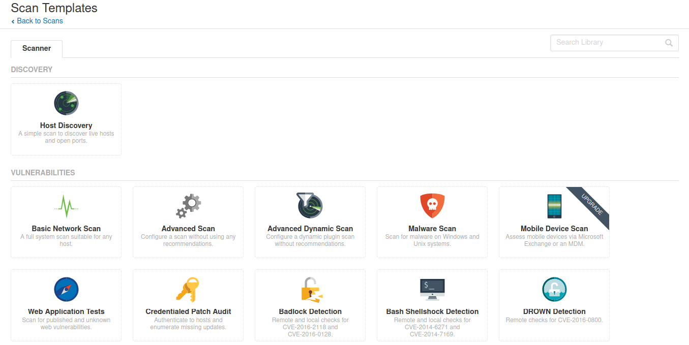
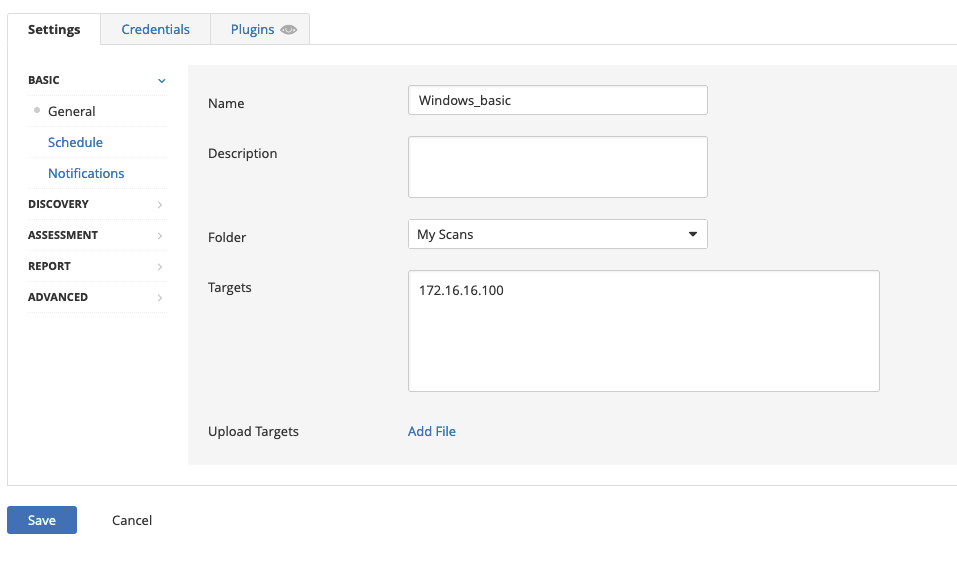
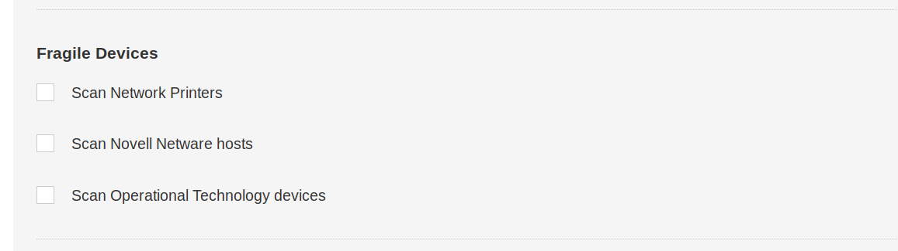
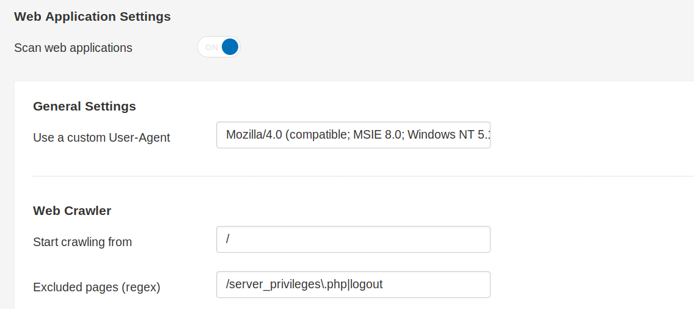
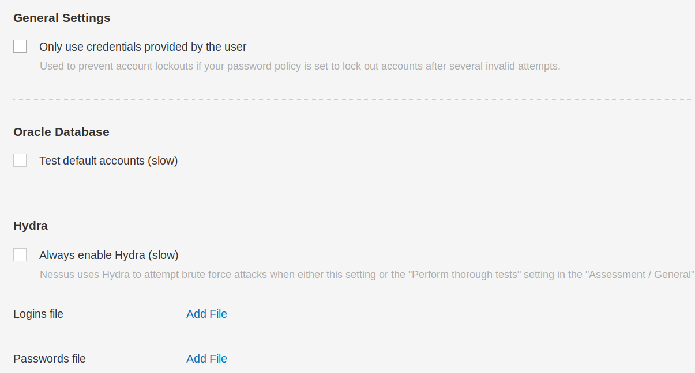
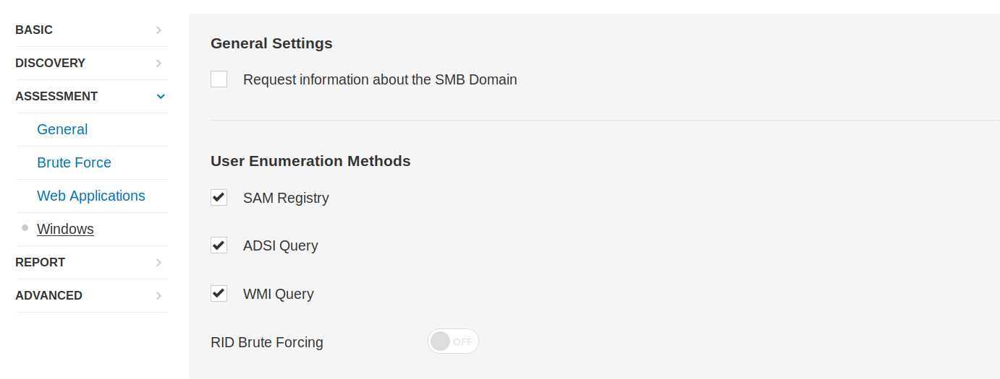
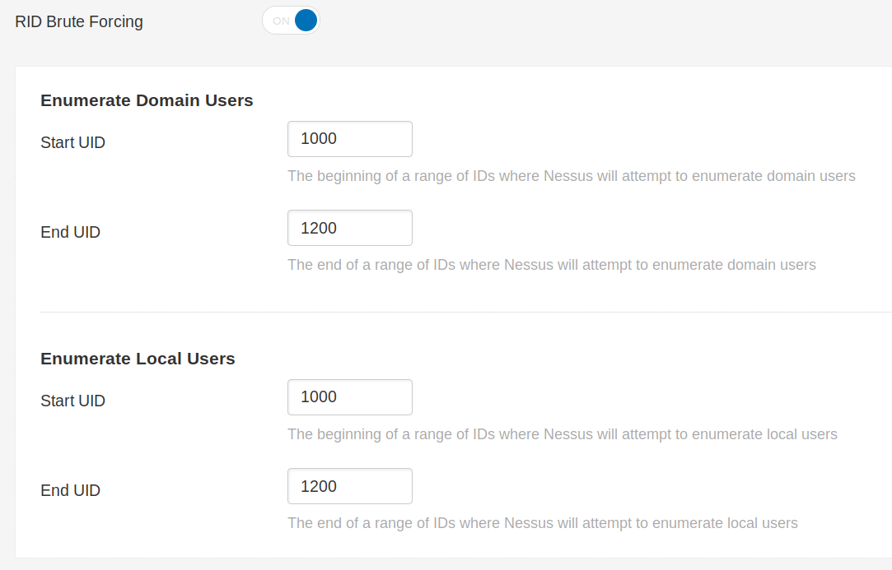
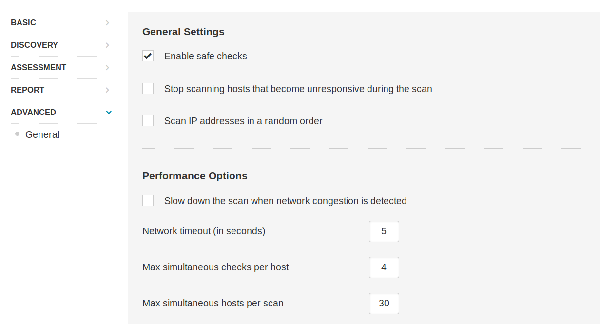

# Nessus Scan

Yeni bir Nessus taraması `New Scan` butonuna tıklanarak ve bir tarama türü seçilerek yapılandırılabilir. Tarama şablonları üç kategoriye ayrılır:

1. Discovery
2. Vulnerabilities
3. Compliance

## New Scan

Ulaşılabilir bilgisayarları/açık portları tanımlamak için `Host Discovery` taraması veya `Basic Network Scan`, `Advanced Scan`, `Malware Scan`, `Web Application Tests` gibi çeşitli tarama seçenekleri vardır. Tarama türlerine ait açıklamalar [burada](https://docs.tenable.com/nessus/Content/ScanAndPolicyTemplates.htm) bulunabilir.

Örneğin `Basic Network Scan` seçeneğine bakacak olursak:

Anlatım boyunca Windows hedefi için IP adresi 172.16.16.100 ve Linux hedefi için IP adresi 172.16.16.160 olacaktır.

## Discovery

Nessus `Discovery` bölümünde `Host Discovery` altında hassas cihazlar için taramayı etkinleştirme seçeneği sunulur. Ağ yazıcıları için tarama gerçekleştirmek, çoğu zaman bu cihazların kağıt tomarları yazdırmalarına ve aygıtların kullanılamaz hale gelmesine neden olur. Bu ayarı devre dışı bırakabiliriz:

Nessus `Port Scanning` bölümünde, gereksinimlerimize bağlı olarak ortak portları, tüm portları veya kendi tanımladığımız bir aralığın taranmasını seçebiliriz.

Nessus `Service Discovery` alt bölümünde `Probe all ports to find services` seçeneği varsayılan olarak seçilidir. Kötü tasarlanmış bir uygulamanın veya hizmetin bu inceleme sonucunda çökmesi mümkündür ancak çoğu uygulama bu durumun üstesinden gelebilecek kadar sağlamdır.

SSL/TLS hizmetlerinin aranması da özel taramada varsayılan olarak etkindir. Ek olarak Nessus aracına süresi dolan ve iptal edilen sertifikaları belirleme talimatı da verilebilir.

## Assessment

Nessus `Assessment` kategorisi altında, gerekirse web uygulaması taraması da etkinleştirilebilir ve özel bir User-Agent ve diğer çeşitli web uygulaması tarama seçenekleri belirtilebilir:

Nessus, sağlanan kimlik bilgilerini kullanarak keşfedilen uygulamalara ve hizmetlere karşı kimlik doğrulaması yapmayı deneyebilir (kimlik bilgisi içeren bir tarama için) veya aksi takdirde, sağlanan kullanıcı adı ve parola listeleriyle kaba kuvvet saldırısı gerçekleştirebilir:

Kullanıcı numaralandırma, RID kaba kuvvet gibi çeşitli teknikler kullanılarak da gerçekleştirilebilir:

RID kaba kuvvet gerçekleştirmeyi tercih edersek hem etki alanı hem de yerel kullanıcı hesapları için başlangıç ​​ve bitiş UID numaralarını ayarlayabiliriz:

## Advanced

Nessus `Advanced` sekmesinde güvenli kontroller (safe checks) varsayılan olarak etkindir. Bu sayede hedef makineyi veya ağı olumsuz etkileyebilecek kontroller yapılmaz. Ayrıca herhangi bir ağ tıkanıklığı tespit edilmesi durumunda tarama yavaşlatılır ve yanıt vermeyen bilgisayarlar için tarama girişimi durdurulur:

