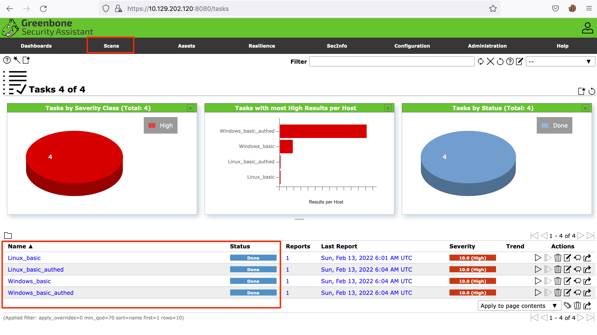
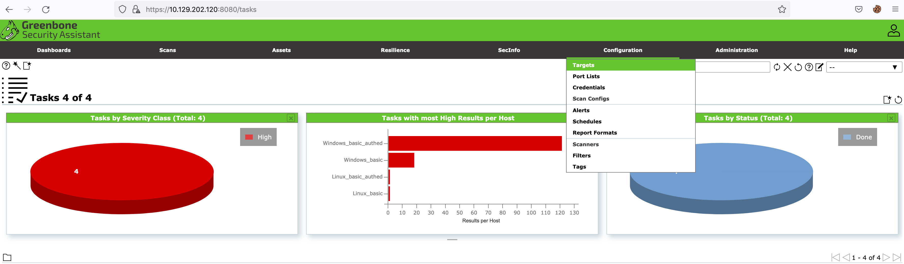
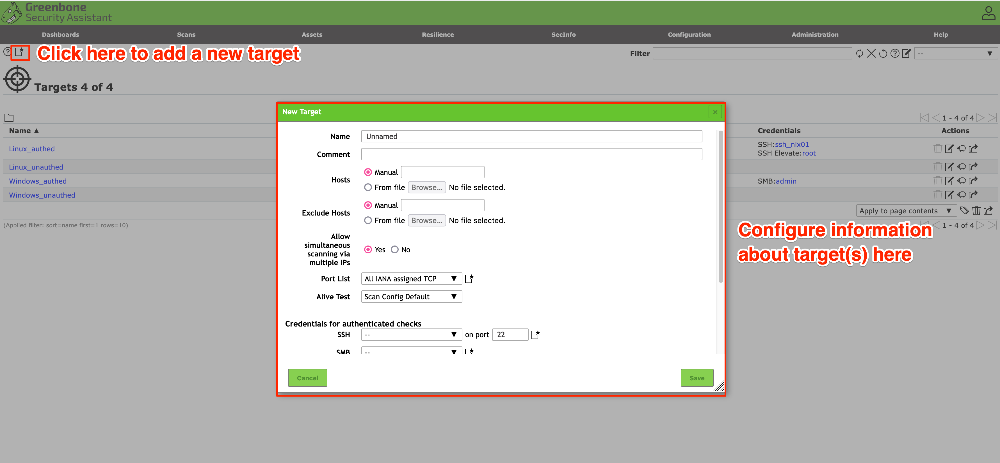
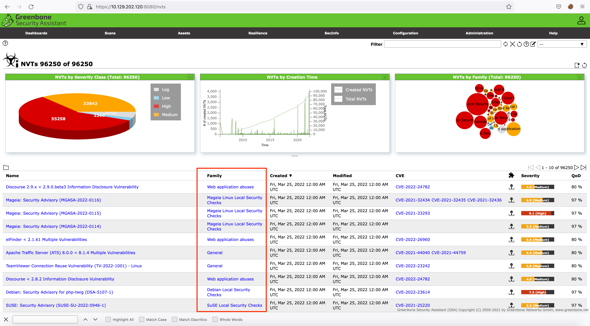

# OpenVAS Scan

OpenVAS Security Assistant uygulamasında etkileşim kurabileceğiniz çeşitli sekmeler bulunur. Aşağıda gösterilen `Scans` sekmesinde geçmişte yürütülen taramaları görebiliriz. Görevler, kullanıcının ayarladığı tarama yapılandırmalarına göre çalışır.

## Configuration

Herhangi bir tarama ayarlamadan önce tarama hedefleri yapılandırılmalıdır. Bunun için `Configuration` sekmesinde `Targets` seçeneği seçilebilir.

Bir hedef eklemek için aşağıda vurgulanan simgeyi tıklayın ve bir hedef veya hedef listesi ekleyin:

## Setting Up a Scan

Çoklu tarama yapılandırmaları, birçok farklı güvenlik açığı kategorisinden oluşan OpenVAS NVT (Network Vulnerability Test) ailelerinden yararlanır. Aşağıdaki görselde bazı aile türleri gösterilmiştir:

OpenVAS, bir ağı taramak için seçilebilecek çeşitli tarama yapılandırmalarına sahiptir:

| Configuration | Description |
|---|---|
| Base | Bu tarama yapılandırmasının amacı, bilgisayarın durumu ve işletim sistemi bilgileri hakkındaki bilgileri numaralandırmaktır. Bu tarama yapılandırması güvenlik açıklarını denetlemez. |
| Discovery | Bu tarama yapılandırmasının amacı, sistem hakkındaki bilgileri numaralandırmaktır. Yapılandırma, bilgisayar hizmetlerini, donanımını, erişilebilir portları ve sistemde kullanılan yazılımları tanımlar. Bu tarama yapılandırması güvenlik açıklarını denetlemez. |
| Host Discovery | Bu tarama yapılandırması, bilgisayarın ayakta olup olmadığını -ping kullanarak- test eder ve ağda bulunan cihazlardan hangilerinin etkin olduğunu belirler. Bu tarama yapılandırması güvenlik açıklarını denetlemez. |
| System Discovery | Bu tarama, hedef bilgisayarı `Discovery` taramasının ötesinde numaralandırır. Bilgisayarda yüklü olan işletim sistemini ve donanım bilgilerini belirlemeye çalışır. |
| Full and Fast | Bu yapılandırma, OpenVAS tarafından en güvenli seçenek olarak önerilir. |

Kişisel bir tarama oluşturmak için `Scans` sekmesinde sihirbaz simgesi (`New Task`) seçilmelidir:

Bunun ardından açılacak olan panelde mevcut tarama yapılandırılabilir.
