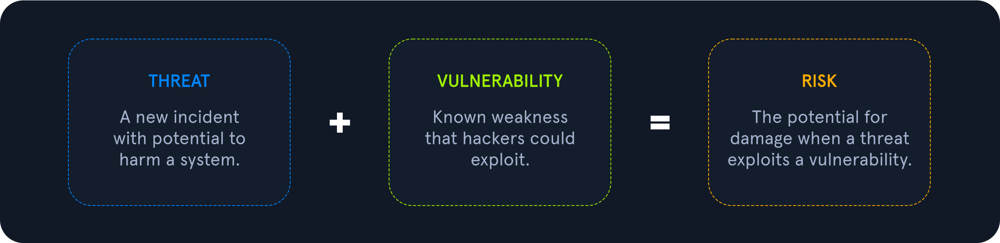
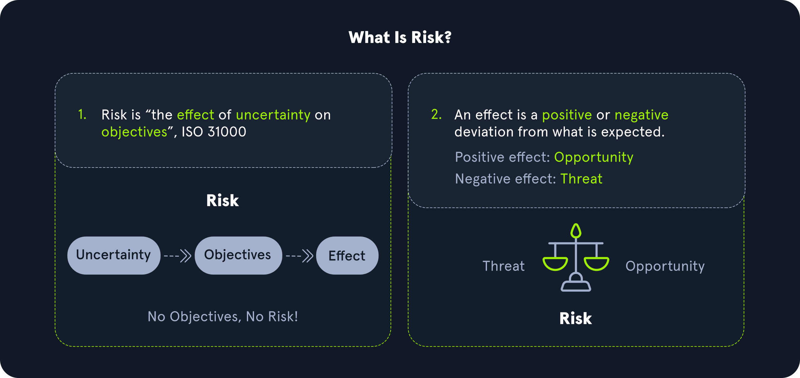
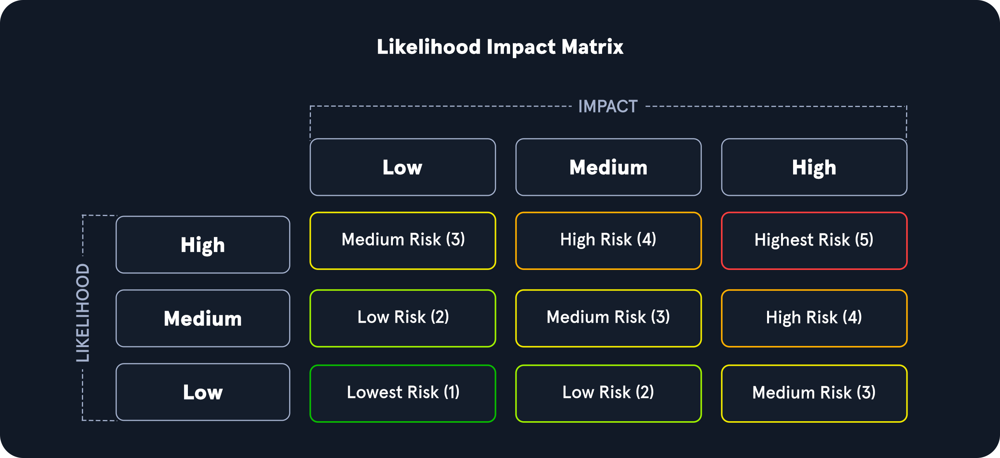

# Vulnerability Assessment

## Methodology

| Title | Description |
|---|---|
| Riski Tanımlama ve Analiz | Bir şirketteki bilgi sisteminin parçası olan tüm varlıkları tanımlayın. Tüm IT ekipmanlarının tam bir listesiyle şirketler, ortaya çıkabilecek çoğu durumu hesaba katmak için her bir varlığa risk atamaya başlayabilir. |
| Güvenlik Açığı Tarama Politikalarının Geliştirilmesi | Politikanın veya prosedürün resmi bir sahibi olmalıdır. Politikanın yürürlüğe girmesinden önce üst yönetim tarafından da onaylanması gerekir. |
| Tarama Türünün Belirlenmesi | Güvenliğini sağlamanız gereken sistemde çalışan yazılımlara bağlı olarak, en fazla faydayı elde etmek için önceden oluşturulacak tarama türünü belirlemeniz gerekir. Tarama türleri ağ tabanlı, bilgisayar tabanlı, kablosuz tabanlı veya uygulama tabanlı olabilir. |
| Taramanın Yapılandırılması | Bir güvenlik açığı taramasını yapılandırmak için şunları yapmanız gerekir: Hedef IP adreslerinin bir listesini ekleyin, port aralıklarını ve protokolleri tanımlayın, hedefleri tanımlayın ve taramanın saldırganlığını ayarlayın. |
| Taramanın Gerçekleştirilmesi | Tarama aracı, temel bilgileri toplamak için belirtilen hedeflerin parmak izini çıkaracaktır. Araç bu bilgilerle hedefleri sıralamaya ve çalışır durumdaki hizmetler gibi daha ayrıntılı özellikleri toplamaya devam eder. |
| Olası Risklerin Değerlendirilmesi | Bağlantılar, taramanın oluşturduğu trafik yükünü kaldıramazsa uzak hedef kapanabilir ve kullanılamaz hale gelebilir. |
| Tarama Sonuçlarının Yorumlanması | Sisteminizde bulduğunuz bir güvenlik açığı için genel bir istismar mevcutsa bu güvenlik açığına öncelik verilmelidir. |
| İyileştirme ve Etki Azaltma Planının Oluşturulması | Bilgi güvenliği personeli her bir güvenlik açığının azaltılmasına öncelik vermelidir. Çözüm sürecini kolaylaştırmak için bilgi güvenliği ve IT personelinin birlikte çalışması gerekir. |

## Understanding Key Terms

### Vulnerability

Güvenlik açığı ile kastedilen, uygulamalar, ağlar ve altyapı da dahil olmak üzere dış aktörlerden gelebilecek tehdit olasılığını ortaya çıkaran bir zayıflık veya hatadır.

Örneğin bir saldırganın, bir kuruluşun veri tabanından veri çıkarmak için sorgulardan yararlanabilmesi amacıyla SQL enjeksiyonu gerçekleştirmesi bir güvenlik açığı olarak kabul edilir.

### Threat

Tehdit, bir tehdit aktörünün bir güvenlik açığından yararlanması gibi olumsuz bir olayın potansiyelini artıran bir süreçtir.

### Exploit

Sömürü yazılımı, bir varlığın zayıflığından yararlanmak için kullanılabilecek herhangi bir kod veya kaynaktır.

### Risk

Risk, varlıkların veya verilerin tehdit aktörleri tarafından zarara uğratılması veya yok edilmesi olasılığıdır.

Risk, tehdit ve güvenlik açığı kavramlarını birbirinden ayırmak için şöyle düşünebiliriz:

* Risk, olabilecek kötü bir şeydir.
* Tehdit, kötü bir şeyler oluyor demektir.
* Güvenlik açığı, tehdit oluşturabilecek zayıflıklardır.

Riskleri, olasılık ve etkiye dayalı olarak ölçmek için niteliksel bir risk matrisi kullanabiliriz:

Oluşma olasılığı (likelihood) düşük ve etkisi (impact) düşük bir güvenlik açığı en düşük risk seviyesine sahiptir. Oluşma olasılığı yüksek ve etkisi yüksek bir güvenlik açığı ise en yüksek risk seviyesine sahiptir.
